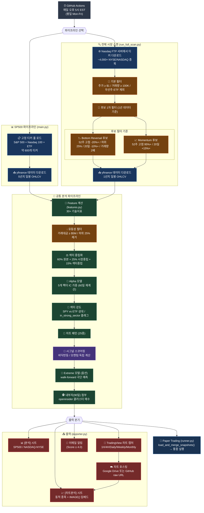

# 시스템 아키텍처

> 스크리너 + 페이퍼 트레이딩 통합 아키텍처 문서.
> 과거 `architecture_diagram.md` + `paper_architecture_diagram.md` 통합본.

---

## 1. 전체 파이프라인 플로우



> **출력 시트 4종 구조 (2026-05 시점)**
>
> | 시트 | 생성 모듈 | 내용 |
> |---|---|---|
> | `[SP500 분석]` | `main.py` | SP500/Nasdaq100/ETF 약 600개 전수 랭킹 |
> | `[SP500 차트분석]` | `main.py:338-388` | Signals 점수 임계 통과 종목만 동적 추출 + 차트 임베드 |
> | `[NASDAQ/NYSE 분석]` | `run_full_scan.py` | 전체 시장 스캔 후 후보 정밀 분석 |
> | `[NASDAQ/NYSE 차트분석]` | `run_full_scan.py:371+` | NASDAQ 후보 중 차트 첨부 대상 |

---

## 2. 페이퍼 트레이딩 개요

실제 매매 없이 가상으로 매수/매도를 기록해 전략 검증을 수행한다.

| 항목 | 값 | 설명 |
|------|-----|------|
| 최대 보유 종목 | 3개 | `PAPER_TRADING_MAX_POSITIONS = 3` |
| 수익 목표 | 바닥반등 +18% / 모멘텀 +12% / 기본 +15% | 전략별 `EXIT_PARAMS` (config.py:800-828) |
| 손절 | -10% (전략별) / 기본 -7% | `PAPER_TRADING_STOP_LOSS = 0.07`, `EXIT_PARAMS[*].stop_loss = 0.10` |
| 트레일링 스탑 | 바닥반등 -6% / 모멘텀 -5% / 기본 -5% | 고점 대비 |
| 최대 보유 기간 | 바닥반등 25일 / 모멘텀 18일 / 기본 21일 | 이후 stale_min_return 미달이면 매도 |
| Hold-Winners Defer | 5개 체크 모두 통과 시 매도 보류 (최대 2회) | 보류 중 트레일링 -3.5%로 타이트닝 (engine.py:160-220) |
| 실행 시각 | 매일 오후 5시 EST (평일) | GitHub Actions |
| 후보 선정 방식 | CCS (Composite Conviction Score) | 5개 컴포넌트 × 레짐 가중치 |
| 교체 조건 | 새 후보 CCS > 최약 CCS + 0.10 | `CCS_REPLACE_MARGIN = 0.10` |

### 매일 거래 엔진 (engine.py)

`run_daily_trading(ranked_df)` — 순서는 **SELL → SELECT → BUY/REPLACE** 고정.

```mermaid
flowchart TD
    START["run_daily_trading(ranked_df)"]
    START --> LOAD["positions.json / trades.json 로드"]
    LOAD --> PRICE["보유 종목 현재가 + 고점 갱신"]
    PRICE --> SELL_LOOP["매도 조건 검사"]

    subgraph SELL_PHASE ["SELL PHASE"]
        SELL_LOOP --> C1{"목표가 도달?\n(전략별 +12~18%)"}
        C1 -->|Yes| DEFER{"Hold-Winners\n5체크 통과?"}
        DEFER -->|Yes (≤2회)| TIGHT["tight-trail 전환\n(-3.5%)"]
        DEFER -->|No| EXIT1["매도: 목표가"]
        C1 -->|No| C2{"수익률 <= 손절선?\n(전략별 -10%)"}
        C2 -->|Yes| EXIT2["매도: 손절"]
        C2 -->|No| C3{"고점 대비 트레일링?\n(-5~-6%)"}
        C3 -->|Yes| EXIT3["매도: 트레일링"]
        C3 -->|No| C4{"최대일+ AND\n<stale_min_return?"}
        C4 -->|Yes| EXIT4["매도: 시간 감쇄"]
        C4 -->|No| HOLD["보유 유지"]
        TIGHT --> HOLD
    end

    EXIT1 & EXIT2 & EXIT3 & EXIT4 --> CLOSE["close_position()"]
    CLOSE & HOLD --> SELECT["select_best_candidate()"]
    SELECT --> SLOT{"보유 < 3?"}
    SLOT -->|Yes| BUY["add_position()"]
    SLOT -->|No| WORST["최약 포지션 선정\n(weakness = return*0.6 + CCS*0.4)"]
    WORST --> REPLACE{"새 CCS > 최약 + 0.10?"}
    REPLACE -->|Yes| SWAP["교체 매수"]
    REPLACE -->|No| SKIP["SKIP"]
    BUY & SWAP & SKIP --> RESULT["결과 반환"]
```

---

## 3. 후보 선정 엔진 (candidate_selector.py)

`select_best_candidate(df, current_holdings)` — 500~1000개 후보 중 최적 1종목 선정.

### Phase 1: 하드 필터 (7가지)

| 필터 | 기준 | config 상수 |
|------|------|-------------|
| 전략 점수 | 바닥반등/모멘텀 적합도 ≥ 6.0 | `CANDIDATE_MIN_STRATEGY_SCORE = 6.0` |
| 판단 등급 | "1. 매수 후보" / "1. 저점 반등" | — |
| RSI 과매수 | < 75 | `CANDIDATE_RSI_MAX = 75` |
| 볼린저 | bollinger_pband < 0.95 | `CANDIDATE_BOLLINGER_MAX = 0.95` |
| 단기 급등 | 5일 수익률 < +15% | `CANDIDATE_5D_RETURN_MAX = 0.15` |
| 유동성 | 20일 평균 거래대금 ≥ $10M | `CANDIDATE_LIQUIDITY_MIN = 10_000_000` |
| 실적 발표 | 다음 실적까지 3일+ | `CANDIDATE_EARNINGS_BUFFER_DAYS = 3` |
| 섹터 집중 | 동일 섹터 최대 2종목 | `CANDIDATE_MAX_SAME_SECTOR = 2` |

### Phase 2: CCS 컴포넌트 (5개)

```
CCS = w_strategy × A + w_timing × B + w_alpha × C + w_risk × D + w_confluence × E
```

| 컴포넌트 | 설명 |
|----------|------|
| **A. 전략 적합도** | max(바닥반등, 모멘텀) / 10, 애매한 신호 페널티 |
| **B. 진입 타이밍** | RSI 스윗스팟 + 볼린저 위치 + 거래량Z + MACD 방향 |
| **C. 알파 팩터** | 전략별 가중치 다른 5개 팩터 합산 |
| **D. 위험조정 품질** | ATR 압축 + 52주 포지션 + ROE + 부채비율 + 기관비율 + 공매도비율 |
| **E. 패턴 컨플루언스** | ML 저점확률 + 반등스코어 + 다중 타임프레임 패턴 + EMA 정렬 |

### Phase 3~4: 레짐별 CCS 가중치

```
Bull   : SPY 종가 > EMA50 > EMA200
Bear   : SPY 종가 < EMA200
Neutral: 그 외
```

| 컴포넌트 | Bull | Neutral | Bear |
|----------|------|---------|------|
| 전략 적합도 | 0.25 | 0.25 | 0.20 |
| 진입 타이밍 | 0.15 | 0.20 | 0.25 |
| 알파 팩터 | 0.25 | 0.20 | 0.15 |
| 위험조정 품질 | 0.15 | 0.20 | 0.30 |
| 패턴 컨플루언스 | 0.20 | 0.15 | 0.10 |

### Phase 5~7: 섹터 페널티 / 임계값 / 동점 처리

- 섹터 페널티: 보유 1종목 동섹터 -0.05, 2종목+ -0.15
- 임계값: Bull/Neutral ≥ 0.35, Bear ≥ 0.45 (+ `buy_signal == True`, 모멘텀 제외)
- 동점 처리 (CCS 차 ≤ 0.02): 바닥반등 > 모멘텀 > 전환구간 → 매수 지지 신호 수 → ATR% 낮은 쪽

---

## 4. 상태 관리 (portfolio.py)

### positions.json (현재 보유)

```json
[{
  "ticker": "ACHR",
  "entry_price": 5.35,
  "entry_date": "2026-04-02",
  "strategy": "📉 바닥반등",
  "star_rating": "★★★★★",
  "ccs_score": 0.4996,
  "sector": "Industrials",
  "highest_price": 5.42
}]
```

### trades.json (종료 포지션 누적)

`exit_date`, `exit_price`, `return_pct`, `holding_days`, `exit_reason` 추가.

| 함수 | 설명 |
|------|------|
| `add_position()` | positions에 추가 |
| `close_position()` | positions에서 제거 → trades에 기록 |
| `update_highest_price()` | 신고가 갱신 |
| `get_worst_position()` | weakness = (1-return_norm)×0.6 + (1-ccs_norm)×0.4 |

---

## 5. 스냅샷 병합 (runner.py)

```
sp500_ranked.parquet  ┐
                       ├─ load_and_merge_snapshots() → merged_df (~600~1000개)
nasdaq_ranked.parquet ┘
```

동일 티커 중복 시 (바닥반등 + 모멘텀) 합이 높은 쪽 유지.

---

## 6. Google Sheets 연동 (sheet_sync.py)

| 워크시트 | 방식 | 컬럼 |
|----------|------|------|
| `페이퍼_거래로그` | Append-only | 날짜, 티커, 액션, 매수/매도가, 수익률, 보유일, 전략, 별점, CCS, 사유 |
| `페이퍼_포지션현황` | Clear + 재작성 | 티커, 매수일, 매수가, 현재가, 수익률, 고점, 낙폭, 보유일, 전략, 별점, CCS |
| `페이퍼_성과요약` | Clear + 재작성 | 총 거래수, 승률, 평균수익률, 누적수익률, 전략별/별점별 breakdown |

---

## 7. 백테스트 모듈 (backtest.py)

라이브와 동일 매매 로직을 과거 OHLCV로 시뮬레이션.

| 항목 | 라이브 | 백테스트 |
|------|--------|----------|
| 데이터 소스 | 실시간 parquet | 과거 OHLCV + `_compute_ranked_snapshot()` |
| 체결 가격 | 당일 현재가 | 다음 거래일 시가 (슬리피지 반영) |
| 리밸런싱 | 매 거래일 | `rebalance_every=5` 거래일마다 |
| 포지션 저장 | JSON | 메모리 내 `@dataclass BtPosition` |

출력: `trades`, `summary` (total_trades, win_rate, avg_return, sharpe, max_drawdown, strategy_breakdown, exit_distribution), `equity_curve`.

---

## 8. 파일 맵

### 스크리너

| 파일 | 역할 |
|------|------|
| `src/main.py` | SP500 파이프라인 진입점 |
| `src/run_full_scan.py` | 전체 시장 스캔 |
| `src/data/ticker_fetcher.py` | Nasdaq FTP 티커 다운로드 |
| `src/data/fetch.py` | yfinance OHLCV |
| `src/screener/features.py` | 30+ 기술지표 |
| `src/screener/processing.py` | 유동성 필터 + 섹터 중립화 |
| `src/screener/alpha_model.py` | 5팩터 Alpha 모델 (기본 가중치 momentum 0.30 / trend 0.25 / volume 0.15 / volatility 0.15 / mean_reversion 0.15) |
| `src/screener/signals.py` | Bottom/Momentum 스코어 |
| `src/screener/patterns.py` | 차트 패턴 감지 (골든크로스 50바 sustained-below 검증 포함) |
| `src/screener/sector_rotation.py` | `get_strong_sectors()` + `in_strong_sector` 필터 |
| `src/screener/insider.py` | `attach_insider_summary()` — openinsider 90일 클러스터 매수 |
| `src/screener/exporter.py` | Google Sheets + 이메일 |
| `src/screener/config.py` | 모든 파라미터 |
| `src/analytics/extremes.py` | `score_extremes_for_snapshot()` — walk-forward 극단 예측 (`EXTREME_MODEL_ENABLED` opt-in) |
| `charts/tradingview_capture.py` | `capture_multiple_timeframes()` (1H/4H/D/W/M) |
| `charts/gdrive_uploader.py` | Google Drive 차트 호스팅 (옵션) |

### 페이퍼 트레이딩

| 파일 | 역할 |
|------|------|
| `src/paper_trading/run_paper_trading.py` | CLI 진입점 |
| `src/paper_trading/runner.py` | 통합 오케스트레이터 — `load_and_merge_snapshots()` + `run_unified_paper_trading()` |
| `src/paper_trading/engine.py` | 매일 거래 로직 + Hold-Winners Defer (`_should_defer_sell`, `_activate_tight_trail`) |
| `src/paper_trading/portfolio.py` | JSON 포지션/이력 관리 |
| `src/paper_trading/candidate_selector.py` | CCS 기반 후보 선정 |
| `src/paper_trading/sheet_sync.py` | 시트 3탭 동기화 |
| `src/paper_trading/backtest.py` | 백테스트 엔진 |
| `data/paper_trading/positions.json` | 현재 보유 |
| `data/paper_trading/trades.json` | 거래 이력 |
| `data/paper_trading/sp500_ranked.parquet` | SP500 스냅샷 |
| `data/paper_trading/nasdaq_ranked.parquet` | NASDAQ 스냅샷 |

### 백테스팅 CLI

| 파일 | 역할 |
|------|------|
| `scripts/run_sp500_backtest.py` | SP500 501개 전용 백테스트 |
| `scripts/paper_trading.py backtest` | 임의 유니버스 백테스트 |
| `scripts/run_backtest_only.py` | 스크리너 백테스트 (`BACKTEST_RUNS` 기반) |
| `src/paper_trading/backtest.py` | 페이퍼 트레이딩 백테스트 엔진 |
| `src/screener/backtest.py` | 스크리너 시그널 백테스트 엔진 |

---

## 9. 핵심 상수 요약 (src/screener/config.py)

```python
# 포지션 관리 (기본 — 전략별 오버라이드 있음, EXIT_PARAMS 참조)
PAPER_TRADING_MAX_POSITIONS    = 3
PAPER_TRADING_PROFIT_TARGET    = 0.15
PAPER_TRADING_STOP_LOSS        = 0.07   # 전략별 EXIT_PARAMS가 -10%로 오버라이드
PAPER_TRADING_TRAILING_STOP    = 0.05
PAPER_TRADING_MAX_HOLDING_DAYS = 21
PAPER_TRADING_STALE_MIN_RETURN = 0.02

# 전략별 EXIT 파라미터 (EXIT_PARAMS, config.py:800-828)
# 바닥반등: profit 18%, stop 10%, trailing 6%, max 25일
# 모멘텀  : profit 12%, stop 10%, trailing 5%, max 18일

# 후보 선정 하드 필터
CANDIDATE_MIN_STRATEGY_SCORE   = 6.0
CANDIDATE_BOTTOM_MAX_52W_POS   = 0.65   # 바닥반등: 이미 회복된 종목 차단
CANDIDATE_RSI_MAX              = 75
CANDIDATE_BOLLINGER_MAX        = 0.95
CANDIDATE_5D_RETURN_MAX        = 0.15
CANDIDATE_LIQUIDITY_MIN        = 10_000_000
CANDIDATE_EARNINGS_BUFFER_DAYS = 3
CANDIDATE_MAX_SAME_SECTOR      = 2

# 교체 및 CCS
CCS_REPLACE_MARGIN             = 0.10
CANDIDATE_CCS_MIN_NORMAL       = 0.40
CANDIDATE_CCS_MIN_BEAR         = 0.45

# Hold-Winners Defer (목표가 도달 시 매도 보류)
HOLD_WINNERS_TIGHT_TRAIL       = 0.035  # defer 후 고점 대비 -3.5% trailing
HOLD_WINNERS_MAX_DEFERS        = 2
HOLD_WINNERS_RSI_MAX           = 75.0
HOLD_WINNERS_ADX_MIN           = 20.0
HOLD_WINNERS_VOLUME_MULT_MIN   = 1.2
HOLD_WINNERS_VOLUME_Z_MIN      = 1.0
HOLD_WINNERS_BB_PBAND_MAX      = 0.95
HOLD_WINNERS_MIN_CHECKS        = 5      # 5개 전부 통과해야 defer

# Machine Learning
ML_ENABLED                     = False  # Phase B 코드 통합, 기본 비활성
ML_BLEND_WEIGHT_ALPHA          = 0.4
EXTREME_MODEL_ENABLED          = False  # walk-forward extreme prediction opt-in
```
