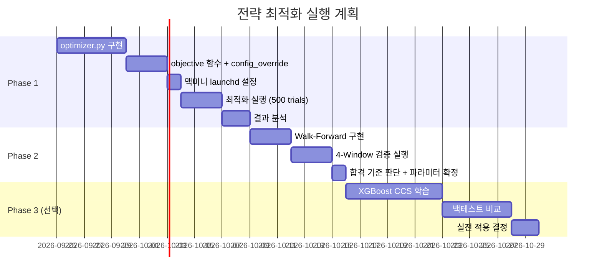

# 🔬 전략 파라미터 자동 최적화 계획서

> **목표:** 맥미니 서버에서 백테스트를 24시간 자동 반복 실행하여, 현재 전략의 최적 파라미터 조합을 탐색한다.  
> **핵심 원칙:** 과적합(Overfitting) 방지를 최우선으로 하며, 모든 결과는 Out-of-Sample 구간에서 검증한다.  
> **예상 소요:** Phase 1 구현 ~2주, Phase 2 ~1주, Phase 3(선택) ~3주

---

## 현재 시스템 분석

### 최적화 가능한 파라미터 현황

현재 `config.py`에 하드코딩된 파라미터 약 **80개** 중, 백테스트 성과에 직접적으로 영향을 미치는 핵심 파라미터를 3개 그룹으로 분류한다.

#### 그룹 A: 진입 조건 (Entry Parameters)

| 파라미터 | 현재값 | 탐색 범위 (제안) |
|----------|--------|-----------------|
| `CANDIDATE_MIN_STRATEGY_SCORE` | 6.0 | 4.5 ~ 7.5 |
| `CANDIDATE_CCS_MIN_NORMAL` | 0.40 | 0.30 ~ 0.55 |
| `CANDIDATE_CCS_MIN_BEAR` | 0.45 | 0.35 ~ 0.60 |
| `CANDIDATE_RSI_MAX` | 75 | 65 ~ 85 |
| `CANDIDATE_BOLLINGER_MAX` | 0.95 | 0.85 ~ 1.0 |
| `CANDIDATE_5D_RETURN_MAX` | 0.15 | 0.10 ~ 0.25 |
| `ADX_BUY_MIN` | 25 | 18 ~ 35 |

#### 그룹 B: 청산 조건 (Exit Parameters)

| 파라미터 | 현재값 (바닥반등 / 모멘텀) | 탐색 범위 |
|----------|---------------------------|-----------|
| `profit_target` | 0.18 / 0.12 | 0.08 ~ 0.25 |
| `stop_loss` | 0.10 / 0.10 | 0.04 ~ 0.15 |
| `trailing_stop` | 0.06 / 0.05 | 0.03 ~ 0.10 |
| `max_holding_days` | 25 / 18 | 10 ~ 40 |
| `time_profit_days` | 12 / 8 | 5 ~ 20 |
| `time_profit_min` | 0.07 / 0.05 | 0.03 ~ 0.12 |

#### 그룹 C: CCS 가중치 (Scoring Weights)

| 파라미터 | 현재값 (Bull) | 탐색 범위 |
|----------|--------------|-----------|
| `strategy` weight | 0.25 | 0.10 ~ 0.40 |
| `timing` weight | 0.20 | 0.10 ~ 0.35 |
| `alpha` weight | 0.15 | 0.05 ~ 0.30 |
| `risk` weight | 0.20 | 0.10 ~ 0.40 |
| `confluence` weight | 0.20 | 0.05 ~ 0.30 |

> [!IMPORTANT]
> CCS 가중치는 합이 1.0이 되어야 한다. Optuna에서 Dirichlet 분포 또는 정규화 후처리로 구현한다.

#### Hold-Winners 파라미터

| 파라미터 | 현재값 | 탐색 범위 |
|----------|--------|-----------|
| `HOLD_WINNERS_TIGHT_TRAIL` | 0.035 | 0.02 ~ 0.06 |
| `HOLD_WINNERS_MAX_DEFERS` | 2 | 1 ~ 4 |
| `HOLD_WINNERS_RSI_MAX` | 75.0 | 65 ~ 85 |
| `HOLD_WINNERS_ADX_MIN` | 20.0 | 15 ~ 30 |

---

## Phase 1: Optuna 기반 파라미터 최적화 (~2주)

### 1.1 아키텍처

```
맥미니 (24시간 상시 가동)
│
├── 기존 시스템 (변경 없음)
│   └── main.py → 매일 오후 5시 페이퍼 트레이딩
│
└── 최적화 시스템 (신규)
    ├── src/optimization/
    │   ├── __init__.py
    │   ├── optimizer.py          ← Optuna Study 관리
    │   ├── param_space.py        ← 파라미터 탐색 공간 정의
    │   ├── objective.py          ← 목적 함수 (백테스트 실행 + Sharpe 계산)
    │   ├── config_override.py    ← config.py 파라미터를 동적으로 오버라이드
    │   └── dashboard.py          ← 결과 시각화 (Optuna Dashboard)
    │
    ├── scripts/
    │   └── run_optimizer.py      ← 실행 스크립트
    │
    └── data/optimization/
        ├── optuna.db             ← SQLite (Optuna 결과 저장)
        └── results/              ← 최적 파라미터 스냅샷
```

### 1.2 핵심 구현 설계

#### `objective.py` — 목적 함수 (Optuna가 최소화/최대화할 대상)

```python
import optuna
from paper_trading.backtest import run_paper_trading_backtest
from optimization.config_override import apply_overrides

def objective(trial: optuna.Trial) -> float:
    """Optuna 목적 함수: Sharpe Ratio를 최대화한다."""

    # ── 1. 파라미터 제안 ──
    params = {
        # 그룹 A: 진입 조건
        "CANDIDATE_MIN_STRATEGY_SCORE": trial.suggest_float(
            "min_strategy_score", 4.5, 7.5, step=0.5
        ),
        "CANDIDATE_CCS_MIN_NORMAL": trial.suggest_float(
            "ccs_min_normal", 0.30, 0.55, step=0.05
        ),
        "CANDIDATE_RSI_MAX": trial.suggest_int(
            "rsi_max", 65, 85, step=5
        ),
        "ADX_BUY_MIN": trial.suggest_int(
            "adx_buy_min", 18, 35, step=2
        ),

        # 그룹 B: 바닥반등 Exit
        "EXIT_bottom_profit": trial.suggest_float(
            "bottom_profit_target", 0.08, 0.25, step=0.02
        ),
        "EXIT_bottom_stop": trial.suggest_float(
            "bottom_stop_loss", 0.04, 0.15, step=0.01
        ),
        "EXIT_bottom_trail": trial.suggest_float(
            "bottom_trailing_stop", 0.03, 0.10, step=0.01
        ),

        # 그룹 B: 모멘텀 Exit
        "EXIT_momentum_profit": trial.suggest_float(
            "momentum_profit_target", 0.06, 0.20, step=0.02
        ),
        "EXIT_momentum_stop": trial.suggest_float(
            "momentum_stop_loss", 0.04, 0.15, step=0.01
        ),
        "EXIT_momentum_trail": trial.suggest_float(
            "momentum_trailing_stop", 0.03, 0.10, step=0.01
        ),

        # 그룹 C: CCS 가중치 (Dirichlet 근사)
        "CCS_strategy_w": trial.suggest_float("ccs_strategy", 0.10, 0.40),
        "CCS_timing_w": trial.suggest_float("ccs_timing", 0.10, 0.35),
        "CCS_alpha_w": trial.suggest_float("ccs_alpha", 0.05, 0.30),
        "CCS_risk_w": trial.suggest_float("ccs_risk", 0.10, 0.40),
        "CCS_confluence_w": trial.suggest_float("ccs_confluence", 0.05, 0.30),
    }

    # CCS 가중치 정규화 (합 = 1.0)
    ccs_keys = [k for k in params if k.startswith("CCS_")]
    ccs_sum = sum(params[k] for k in ccs_keys)
    for k in ccs_keys:
        params[k] /= ccs_sum

    # ── 2. config 오버라이드 적용 ──
    apply_overrides(params)

    # ── 3. 백테스트 실행 (Train 구간만) ──
    metrics = run_paper_trading_backtest(
        start_date="2022-03-01",
        end_date="2025-06-30",    # ← Train 구간
        use_fundamentals=True,
    )

    # ── 4. 다목적 최적화 (Pruning 포함) ──
    sharpe = metrics.get("sharpe_ratio", 0.0)
    mdd = abs(metrics.get("max_drawdown", -1.0))
    total_trades = metrics.get("total_trades", 0)

    # 최소 거래 수 미달 시 Pruning
    if total_trades < 50:
        raise optuna.TrialPruned()

    # MDD 페널티 적용 Sharpe
    penalized_sharpe = sharpe - max(0, mdd - 0.30) * 2.0

    return penalized_sharpe
```

#### `config_override.py` — 동적 파라미터 주입

```python
"""config.py의 모듈 수준 변수를 런타임에 오버라이드한다.

기존 코드를 전혀 수정하지 않고, Optuna가 제안한 파라미터를
screener.config 네임스페이스에 직접 주입하는 방식.
"""
import screener.config as cfg

_PARAM_MAP = {
    "CANDIDATE_MIN_STRATEGY_SCORE": "CANDIDATE_MIN_STRATEGY_SCORE",
    "CANDIDATE_CCS_MIN_NORMAL": "CANDIDATE_CCS_MIN_NORMAL",
    "CANDIDATE_RSI_MAX": "CANDIDATE_RSI_MAX",
    "ADX_BUY_MIN": "ADX_BUY_MIN",
    # ... 나머지 매핑
}

def apply_overrides(params: dict) -> None:
    for key, cfg_attr in _PARAM_MAP.items():
        if key in params:
            setattr(cfg, cfg_attr, params[key])

    # EXIT_PARAMS 구조체 업데이트
    if "EXIT_bottom_profit" in params:
        cfg.EXIT_PARAMS["바닥반등"]["profit_target"] = params["EXIT_bottom_profit"]
        cfg.EXIT_PARAMS["바닥반등"]["stop_loss"] = params["EXIT_bottom_stop"]
        cfg.EXIT_PARAMS["바닥반등"]["trailing_stop"] = params["EXIT_bottom_trail"]

    if "EXIT_momentum_profit" in params:
        cfg.EXIT_PARAMS["모멘텀"]["profit_target"] = params["EXIT_momentum_profit"]
        cfg.EXIT_PARAMS["모멘텀"]["stop_loss"] = params["EXIT_momentum_stop"]
        cfg.EXIT_PARAMS["모멘텀"]["trailing_stop"] = params["EXIT_momentum_trail"]

    # CCS 가중치 업데이트
    if "CCS_strategy_w" in params:
        for regime in cfg.CANDIDATE_REGIME_WEIGHTS:
            cfg.CANDIDATE_REGIME_WEIGHTS[regime] = {
                "strategy": params["CCS_strategy_w"],
                "timing": params["CCS_timing_w"],
                "alpha": params["CCS_alpha_w"],
                "risk": params["CCS_risk_w"],
                "confluence": params["CCS_confluence_w"],
            }
```

### 1.3 실행 스크립트

```python
# scripts/run_optimizer.py
import optuna
from optimization.objective import objective

def main():
    # SQLite에 저장 → 맥미니 재시작 후 이어서 실행 가능
    study = optuna.create_study(
        study_name="project1_v1",
        storage="sqlite:///data/optimization/optuna.db",
        direction="maximize",
        load_if_exists=True,
        sampler=optuna.samplers.TPESampler(seed=42),
        pruner=optuna.pruners.MedianPruner(),
    )

    # 현재 파라미터를 첫 trial로 등록 (baseline)
    study.enqueue_trial({
        "min_strategy_score": 6.0,
        "ccs_min_normal": 0.40,
        "rsi_max": 75,
        "adx_buy_min": 25,
        "bottom_profit_target": 0.18,
        "bottom_stop_loss": 0.10,
        "bottom_trailing_stop": 0.06,
        "momentum_profit_target": 0.12,
        "momentum_stop_loss": 0.10,
        "momentum_trailing_stop": 0.05,
        "ccs_strategy": 0.25,
        "ccs_timing": 0.20,
        "ccs_alpha": 0.15,
        "ccs_risk": 0.20,
        "ccs_confluence": 0.20,
    })

    study.optimize(objective, n_trials=500, timeout=3600*24)

    print(f"Best Sharpe: {study.best_value:.3f}")
    print(f"Best Params: {study.best_params}")

if __name__ == "__main__":
    main()
```

### 1.4 맥미니 서비스 등록 (launchd)

```xml
<!-- ~/Library/LaunchAgents/com.project1.optimizer.plist -->
<?xml version="1.0" encoding="UTF-8"?>
<!DOCTYPE plist PUBLIC "-//Apple//DTD PLIST 1.0//EN"
  "http://www.apple.com/DTDs/PropertyList-1.0.dtd">
<plist version="1.0">
<dict>
  <key>Label</key>
  <string>com.project1.optimizer</string>
  <key>ProgramArguments</key>
  <array>
    <string>/Users/seancho/Desktop/Code/Project_1/.venv/bin/python</string>
    <string>/Users/seancho/Desktop/Code/Project_1/scripts/run_optimizer.py</string>
  </array>
  <key>WorkingDirectory</key>
  <string>/Users/seancho/Desktop/Code/Project_1/src</string>
  <key>KeepAlive</key>
  <true/>                <!-- 프로세스 종료 시 자동 재시작 -->
  <key>StandardOutPath</key>
  <string>/Users/seancho/Desktop/Code/Project_1/logs/optimizer.log</string>
  <key>StandardErrorPath</key>
  <string>/Users/seancho/Desktop/Code/Project_1/logs/optimizer_error.log</string>
  <key>Nice</key>
  <integer>10</integer>  <!-- 낮은 우선순위 (기존 작업에 영향 없게) -->
</dict>
</plist>
```

```bash
# 서비스 등록 및 시작
launchctl load ~/Library/LaunchAgents/com.project1.optimizer.plist

# 상태 확인
launchctl list | grep project1

# 중지
launchctl unload ~/Library/LaunchAgents/com.project1.optimizer.plist
```

### 1.5 예상 소요 시간

| 항목 | 시간 |
|------|------|
| 1회 백테스트 (5년, 501종목) | ~3~5분 (추정) |
| 500 trials | ~25~42시간 |
| 1,000 trials | ~50~84시간 (2~3.5일) |

> [!NOTE]
> 맥미니 M2 기준. 실제 시간은 캐시 활용, 종목 수, 펀더멘털 포함 여부에 따라 달라진다.
> 처음 10 trials로 1회 소요 시간을 측정한 뒤 전체 일정을 재산정한다.

---

## Phase 2: Walk-Forward 검증으로 과적합 방지 (~1주)

### 왜 필요한가?

Phase 1에서 찾은 "최적" 파라미터가 실전에서도 통하는지 확인하는 **가장 중요한 단계**이다.

```
❌ 잘못된 방법: 전체 기간(2022~2026)으로 최적화 → 같은 기간에서 테스트
   → 과적합. 미래에 망할 확률 높음.

✅ 올바른 방법: Walk-Forward Optimization
   Train 구간에서 최적화 → Test 구간에서 검증 → 윈도우 이동 → 반복
```

### 2.1 Walk-Forward 구조

```
전체 데이터: 2022-03 ──────────────────────────────── 2026-09

Window 1:  [████ Train ████][▒▒ Test ▒▒]
           2022-03 → 2024-02  2024-03 → 2024-08

Window 2:      [████ Train ████][▒▒ Test ▒▒]
               2022-09 → 2024-08  2024-09 → 2025-02

Window 3:          [████ Train ████][▒▒ Test ▒▒]
                   2023-03 → 2025-02  2025-03 → 2025-08

Window 4:              [████ Train ████][▒▒ Test ▒▒]
                       2023-09 → 2025-08  2025-09 → 2026-09

→ Test 구간의 Sharpe를 종합해서 최종 파라미터 선정
```

### 2.2 구현 개요

```python
# optimization/walk_forward.py

import optuna
from datetime import date, timedelta

WINDOWS = [
    {"train": ("2022-03-01", "2024-02-28"), "test": ("2024-03-01", "2024-08-31")},
    {"train": ("2022-09-01", "2024-08-31"), "test": ("2024-09-01", "2025-02-28")},
    {"train": ("2023-03-01", "2025-02-28"), "test": ("2025-03-01", "2025-08-31")},
    {"train": ("2023-09-01", "2025-08-31"), "test": ("2025-09-01", "2026-09-30")},
]

def walk_forward_optimize(n_trials_per_window: int = 200):
    """각 윈도우별 최적화 → Test 구간 성과 집계."""
    all_test_results = []

    for i, window in enumerate(WINDOWS):
        # Train 구간에서 Optuna 최적화
        study = optuna.create_study(
            study_name=f"wf_window_{i}",
            storage="sqlite:///data/optimization/optuna_wf.db",
            direction="maximize",
            load_if_exists=True,
        )

        def objective_for_window(trial):
            params = suggest_params(trial)
            apply_overrides(params)
            metrics = run_backtest(
                start_date=window["train"][0],
                end_date=window["train"][1],
            )
            return metrics["sharpe_ratio"]

        study.optimize(objective_for_window, n_trials=n_trials_per_window)

        # Test 구간에서 검증 (최적 파라미터 적용)
        apply_overrides(study.best_params)
        test_metrics = run_backtest(
            start_date=window["test"][0],
            end_date=window["test"][1],
        )

        all_test_results.append({
            "window": i,
            "train_sharpe": study.best_value,
            "test_sharpe": test_metrics["sharpe_ratio"],
            "test_return": test_metrics["cumulative_return"],
            "test_mdd": test_metrics["max_drawdown"],
            "best_params": study.best_params,
        })

    return all_test_results
```

### 2.3 합격 기준

| 지표 | 기준 | 현재 (참고) |
|------|------|------------|
| Test 구간 평균 Sharpe | > 0.40 | 0.56 (전체) |
| Test 구간 최악 Sharpe | > 0.0 (양수) | — |
| Train vs Test Sharpe 괴리 | < 50% | — |
| Test 구간 평균 MDD | > -35% | -30.8% |
| 4개 Window 중 양수 수익 | ≥ 3/4 | — |

> [!WARNING]
> Train Sharpe = 1.5인데 Test Sharpe = 0.1이면 → **과적합 확정**. 파라미터 채택하지 않는다.

---

## Phase 3: ML 확장 — CCS 가중치 학습 (선택, ~3주)

> [!NOTE]
> Phase 1 & 2가 충분한 성과를 보이면 Phase 3는 선택사항이다.
> 현재 `ML_ENABLED = False` 상태이며, 기존 ML 인프라(`src/ml/`)를 확장한다.

### 3.1 접근: XGBoost로 CCS 서브스코어 가중치 학습

현재 CCS는 5개 서브스코어의 **고정 가중치** 합산이다:
```
CCS = strategy×0.25 + timing×0.20 + alpha×0.15 + risk×0.20 + confluence×0.20
```

이것을 ML이 **시장 상황에 따라 동적으로** 결정하게 한다:
```
CCS = XGBoost(strategy, timing, alpha, risk, confluence, regime, volatility, ...)
```

### 3.2 학습 데이터

| 소스 | 내용 |
|------|------|
| 백테스트 거래 로그 | 261건 (현재) + 최적화 후 추가 |
| 입력 피처 | CCS 5개 서브스코어 + 시장 레짐 + VIX + 섹터 강도 |
| 타겟 변수 | 거래 수익률 (return_pct) 또는 이진 (수익/손실) |

### 3.3 구현 흐름

```
① 백테스트 거래 로그에서 학습 데이터 추출
     ↓
② 피처 엔지니어링 (진입 시점의 5개 서브스코어 + 시장 상태)
     ↓
③ XGBoost / LightGBM 학습 (TimeSeriesSplit CV)
     ↓
④ candidate_selector.py에 모델 예측값 반영
     ↓
⑤ 백테스트로 성과 비교 (rule-based CCS vs ML CCS)
```

### 3.4 검증 방법

```python
# Walk-Forward Cross Validation (시계열 특성 반영)
from sklearn.model_selection import TimeSeriesSplit

tscv = TimeSeriesSplit(n_splits=5)
for train_idx, test_idx in tscv.split(X):
    model.fit(X[train_idx], y[train_idx])
    score = model.score(X[test_idx], y[test_idx])
```

> [!CAUTION]
> ML 모델은 261건의 거래로는 **데이터 부족**할 수 있다.
> `ML_MIN_TRAINING_SAMPLES = 200`이 설정되어 있으므로,
> Phase 1-2에서 거래 수를 늘린 후 (파라미터 변경으로 300건+ 확보) Phase 3를 진행하는 것을 권장한다.

---

## 결과 모니터링

### Optuna Dashboard (실시간)

```bash
# Optuna 내장 대시보드 (웹 브라우저에서 확인)
pip install optuna-dashboard
optuna-dashboard sqlite:///data/optimization/optuna.db --port 8080
```

접속: `http://맥미니IP:8080`

볼 수 있는 것:
- Trial 별 Sharpe 변화 추이
- 파라미터 중요도 (어떤 파라미터가 성과에 가장 영향이 큰지)
- 파라미터 간 상관관계 히트맵
- 최적 파라미터 조합

### 이메일 알림 (기존 시스템 활용)

```python
# 최적화 완료 시 또는 신기록 달성 시 이메일 발송
def on_trial_complete(study, trial):
    if trial.value == study.best_value:
        send_email(
            subject=f"[Optimizer] 신기록! Sharpe={trial.value:.3f}",
            body=f"Trial #{trial.number}\n{trial.params}",
        )

study.optimize(objective, n_trials=500, callbacks=[on_trial_complete])
```

---

## 전체 실행 타임라인



---

## 필요한 추가 패키지

```bash
pip install optuna optuna-dashboard
# Phase 3 진행 시:
pip install xgboost lightgbm shap
```

---

## 핵심 체크리스트

- [ ] **Phase 1**: `src/optimization/` 디렉토리 생성
- [ ] **Phase 1**: `objective.py` 구현 (목적 함수)
- [ ] **Phase 1**: `config_override.py` 구현 (동적 파라미터 주입)
- [ ] **Phase 1**: `run_optimizer.py` 구현 (실행 스크립트)
- [ ] **Phase 1**: launchd plist 등록 (맥미니 상시 실행)
- [ ] **Phase 1**: 500 trials 실행 완료
- [ ] **Phase 2**: Walk-Forward 4개 윈도우 검증
- [ ] **Phase 2**: Train vs Test Sharpe 괴리 < 50% 확인
- [ ] **Phase 2**: 최적 파라미터 `config.py`에 반영
- [ ] **Phase 3**: (선택) XGBoost CCS 모델 학습
- [ ] **Phase 3**: (선택) rule-based vs ML 성과 비교

---

## FAQ

**Q: ML이 꼭 필요한가?**  
A: 아니다. Phase 1-2의 Optuna + Walk-Forward만으로 충분히 의미 있는 개선을 기대할 수 있다. ML은 "더 나은 CCS 가중치를 자동으로 찾겠다"는 확장이지 필수가 아니다.

**Q: 맥미니 성능이 충분한가?**  
A: M2 기준 백테스트 1회 ~3~5분이면, 24시간에 약 300~500 trials를 돌릴 수 있다. `Nice=10`으로 우선순위를 낮추면 기존 페이퍼 트레이딩에 영향 없다.

**Q: 최적화 중 기존 페이퍼 트레이딩에 영향이 있는가?**  
A: 없다. `config_override.py`는 최적화 프로세스 내에서만 `config.py`를 수정하고, 별도 프로세스인 `main.py`는 원본 값을 사용한다.

**Q: 과적합을 어떻게 감지하는가?**  
A: Phase 2의 Walk-Forward에서 Train Sharpe 대비 Test Sharpe가 50% 이상 하락하면 과적합으로 판단한다. 또한 4개 Window 중 3개 이상에서 양수 수익이 나와야 채택한다.
