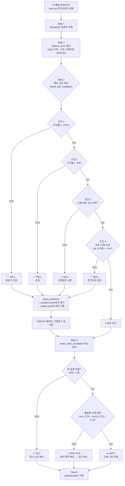

# 페이퍼 트레이딩 후보 선정 로직

---
*최근 변경: 2026-04-15 — Hold-Winners 재평가 + 상승 예측 모델 + 리포트 투명성 강화*
- **Hold-Winners 재평가**: 목표가/시간익절 트리거 시 오늘 factor로 모멘텀 재평가 (RSI<75·하한없음, ADX≥20, 거래량 ≥1.2× 또는 z≥1.0, BB pband<0.95, 5일수익률>0). **5개 전부 통과** 시 최대 2회까지 defer + tight trailing stop(-3.5%). 손절/트레일링은 defer 금지. (freeze 비활성 — `HOLD_WINNERS_DEFER_FREEZE_DAYS = 0`)
- **상승 예측 모델 (경험적 분포)**: `src/paper_trading/upside_model.py` 신규 — 과거 백테스트 거래에서 (전략, CCS버킷, ★버킷)별 P25/P50/P75/P90 분포 빌드. 매수 payload에 upside_pXX + 예상 목표가 포함. 캐시: `data/paper_trading/upside_distribution.json` (초기 빌드 128 거래 / 18 버킷).
- **리포트/이메일 개선**: 현재가·수익률·재평가 뱃지 컬럼 추가. 고RSI 매수 rationale 박스. 예상 상승 분포 박스(P25/P50/P75/P90 + 목표가). PDF 개별 종목 페이지에도 동일 반영.
- **이메일 수신자 추가**: `ssamjungtan@naver.com` 추가 (기존 `chunghwan14@gmail.com`과 함께 발송).
- 관련 파일: `src/paper_trading/engine.py`, `src/paper_trading/backtest.py`, `src/paper_trading/portfolio.py`, `src/paper_trading/upside_model.py` (신규), `src/paper_trading/report_generator.py`, `src/paper_trading/runner.py`, `src/screener/exporter.py`, `src/screener/config.py`

---
*최근 변경: 2026-04-04 — 백테스트 달러 자본 추적 모드 추가 (`--capital`)*
- `src/paper_trading/backtest.py` — `initial_capital` 파라미터 추가 (0이면 기존 수익률 % 모드)
- `BtPosition`에 `shares` 필드 추가 — 보유 주식 수 추적
- 매수 시 `현금 / 빈슬롯수` 로 포지션 배분 → 주식 수 계산 후 현금 차감
- 매도 시 매도대금 현금 복귀 → 복리 재투자 자동 반영
- 에쿼티 커브 달러 기준 전환, 결과 요약에 초기자본 / 최종자본 / 총수익금 출력
- `scripts/run_sp500_backtest.py`, `scripts/paper_trading.py` — `--capital USD` 옵션 추가
- 관련 파일: `src/paper_trading/backtest.py`, `scripts/run_sp500_backtest.py`, `scripts/paper_trading.py`

---
*최근 변경: 2026-04-04 — S&P500 전용 백테스트 CLI 추가 및 기본 기간 2y 변경*
- `scripts/run_sp500_backtest.py` 신규 생성 — S&P500 501개 전체 유니버스 전용 백테스트 CLI
- `max_tickers=None`으로 전체 종목 사용 (기존 `paper_trading.py backtest`는 기본 100개 제한)
- 기본 기간 `1y` → `2y` 변경 (이유: 1y는 워밍업 220일 제외 시 ~30거래일만 시뮬레이션, 거래 6건 수준으로 통계 신뢰 불가. 2y면 ~284거래일 / 50~80건 확보)
- 관련 파일: `scripts/run_sp500_backtest.py`

---
*최근 변경: 2026-04-03 — 백테스트 모듈 추가*
- `src/paper_trading/backtest.py` 신규 생성 — 과거 데이터 기반 페이퍼 트레이딩 시뮬레이션 엔진
- `scripts/paper_trading.py` — `backtest` 서브커맨드 추가 (`--period`, `--rebalance`, `--max-tickers`, `--no-sheets`, `--fundamentals` 옵션)
- `src/paper_trading/sheet_sync.py` — `sync_backtest_result()` 함수 추가, Google Sheets `[백테스트_결과]` 탭 동기화
- 관련 파일: `src/paper_trading/backtest.py`, `scripts/paper_trading.py`, `src/paper_trading/sheet_sync.py`
- 문서 수정: 장기보유 청산 기준 14일→21일, 최소 수익률 3%→2%로 실제 코드(`config.py`)와 일치하도록 업데이트
- 문서 수정: 손절 -7%→-5%, 트레일링 스탑 -8%→-5%, CCS 교체 마진 0.05→0.10, 전략 점수 기준 5.0→6.0 반영

---

## 백테스트 실행 명령어

### S&P500 전체 전용 (권장)

```bash
# S&P500 501개 전체 유니버스 (기본: 2y, 리밸런스 1일) — 권장
python scripts/run_sp500_backtest.py

# 확실한 검증 (3년치, 거래 100~150건)
python scripts/run_sp500_backtest.py --period 3y

# $5,000 자본 기준 달러 시뮬레이션
python scripts/run_sp500_backtest.py --period 3y --capital 5000

# 빠른 확인 (1년치, 단 거래 건수 적어 통계 신뢰도 낮음)
python scripts/run_sp500_backtest.py --period 1y

# 2년치 + 펀더멘탈 포함
python scripts/run_sp500_backtest.py --fundamentals
```

**옵션 요약 (`run_sp500_backtest.py`):**

| 옵션 | 기본값 | 설명 |
|------|--------|------|
| `--period` | `2y` | 데이터 기간 (`1y`, `2y`, `3y`) |
| `--rebalance` | `1` | 후보 선정 주기 (거래일) |
| `--fundamentals` | off | ROE/부채비율 등 펀더멘탈 포함 |
| `--capital` | `0` | 초기 자본금 (USD). 0이면 수익률 % 모드 |

**기간별 통계 신뢰도:**

| 기간 | 시뮬레이션 일수 | 예상 거래 건수 | 신뢰도 |
|------|--------------|-------------|--------|
| `1y` | ~30일 | ~6건 | ❌ 통계 불충분 |
| `2y` | ~284일 | ~50~80건 | ✅ 충분 (기본값) |
| `3y` | ~536일 | ~100~150건 | ✅✅ 확실한 검증 |

> 워밍업: `min_history_days=220`이 기술 지표 계산에 필요. 전체 기간에서 220일을 제외한 구간이 실제 시뮬레이션 대상.

> 유니버스: `SP500_TICKERS` 고정 501개, `max_tickers=None`으로 전체 사용. 구글 시트 동기화 없음 (터미널 출력만).

---

### 유연한 옵션이 필요할 때

```bash
# 완벽한 백테스팅 — 실제 페이퍼 트레이딩과 100% 동일 (매일 후보 선정 + 펀더멘탈)
# 1~2시간 소요
python scripts/paper_trading.py backtest --rebalance 1 --fundamentals

# $5,000 자본 기준 달러 시뮬레이션
python scripts/paper_trading.py backtest --rebalance 1 --capital 5000

# 빠른 검증용 (50종목, 구글 시트 포함)
# 10~20분 소요
python scripts/paper_trading.py backtest --max-tickers 50 --rebalance 1

# 2년치 완벽한 백테스팅
python scripts/paper_trading.py backtest --period 2y --rebalance 1 --fundamentals

# 구글 시트 없이 터미널만
python scripts/paper_trading.py backtest --rebalance 1 --fundamentals --no-sheets
```

**옵션 요약 (`paper_trading.py backtest`):**

| 옵션 | 기본값 | 사용 가능한 값 | 설명 |
|------|--------|---------------|------|
| `--period` | `1y` | `1y`, `2y`, `5y`, `10y`, `max` | 데이터 기간 (yfinance 지원 기간, 길수록 실행 시간 증가) |
| `--rebalance` | `5` | 아무 정수 (`1`=매일, `5`=주 1회 등) | 후보 선정 주기 (거래일) |
| `--max-tickers` | `100` | `1` ~ `500`+ (S&P500 전체 ~500개) | 분석 종목 수 제한. 많을수록 실행 시간 증가 |
| `--no-sheets` | off | 플래그 | 구글 시트 동기화 건너뜀 |
| `--fundamentals` | off | 플래그 | ROE/부채비율 등 펀더멘탈 포함 (느림) |
| `--capital` | `0` | `0`=수익률 모드, `5000`, `10000` 등 | 초기 자본금 (USD). 0이면 수익률 % 모드 |

**GitHub Actions에서 실행 (수동):**
- Actions 탭 → "Run Backtest" → "Run workflow" → 파라미터 입력 후 실행
- 결과는 Job Summary + artifact 로그로 확인
- 워크플로우 파일: `.github/workflows/run-backtest.yml`

**출력 결과:**
- 터미널: 요약 (승률/평균수익/Sharpe/MDD/SPY비교), 전략별 성과, 매도사유 분포
- `--capital` 사용 시 추가 출력: 초기자본 / 최종자본 / 총수익금 (달러 기준)
- Google Sheets (`paper_trading.py`만): `[백테스트_결과]` 탭 — 요약 + 전략별 + 매도사유 + 전체 거래 로그

> **완벽한 백테스팅** (`--rebalance 1 --fundamentals`): 실제 페이퍼 트레이딩과 100% 동일. 1~2시간 소요.
> **빠른 검증** (`--max-tickers 50 --rebalance 1`): 로직은 동일, 종목 수만 줄임. 10~20분 소요.
> **참고:** GitHub Actions 무료 플랜 기준 job 당 최대 6시간 제한. 종목 500개 + 긴 기간은 타임아웃 가능.

---

**관련 파일:**
- `src/paper_trading/candidate_selector.py` — 선정 엔진 (메인)
- `src/paper_trading/engine.py` — 일일 트레이딩 오케스트레이터
- `src/screener/config.py` — 설정값 (lines 706–731)

---

## 전체 파이프라인: N개 → 1개

```
스크리너 DataFrame (100+ 종목)
    ↓
[Phase 1] Hard Filters (7개) — 부적합 종목 대부분 제거
    ↓
[Phase 2] CCS 계산 (5개 서브스코어) — 통과 종목 점수화
    ↓
[Phase 3] 시장 레짐 감지 + 가중치 조정 — 레짐에 맞는 평가 기준 적용
    ↓
[Phase 4] 섹터 페널티 + 정렬 + 동점 처리
    ↓
최종 1개 선정 (또는 None)
```

---

## Phase 1: Hard Filters

> `candidate_selector.py` — `_apply_hard_filters()`

**목적:** CCS 계산 전 명백히 부적합한 종목을 빠르게 탈락시켜 연산 낭비를 막고, 잘못된 종목이 스코어링 단계로 넘어가는 것을 원천 차단.  
7개 필터가 **순서대로(AND)** 적용되며, 탈락 수는 `debug["rejections"]`에 필터별로 기록된다.

---

### Filter 1 — 전략 점수 (Strategy Score)

```python
(바닥반등_적합도 >= 6.0) OR (모멘텀_적합도 >= 6.0)
```

| 항목 | 설명 |
|------|------|
| **목적** | 스크리너가 어떤 전략으로도 의미있는 점수를 주지 않은 종목 제거 |
| **기준** | 10점 만점 중 6.0 이상 — 상위 40% 이상의 적합도 |
| **OR 조건** | 두 전략 중 하나만 강해도 통과 (둘 다 낮으면 탈락) |
| **탈락 키** | `전략점수<5.0` |

> 💡 이 필터 하나로 전체 종목의 50–70%가 탈락하는 경우가 많다.

---

### Filter 2 — 판단 등급 (Judgment Grade)

```python
판단 in {"1. 매수 후보", "1. 저점 반등"}
OR
추천 in {"1. 즉시 진입", "1. 반등 매수"}
```

| 컬럼 | 통과 값 | 의미 |
|------|---------|------|
| `판단` | `"1. 매수 후보"` | 종합 판단 최상위 등급 |
| `판단` | `"1. 저점 반등"` | 바닥 반등 가능성 최상위 |
| `추천` | `"1. 즉시 진입"` | 즉각 진입 권고 |
| `추천` | `"1. 반등 매수"` | 반등 시 즉시 매수 권고 |

**목적:** 스크리너의 종합 판단 알고리즘과 CCS가 **이중으로 검증**하도록 설계. 스크리너가 최상위 등급을 주지 않은 종목은 CCS가 높아도 신뢰도 부족으로 탈락.  
**탈락 키:** `판단등급_미달`

---

### Filter 3 — 과열 차단 (Overheating Block)

```python
RSI < 75  AND  bollinger_pband < 0.95  AND  5일수익률 < 0.15
```

| 지표 | 기준 | 차단 이유 |
|------|------|----------|
| `RSI` | < 75 | RSI 75 이상은 단기 과매수 — 추가 상승 여력 제한 |
| `bollinger_pband` | < 0.95 | 볼린저 상단(1.0) 근처면 이미 고점 진입 |
| `5일수익률` | < 15% | 최근 5일 급등은 단기 과열 — 추격 매수 위험 |

**세 조건 모두 AND** — 하나라도 초과하면 과열 탈락.  
**탈락 키:** `과열_차단`

> ⚠️ **약세장(bear regime):** RSI 기준이 75 → **70**으로 강화. 더 보수적으로 과열 판단.

---

### Filter 4 — 유동성 (Liquidity)

```python
최근20일평균거래대금 >= $10,000,000
```

| 항목 | 설명 |
|------|------|
| **목적** | 거래가 너무 적은 종목은 진입/청산 시 슬리피지 위험 |
| **기준** | 일평균 거래대금 $10M 이상 — 중소형주까지 포함하는 최소 기준 |
| **컬럼** | `최근20일평균거래대금` |
| **탈락 키** | `유동성_부족` |

---

### Filter 5 — 어닝 회피 (Earnings Buffer)

```python
days_to_next_earnings > 3  OR  days_to_next_earnings is NaN
```

| 케이스 | 처리 |
|--------|------|
| 어닝까지 3일 이하 | **탈락** — 어닝 발표 불확실성 차단 |
| 어닝까지 4일 이상 | **통과** |
| 어닝 날짜 미상 (NaN) | **통과** — 정보 없으면 회피 안 함 |

**목적:** 어닝 발표 직전은 방향성 불확실성이 극도로 높아 전략 신호 무의미. 발표 이후 결과를 보고 진입하는 구조.  
**탈락 키:** `어닝_임박`

---

### Filter 6 — 보유 중복 (Duplicate Holding)

```python
티커 not in {현재 보유 중인 ticker 집합}
```

**목적:** 이미 보유 중인 종목을 다시 매수하는 것 방지 (더블딩 차단).  
**탈락 키:** `보유_중복`

---

### Filter 7 — 섹터 집중 (Sector Concentration)

```python
blocked_sectors = {섹터 : 보유수가 2 이상인 섹터들}
후보 섹터 not in blocked_sectors
```

| 보유 섹터 수 | 처리 |
|-------------|------|
| 해당 섹터 보유 0–1개 | **통과** |
| 해당 섹터 보유 2개 이상 | **탈락** — 해당 섹터 전체 차단 |

**목적:** 동일 섹터 3개 이상 보유 시 섹터 리스크 집중. 포트폴리오 섹터 분산 강제.  
**탈락 키:** `섹터_집중`

---

### 약세장(bear) 추가 제한

Phase 3에서 레짐이 `bear`로 감지되면 Hard Filter 이후 **추가 필터** 적용:

```python
buy_signal == True  # 명시적 매수 신호가 있는 종목만 통과
```

### debug["rejections"] 출력 예시

```python
{
    "전략점수<5.0":  45,    # 45개 탈락
    "판단등급_미달": 12,
    "과열_차단":     8,
    "유동성_부족":   3,
    "어닝_임박":     2,
    "보유_중복":     2,
    "섹터_집중":     1,
    "_통과":         5,     # 최종 통과 수
    "_전체":        78,    # 입력 종목 수
}
```

---

## Phase 2: Composite Conviction Score (CCS)

> `candidate_selector.py` — `_score_*` 함수들

필터 통과 종목 각각에 대해 **5개 서브스코어(모두 [0, 1])** 를 독립적으로 계산한 뒤, 레짐별 가중치를 곱해 합산한다.  
각 서브스코어는 "이 종목을 지금 사는 게 얼마나 확신이 있는가"를 서로 다른 관점에서 측정한다.

---

### A. Strategy Fit — `_score_strategy_fit()`

**목적:** 스크리너가 부여한 전략 점수가 얼마나 강한지 측정.

```python
score = max(바닥반등_적합도, 모멘텀_적합도) / 10.0
if "전환구간" in 전략구분:
    score += 0.1          # 전환구간은 두 전략 특성을 동시에 가짐 → 보너스
return min(score, 1.0)
```

| 계산 요소 | 설명 |
|-----------|------|
| `바닥반등_적합도` | 바닥반등 전략 점수 (0–10) |
| `모멘텀_적합도` | 모멘텀 전략 점수 (0–10) |
| 둘 중 **max** 사용 | 한 전략만 강해도 인정 |
| `/10.0` | [0, 10] → [0, 1] 정규화 |
| 전환구간 보너스 +0.1 | 두 전략 교차점 구간은 추가 신뢰도 부여 |

**예시:** 바닥반등_적합도=8.5, 전략구분="전환구간" → `(8.5/10) + 0.1 = 0.95`

---

### B. Entry Timing — `_score_entry_timing()`

**목적:** 지금 이 가격/시점이 진입하기 적합한 타이밍인지 4가지 기술지표로 측정.  
최대 합산 가능 점수는 1.0에 cap.

#### B-1. RSI 스윗스팟 (최대 +0.4)

전략마다 최적 RSI 구간이 다르다.

| 전략 | RSI 범위 | 점수 | 판단 근거 |
|------|----------|------|-----------|
| 바닥반등 / 전환구간 | 25 ≤ RSI ≤ 40 | **+0.4** | 과매도 구간 — 반등 직전 최적 진입 |
| 바닥반등 / 전환구간 | 40 < RSI ≤ 50 | +0.2 | 회복 초입 — 아직 유효하나 최적 아님 |
| 모멘텀 | 45 ≤ RSI ≤ 60 | **+0.4** | 과열 없이 추세 유지 중인 골든존 |
| 모멘텀 | 35 ≤ RSI < 45 | +0.2 | 눌림 매수 — 추세 복귀 가능성 있음 |
| 위 범위 외 | — | +0.0 | RSI 타이밍 부적합 |

#### B-2. 볼린저밴드 위치 (최대 +0.3)

`bollinger_pband`: 볼린저밴드 내 현재가 위치 (0=하단, 1=상단)

| 조건 | 점수 | 해석 |
|------|------|------|
| `bband < 0.2` | **+0.3** | 하단 돌파 직전 — 극도의 눌림 |
| `bband < 0.4` | +0.15 | 하단 근처 — 양호한 진입 위치 |
| `bband ≥ 0.4` | +0.0 | 중단 이상 — 진입 타이밍 이점 없음 |

#### B-3. 거래량 Z-Score (최대 +0.15)

`거래량Z(20)`: 최근 거래량의 20일 평균 대비 표준편차 단위 편차

| 조건 | 점수 | 해석 |
|------|------|------|
| `vol_z > 1.0` | **+0.15** | 평균 대비 뚜렷한 거래량 급증 — 세력 개입 가능성 |
| `vol_z > 0.0` | +0.05 | 평균 이상 — 소폭 관심 증가 |
| `vol_z ≤ 0.0` | +0.0 | 거래량 약세 |

#### B-4. MACD 방향 (최대 +0.15)

`macd_hist`: MACD 히스토그램 (MACD line − Signal line)

| 전략 | 조건 | 점수 | 해석 |
|------|------|------|------|
| 모멘텀 | `macd_hist > 0` | **+0.15** | 모멘텀 상승 확인 |
| 바닥반등 / 전환구간 | `macd_hist > -0.5` | +0.1 | 깊은 하락이 아닌 턴업 준비 중 |

> 💡 **만점(1.0) 예시 (바닥반등):** RSI=32(+0.4) + bband=0.15(+0.3) + vol_z=1.5(+0.15) + macd_hist=-0.2(+0.1) = **0.95**

---

### C. Alpha Factor — `_score_alpha_factor()`

**목적:** 스크리너가 계산한 5개 팩터 점수를 전략 특성에 맞게 가중합산해 종목의 알파 잠재력 측정.

#### 팩터 정의

| 팩터 컬럼 | 의미 | 범위 |
|-----------|------|------|
| `팩터_모멘텀` | 가격 추세 가속도 | [-1, 1] |
| `팩터_추세` | 장기 추세 방향성 | [-1, 1] |
| `팩터_거래량` | 거래량 이상 신호 | [-1, 1] |
| `팩터_변동성` | 변동성 수준 (낮을수록 좋음) | [-1, 1] |
| `팩터_평균회귀` | 평균 대비 과매도 여부 | [-1, 1] |

#### 전략별 가중치

| 팩터 | 바닥반등 / 전환구간 | 모멘텀 | 가중치 의도 |
|------|---------------------|--------|-------------|
| 모멘텀 | **10%** | **20%** | 모멘텀 전략도 모멘텀 비중 두지만 과대평가 차단 |
| 추세 | **10%** | **20%** | 추세 신호 중요하나 단일 팩터 과대 의존 방지 |
| 거래량 | **15%** | **25%** | 모멘텀에서 가장 큰 비중 — 거래량 확인 = 신뢰도 |
| 변동성 | **25%** | **15%** | 바닥반등은 압축 후 폭발 패턴 주목 |
| 평균회귀 | **40%** | **20%** | 바닥반등의 핵심 — 얼마나 저평가됐나 (모멘텀도 일정 비중 유지로 고점매수 방지) |

#### 계산식

```python
# 바닥반등 / 전환구간
raw = 0.10*mom + 0.10*trend + 0.15*vol + 0.25*volat + 0.40*mr

# 모멘텀 — 2026-04 개편: 모멘텀/추세 과대평가 방지, 거래량·mean_reversion 비중 강화
raw = 0.20*mom + 0.20*trend + 0.25*vol + 0.15*volat + 0.20*mr

# [-1, 1] → [0, 1] 정규화
score = max(0.0, min((raw + 1.0) / 2.0, 1.0))
```

> 코드 출처: `src/paper_trading/candidate_selector.py:232-236`. 이전 문서(2026-04 이전)에는 `0.35/0.30/0.20/0.10/0.05`로 기재됐으나 코드와 불일치 → 2026-05-24 정정.

#### ML 알파 블렌딩 (옵션)

`ML_ENABLED=True`이면 위 rule-based score와 ML 예측치를 가중 평균한다 (`candidate_selector.py:243-264`):

```python
return ML_BLEND_WEIGHT_ALPHA * ml_score + (1 - ML_BLEND_WEIGHT_ALPHA) * rule_score
# 기본 ML_BLEND_WEIGHT_ALPHA = 0.4
```

> 현재 prod는 `ML_ENABLED=False` (config.py:858) — 위 식은 사용되지 않는다.

> 💡 모든 팩터가 +1이면 raw=1.0 → score=1.0 / 모든 팩터가 -1이면 raw=-1.0 → score=0.0

---

### D. Risk-Adjusted Quality — `_score_risk_quality()`

**목적:** 손실 가능성을 낮추는 리스크 품질 요소 + 기업 펀더멘털 품질 측정.  
최대 합산 가능 점수: **1.0** (하한 0.0으로 클램프)

#### D-1. 변동성 압축 (최대 +0.3)

```python
vol_ratio = ATR% / atr_med_252   # 현재 ATR ÷ 252일 중앙값 ATR
```

| 조건 | 점수 | 해석 |
|------|------|------|
| `vol_ratio < 0.8` | **+0.3** | 변동성이 1년 평균보다 20% 이상 낮음 → 코일 압축 상태 |
| `vol_ratio < 1.0` | +0.15 | 평균보다 낮음 — 양호한 리스크 수준 |
| `vol_ratio ≥ 1.0` | +0.0 | 변동성 확대 중 — 리스크 높음 |

#### D-2. 52주 가격 포지션 (최대 +0.2)

`52주포지션`: 현재가의 52주 최저-최고 범위 내 위치 (0=바닥, 1=천장)

| 전략 | 적합 범위 | 점수 | 판단 근거 |
|------|-----------|------|-----------|
| 바닥반등 / 전환구간 | 10–40% | **+0.2** | 저점 구간에서 반등 狙い |
| 모멘텀 | 55–85% | **+0.2** | 신고가 근처이나 과열 아닌 구간 |
| 범위 외 | — | +0.0 | 전략과 포지션 불일치 |

#### D-3. 펀더멘털 (최대 +0.25)

| 항목 | 컬럼 | 조건 | 점수 |
|------|------|------|------|
| ROE | `fund_roe` | > 10% (0.10) | **+0.15** |
| 부채비율 | `fund_debt_to_equity` | < 100 | +0.10 |

#### D-4. 기관 수급 (최대 +0.10)

| 항목 | 컬럼 | 조건 | 점수 |
|------|------|------|------|
| 기관 보유 비율 | `fund_institutional_holders_pct` | > 60% (0.60) | **+0.10** |

#### D-5. 공매도 위험 (최대 +0.05 / 최소 -0.05)

| 항목 | 컬럼 | 조건 | 점수 |
|------|------|------|------|
| 공매도 안전 | `fund_short_pct_float` | < 5% (0.05) | **+0.05** |
| 공매도 위험 | `fund_short_pct_float` | > 15% (0.15) | **-0.05** (페널티) |

> 💡 **이론적 최고점 구성:** vol_ratio=0.7(+0.3) + 52주포지션 적합(+0.2) + ROE>10%(+0.15) + 부채<100(+0.1) + 기관>60%(+0.1) + 공매도<5%(+0.05) = **0.90**

---

### E. Pattern & ML Confluence — `_score_confluence()`

**목적:** 기술적 패턴 신호와 ML 모델 예측이 얼마나 일치하는지(confluence) 측정.  
신호가 많을수록 확신도가 높아진다.

#### E-1. ML 저점확률 (최대 +0.4)

`저점확률`: ML 모델이 예측한 현재가 근처가 단기 저점일 확률 (0–1)

| 전략 | 조건 | 점수 |
|------|------|------|
| 바닥반등 / 전환구간 | `저점확률 ≥ 0.70` | **+0.4** |
| 바닥반등 / 전환구간 | `저점확률 ≥ 0.50` | +0.2 |
| 모멘텀 | — | +0.0 (해당 없음) |

> 바닥반등 전략에 특화된 항목. 모멘텀 전략은 저점확률이 낮아도 페널티 없음.

#### E-2. 반등스코어 (최대 +0.2, 가변)

```python
score += min(반등스코어 / 10.0, 1.0) * 0.2
```

`반등스코어`: 스크리너가 종합 계산한 반등 가능성 점수 (0–10)  
→ 10점이면 +0.2 / 5점이면 +0.1 / 0점이면 +0.0

#### E-3. 멀티타임프레임 패턴 일치 (최대 +0.3)

일봉 / 주봉 / 월봉 각각에서 **상승 패턴** 존재 여부 카운트:

| 패턴 일치 수 | 점수 |
|-------------|------|
| 3개 타임프레임 모두 | **+0.3** |
| 2개 타임프레임 | +0.15 |
| 1개 타임프레임 | +0.05 |
| 0개 | +0.0 |

**인식하는 상승 패턴 목록:**

| 패턴 | 유형 |
|------|------|
| 이중바닥 | 반전 |
| 역헤드앤숄더 | 반전 |
| 하락쐐기 | 반전 |
| 강세잉걸핑 | 캔들 |
| 모닝스타 | 캔들 |
| 상승삼각형 | 지속 |
| 컵앤핸들 | 지속 |
| 골든크로스 | 이평 |
| 골든크로스임박 | 이평 |

#### E-4. EMA 정배열 (최대 +0.1)

```python
EMA20 > EMA50 > EMA200  →  +0.10
```

단기 > 중기 > 장기 순서의 완전 정배열 — 추세 방향 전반적 확인.

> 💡 **만점(1.0) 구성 예시 (바닥반등):** 저점확률=0.75(+0.4) + 반등스코어=10(+0.2) + 3타임프레임 패턴(+0.3) + EMA정배열(+0.1) = **1.0**

---

## Phase 3: 시장 레짐 감지 + CCS 가중치

> `candidate_selector.py` — `detect_market_regime()`

**목적:** 시장 전체의 방향성(레짐)을 감지해 CCS 계산 시 서브스코어 가중치를 동적으로 조정.  
강세장/약세장/중립 각각 다른 리스크 허용도와 분석 우선순위를 반영한다.

---

### 레짐 감지 로직

스크리너 DataFrame 내 `티커 == "SPY"` 행을 찾아 EMA 상태로 판단.

```python
spy_close = SPY 현재가
spy_ema50 = SPY 50일 EMA
spy_ema200 = SPY 200일 EMA

if spy_close > spy_ema50 > spy_ema200:
    regime = "bull"      # 단기·장기 모두 상승 추세
elif spy_close < spy_ema200:
    regime = "bear"      # 장기 이평선 하회 — 하락 추세
else:
    regime = "neutral"   # 이평선 사이 — 방향 불명확
```

| 레짐 | 조건 | 시장 상태 해석 |
|------|------|---------------|
| **bull** | 종가 > EMA50 > EMA200 | 단·장기 정배열 — 추세 상승장 |
| **bear** | 종가 < EMA200 | 장기 추세선 하회 — 본격 하락장 |
| **neutral** | 그 외 (EMA 사이에 위치) | 횡보 또는 전환 구간 |

> ⚠️ SPY 행이 DataFrame에 없으면 자동으로 `"neutral"` 반환.

---

### 레짐별 CCS 가중치

레짐에 따라 5개 서브스코어의 중요도가 달라진다.  
**가중치 합계는 항상 1.0.**

| 서브스코어 | bull | neutral | bear | 레짐별 의도 |
|-----------|------|---------|------|------------|
| **strategy** | 0.25 | 0.25 | 0.20 | 강세장에서도 전략 부합 중요 |
| **timing** | 0.15 | 0.20 | **0.25** | 약세장엔 진입 타이밍이 가장 중요 |
| **alpha** | **0.25** | 0.20 | 0.15 | 강세장엔 알파 잠재력 우선 |
| **risk** | 0.15 | 0.20 | **0.30** | 약세장엔 리스크 관리가 최우선 |
| **confluence** | 0.20 | 0.15 | 0.10 | 강세장엔 신호 일치도 더 활용 |

#### 가중치 변화의 의미

- **bull:** 알파(0.25)와 전략 부합도(0.25)에 더 높은 비중 → 공격적 수익 추구
- **neutral:** 균형 가중치 → 어느 방향도 베팅하지 않는 안정 기조
- **bear:** 리스크(0.30)와 타이밍(0.25)에 집중 → 손실 최소화, 타이밍 정밀 진입

#### 가중치 적용 계산식

```python
# 레짐별 weights dict에서 가중치 로드
weights = REGIME_WEIGHTS[regime]  # config.py에서 정의

CCS = (
    weights["strategy"]    * A  # Strategy Fit
    + weights["timing"]    * B  # Entry Timing
    + weights["alpha"]     * C  # Alpha Factor
    + weights["risk"]      * D  # Risk-Adjusted Quality
    + weights["confluence"]* E  # Pattern & ML Confluence
) - sector_penalty
```

> 💡 **예시 — 같은 종목, 다른 레짐:**
> - A=0.9, B=0.6, C=0.7, D=0.5, E=0.8, 페널티 없음
> - bull CCS: `0.25×0.9 + 0.15×0.6 + 0.25×0.7 + 0.15×0.5 + 0.20×0.8` = **0.700**
> - bear CCS: `0.20×0.9 + 0.25×0.6 + 0.15×0.7 + 0.30×0.5 + 0.10×0.8` = **0.650**
> → 약세장에서는 같은 종목도 CCS가 낮게 평가 → 더 엄격한 기준 자동 적용

---

## Phase 4: 섹터 페널티 + 최종 선정

> `candidate_selector.py` — `_sector_penalty()`, `select_best_candidate()`

**목적:** CCS 계산 완료 후 섹터 리스크를 최종 보정하고, 동점 종목을 안정적으로 처리해 단 1개를 선정.

---

### 섹터 페널티 — `_sector_penalty()`

```python
same_count = 현재 보유 중 같은 섹터 종목 수

if same_count >= 2:  penalty = 0.15  # 안전망 (Filter 7에서 이미 차단)
elif same_count == 1: penalty = 0.05
else:                 penalty = 0.0
```

| 보유 중 같은 섹터 | 페널티 | 비고 |
|-----------------|--------|------|
| 0개 | 0.00 | 페널티 없음 |
| 1개 | **-0.05** | 섹터 집중 시작 — 소폭 불이익 |
| 2개 이상 | **-0.15** | Hard Filter 7의 안전망 (이론상 통과 불가) |

> 💡 Filter 7에서 이미 차단했지만, Edge Case 대비용 이중 안전망으로 존재.

---

### CCS 최종 계산식

```python
CCS = (
    weights["strategy"]    * A   # Strategy Fit
    + weights["timing"]    * B   # Entry Timing
    + weights["alpha"]     * C   # Alpha Factor
    + weights["risk"]      * D   # Risk-Adjusted Quality
    + weights["confluence"]* E   # Pattern & ML Confluence
) - sector_penalty

# 소수점 4자리로 반올림 후 저장
CCS = round(CCS, 4)
```

---

### 정렬 및 동점 처리 (Tiebreaking)

#### Step 1 — CCS 내림차순 정렬

```python
scores.sort(key=lambda x: x["ccs"], reverse=True)
```

#### Step 2 — 동점 감지

```python
if len(scores) >= 2 and abs(scores[0]["ccs"] - scores[1]["ccs"]) < 0.02:
    # 동점 처리 진입 (0.02 이내 차이 = 통계적으로 구별 불가)
```

#### Step 3 — 타이브레이킹 키 (우선순위 순서)

```python
def tiebreak_key(s):
    strat_rank    # 전략 우선순위 (낮을수록 우선)
    -support      # buy_support_count 높을수록 우선 (부호 반전)
    atr           # ATR% 낮을수록 우선 (안정성)
    return (strat_rank, -support, atr)
```

| 우선순위 | 기준 | 값 | 판단 근거 |
|---------|------|----|-----------|
| 1순위 | 전략 타입 | 전환구간(0) > 바닥반등(1) > 모멘텀(2) | 전환구간은 두 전략 신호가 겹치는 가장 강한 구간 |
| 2순위 | `buy_support_count` | 높은 것 우선 | 더 많은 지표가 매수를 지지 |
| 3순위 | `ATR%` | 낮은 것 우선 | 변동성 낮으면 손절 위험 감소 |

> 💡 **동점 예시:** AAPL(CCS=0.7210, 모멘텀) vs MSFT(CCS=0.7205, 전환구간)  
> → CCS 차이 0.0005 < 0.02 → 동점 처리 → 전략 우선순위로 **MSFT 선택**

---

### 반환값 구조

```python
{
    "ticker": str,                # 선정 종목 티커
    "entry_price": float,         # 현재가 (진입 예정가)
    "strategy": str,              # 전략 구분 레이블
    "star_rating": str,           # 스크리너 매수적합도 (★ 표시)
    "ccs_score": float,           # CCS 최종 점수 (4자리 반올림)
    "sector": str,                # 섹터
    "ccs_breakdown": {
        "strategy_fit": float,    # 서브스코어 A
        "timing": float,          # 서브스코어 B
        "alpha": float,           # 서브스코어 C
        "risk": float,            # 서브스코어 D
        "confluence": float,      # 서브스코어 E
        "penalty": float,         # 섹터 페널티 (양수값, 차감됨)
    }
}
```

---

## 엔진 연동: 일일 매매 의사결정

> `engine.py` — `run_daily_trading()`

**실행 시점:** 매일 5PM EST (장 마감 후)  
**전체 실행 흐름:**

```
[Step 1] 보유 종목 현재가 업데이트 + 고점 갱신
    ↓
[Step 2] 매도 판단 — 4가지 조건 체크
    ↓
[Step 3] 후보 선정 — select_best_candidate() 호출
    ↓
[Step 4] 매수/교체 판단
    ↓
[Step 5] 포지션 & 거래 기록 저장
```

---

### Step 2 — 매도 조건 4가지 — `check_sell_conditions()`




보유 종목 각각에 대해 **순서대로** 체크. 하나라도 해당하면 즉시 매도.

#### 조건 1 — 목표가 도달

```python
return_rate = (current_price - entry_price) / entry_price
if return_rate >= +0.15:  # +15%
    sell(reason=f"목표가({return_rate:+.1%})")
```

| 항목 | 값 | 의도 |
|------|----|----- |
| 목표 수익률 | **+15%** | 단기 스윙 트레이딩 기준 평균 목표 |
| 판단 | 즉시 매도 | 수익 확정 — 추가 상승 기대하다 반납하는 리스크 차단 |

#### 조건 2 — 손절 (Stop Loss)

```python
if return_rate <= -0.05:  # -5%
    sell(reason=f"손절({return_rate:+.1%})")
```

| 항목 | 값 | 의도 |
|------|----|----- |
| 손절선 | **-5%** | 최대 허용 손실 — 이 이상 손실은 전략 실패로 판단 |

#### 조건 3 — 트레일링 스탑 (Trailing Stop)

```python
drawdown = (current_price - highest_price) / highest_price
if drawdown <= -0.05:  # 고점 대비 -5%
    sell(reason=f"트레일링({drawdown:+.1%})")
```

| 항목 | 값 | 의도 |
|------|----|----- |
| 기준 | 보유 중 **고점** 대비 | 진입가가 아닌 "한때 올랐던 최고점" 기준 |
| 트레일링 폭 | **-5%** | 수익 중 최대 5%까지 반납 허용 — 그 이상이면 추세 반전으로 판단 |

> 💡 **예시:** 진입 $100 → 고점 $118 → 현재 $112  
> 손절 조건: $112/$100 - 1 = +12% (손절 아님)  
> 트레일링: ($112 - $118) / $118 = -5.08% ≤ -5% → **트레일링 스탑 발동**

#### 조건 4 — 장기 보유 청산 (Stale Position)

```python
if holding_days > 21 and return_rate < 0.02:  # 21일 초과 + 수익 2% 미만
    sell(reason=f"장기보유({days}일,{return_rate:+.1%})")
```

| 항목 | 값 | 의도 |
|------|----|----- |
| 기간 | **21일 초과** | 3주 이상 방치된 포지션 |
| 수익 기준 | **2% 미만** | 기회비용 — 3주 들고 있어도 2% 못 벌면 정리 |

---

### Step 2.5 — Hold-Winners 재평가 (Defer) — `_should_defer_sell()`

> 2026-04-15 신규 / 2026-04-16 강화

수익성 매도(목표가·시간익절) 조건이 발동했을 때, **즉시 매도하는 대신 당일 모멘텀 지표로 재평가**해서 강하면 보유를 연장(defer)한다. 손절·트레일링은 재평가 없이 즉시 매도.

#### 재평가 대상 vs 즉시 매도

| 매도 사유 | 재평가 대상? | 이유 |
|----------|------------|------|
| `목표가` (+12~18%) | ✅ **재평가** | 모멘텀이 살아있으면 더 갈 수 있음 |
| `시간익절` (N일+수익) | ✅ **재평가** | 최근 급등 중이면 계속 보유 |
| `손절` | ❌ 즉시 매도 | 추가 손실 방지 |
| `트레일링스탑` | ❌ 즉시 매도 | 고점 이탈 = 추세 반전 |
| `장기보유` | ❌ 즉시 매도 | 기회비용 — 저조한 종목 교체 |

#### 재평가 조건 (5개 **전부** 통과 시 defer)

```python
checks = {
    "rsi_not_overbought": RSI < 75,          # 과매수 아님 (RSI 하한 없음 — 낮을수록 여지 많음)
    "volume_strong": vol_mult >= 1.2 OR vol_z >= 1.0,  # 거래량 강도 확인
    "ret_5d_positive": 5일수익률 > 0,          # 단기 방향성 양전환
    "adx_trending": ADX >= 20,               # 추세 유효
    "bb_not_peaked": bollinger_pband < 0.95, # 볼린저 상단 미도달
}
# 5개 전부 통과해야 defer (HOLD_WINNERS_MIN_CHECKS = 5, all() 동등)
if sum(1 for v in checks.values() if v) >= HOLD_WINNERS_MIN_CHECKS:
    → defer 발동
```

> **주의:** 기존에는 `RSI >= 60` 하한 조건이 있었으나 2026-04-16 삭제.  
> RSI 55인 종목도 상승 여지가 충분하므로 `RSI < 75`(과매수 아님)만 체크.

> **MIN_CHECKS 히스토리:** 2026-04-15 v1 원형이 `all()` (5/5). 한때 다수결(4/5)로 완화했으나 현재 다시 5/5 (`config.py:839`).

#### defer 발동 시 동작 (현재: freeze 비활성)

```
defer 발동
    ↓
trailing_stop_override = 3.5%  (기존 5% → 타이트하게)
highest_price 현재가로 리셋   (신규 고점 기준 trailing)
defer_count++                  (최대 2회)
last_defer_date = 오늘
    ↓
(HOLD_WINNERS_DEFER_FREEZE_DAYS = 0 — 즉시 재체크 활성)
    다음 거래일에도 시간익절/목표가가 재트리거되면 동일하게 재평가 진행
    5/5 통과 시 두 번째 defer로 진입 (MAX_DEFERS=2)
    ↓
주가 계속 상승 → trailing이 자동으로 따라 올라감
주가 -3.5% 빠지면 → 트레일링으로 매도
    ↓
defer 2회 모두 소진 → 다음 조건 발동 시 즉시 매도
```

#### Freeze 변천사

원래 freeze 5일 동안 재트리거를 막아 "하루에 2회 모두 소진" 버그를 방지했었다. 5/5 강제 통과 + tight trailing이 그 역할을 사실상 대체했기 때문에 현재는 `HOLD_WINNERS_DEFER_FREEZE_DAYS = 0`으로 비활성 운영 중 (`config.py:840`). freeze가 필요할 때 다시 양수로 올리면 활성.

#### 실제 예시 (JOBY 케이스)

```
상황: JOBY 13일 보유, +7.4% → 시간익절 발동
재평가: RSI 51✅ | vol 1.25x✅ | 5일 +5.8%✅ | ADX 22✅ | bb 0.73✅ → 5/5 통과
→ defer 발동! trailing → 3.5%, freeze 5일 시작
→ 5일간 주가 상승 중이면 trailing이 따라 올라감
→ -3.5% 이탈 시점에 매도 (기존보다 훨씬 높은 가격)
```

---

### Step 4 — 매수/교체 판단 — `should_replace()`

```python
# 교체 조건
new_ccs > worst_ccs + 0.10  # 최약 종목 CCS + 0.10 이상이어야만 교체
```

| 포지션 상황 | 동작 |
|------------|------|
| 후보 없음 (None 반환) | 매수 **skip** / 이유: `"후보_없음"` |
| 보유 < 3개 (빈 슬롯 있음) | **즉시 매수** — 비교 없이 바로 진입 |
| 보유 = 3개 (풀슬롯) | 최약 포지션 CCS와 비교 → 교체 여부 판단 |
| 교체 기준 미달 | 매수 **skip** / 이유: `"교체_미달"` |

> 교체 마진: **+0.10** (기존 0.05에서 강화 — 잦은 교체 방지)

#### 교체 상세 흐름 (풀슬롯 시)

```
1. get_worst_position() → 현재 3개 중 CCS 가장 낮은 종목 찾기
2. new_candidate_ccs > worst_ccs + 0.10?  
   → Yes: 최약 종목 매도 후 새 종목 매수 (교체)
   → No:  아무것도 안 함 (교체_미달)
```

> 💡 **교체 예시:**  
> 보유: AAPL(CCS=0.72), MSFT(CCS=0.68), NVDA(CCS=0.61) → 최약 = NVDA  
> 새 후보 TSLA(CCS=0.72) → 0.72 > 0.61 + 0.10 = 0.71 → **0.72 > 0.71 → 교체 실행**  
> 새 후보 META(CCS=0.70) → 0.70 > 0.71? → **No → 교체 미달**

---

## 설정값 요약 (`config.py`)

| 파라미터 | 기본값 | 설명 |
|---------|----|------|
| `CANDIDATE_MIN_STRATEGY_SCORE` | 6.0 | Filter 1: 전략 점수 최소 기준 |
| `CANDIDATE_BOTTOM_MAX_52W_POS` | 0.65 | Filter 1: 바닥반등 — 52주 포지션 상한 (이미 회복된 종목 차단) |
| `CANDIDATE_RSI_MAX` | 75 (bear: 70) | Filter 3: RSI 상한 |
| `CANDIDATE_BOLLINGER_MAX` | 0.95 | Filter 3: 볼린저 위치 상한 |
| `CANDIDATE_5D_RETURN_MAX` | 0.15 | Filter 3: 5일 수익률 상한 |
| `CANDIDATE_LIQUIDITY_MIN` | $10,000,000 | Filter 4: 일평균 거래대금 하한 |
| `CANDIDATE_EARNINGS_BUFFER_DAYS` | 3 | Filter 5: 어닝 회피 버퍼 (일) |
| `CANDIDATE_MAX_SAME_SECTOR` | 2 | Filter 7: 섹터 집중 차단 기준 |
| `CANDIDATE_CCS_MIN_NORMAL` | 0.40 | CCS 임계값 (bull/neutral) |
| `CANDIDATE_CCS_MIN_BEAR` | 0.45 | CCS 임계값 (bear) |
| `CCS_REPLACE_MARGIN` | 0.10 | 교체 최소 CCS 마진 |
| `ADX_BUY_MIN` | 25 | 매수 신호 ADX 강도 요건 |
| `PAPER_TRADING_MAX_POSITIONS` | 3 | 최대 동시 보유 종목 수 |
| `PAPER_TRADING_PROFIT_TARGET` | 0.15 (+15%) | 목표가 도달 매도 기준 (기본) |
| `PAPER_TRADING_STOP_LOSS` | 0.07 (-7%) | 손절 기준 (기본 — EXIT_PARAMS가 전략별 -10%로 오버라이드) |
| `PAPER_TRADING_TRAILING_STOP` | 0.05 (-5%) | 트레일링 스탑 기준 (기본) |
| `PAPER_TRADING_MAX_HOLDING_DAYS` | 21 | 장기 보유 청산 기준 (기본) |
| `PAPER_TRADING_STALE_MIN_RETURN` | 0.02 (+2%) | 장기 보유 시 최소 수익률 기준 |
| **EXIT_PARAMS** | | 전략별 오버라이드 (`config.py:800-828`) |
| `EXIT_PARAMS["바닥반등"]` | profit 18% / stop 10% / trail 6% / max 25일 | 바닥 반등은 업사이드 큼, 넓은 스탑 |
| `EXIT_PARAMS["모멘텀"]` | profit 12% / stop 10% / trail 5% / max 18일 | 모멘텀은 빠른 익절 |
| **Hold-Winners 재평가** | | |
| `HOLD_WINNERS_RSI_MAX` | 75.0 | defer 차단 RSI 상한 (과매수) |
| `HOLD_WINNERS_ADX_MIN` | 20.0 | 추세 유효성 최소 ADX |
| `HOLD_WINNERS_VOLUME_MULT_MIN` | 1.2 | 거래량 배수 최소 기준 |
| `HOLD_WINNERS_VOLUME_Z_MIN` | 1.0 | 거래량 Z-score 대체 기준 |
| `HOLD_WINNERS_BB_PBAND_MAX` | 0.95 | 볼린저 상단 차단 기준 |
| `HOLD_WINNERS_MIN_CHECKS` | **5** | 5개 **전부** 통과해야 defer (all() 동등, `config.py:839`) |
| `HOLD_WINNERS_MAX_DEFERS` | 2 | 최대 defer 횟수 |
| `HOLD_WINNERS_TIGHT_TRAIL` | 0.035 (-3.5%) | defer 후 tight trailing 폭 |
| `HOLD_WINNERS_DEFER_FREEZE_DAYS` | **0** | freeze 비활성 (defer 후에도 시간익절/목표가 즉시 재체크) |
| **Machine Learning** | | |
| `ML_ENABLED` | False | Phase B 알파 블렌딩 활성화 토글 |
| `ML_BLEND_WEIGHT_ALPHA` | 0.4 | ML/rule-based 알파 점수 블렌드 비중 |
