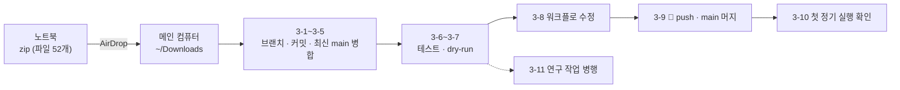

# 메인 컴퓨터 이전 가이드 (zip + AirDrop)

> 작성: 2026-10-01 (토론토) · 회사 노트북 → 메인 컴퓨터 · 리포 `sean-ccho/Project_1`
> 메인 컴퓨터의 Claude가 **이 문서 하나로 처음부터 끝까지** 진행하도록 쓴 실행 순서다.
> 무엇을 왜 바꿨는지는 [WORK_SUMMARY.md](WORK_SUMMARY.md) (0·2절), 설계 근거는 [QUANT_IMPROVEMENT_PLAN.md](QUANT_IMPROVEMENT_PLAN.md) 10절.

---

## 0. 사용자가 할 일

1. **노트북**: 바탕화면의 `project_1_handoff_2026-10-01.zip`을 AirDrop으로 메인 컴퓨터에 보낸다 (받으면 `~/Downloads`에 저장된다). AirDrop이 막혀 있으면 회사 정책상 허용되는 다른 방법으로 옮긴다. 노트북에서 파일을 더 고쳤다면 부록 A로 zip을 다시 만든다.
2. **메인 컴퓨터**: VS Code에서 Project_1 저장소 폴더를 열고 Claude에게 이렇게 말한다.

   > `~/Downloads/project_1_handoff_2026-10-01.zip`을 풀고, 안에 있는 `docs/quant_improvement/HANDOFF.md`를 읽고 순서대로 진행해줘

3. Claude가 🛑에서 멈추고 물어보면 답한다 (push, main 머지 시점 등).



---

## 1. Claude에게 — 진행 규칙

- 3절을 순서대로 진행한다. 각 단계의 **확인**을 통과하지 못하면 멈추고 출력과 함께 보고한다.
- 🛑 = 사용자 확인 후 진행: push, PR, main 머지, 사용자 파일 삭제·덮어쓰기, `reset`·`stash` 같은 되돌리기 어려운 작업.
- 커밋 메시지는 `type: 한국어 설명` ([CLAUDE.md](../../CLAUDE.md)). **이 브랜치의 커밋은 모두 끝에 `[skip ci]`** 를 붙인다 (push만으로 실거래 페이퍼 매매가 돌 수 있다, 3-8).
- stage는 바뀐 파일만 (`git add <파일>`). 날짜는 토론토(미국 동부) 기준.
- `data/paper_trading/`의 실거래 상태(positions·trades·스냅샷)는 수정·커밋하지 않는다. 봇만 커밋한다.
- 노트북에는 pandas·네트워크가 없어서 **pandas가 필요한 코드는 한 번도 실행되지 않았다** (3-6 목록). 테스트·dry-run이 실패할 수 있다 → 원인을 찾아 최소한으로 고치고, 커밋하고, [WORK_SUMMARY.md](WORK_SUMMARY.md) 9절에 한 줄 남긴다.
- 문서와 실제 상태가 다르면 추측하지 말고 묻는다.

---

## 2. zip 구성

```text
project_1_handoff_2026-10-01/
├── docs/ src/ scripts/ tests/ requirements-research.txt   ← 저장소에 들어갈 52개 (수정 15 + 새 파일 37)
└── _handoff/                                             ← 이전용 (저장소에 넣지 않는다)
    ├── files.txt        노트북의 git status ( M = 수정, ?? = 새 파일)
    ├── sha256.txt       52개 파일 체크섬
    ├── base_blobs.txt   수정 15개의 노트북 기준선 blob (git ls-tree)
    └── base/            수정 15개의 기준선 원본 (3-4 대안 경로용)
```

- 데이터·캐시·`output/`은 넣지 않았다 (메인 컴퓨터와 원격에 있다).
- 노트북 저장소는 원격 연결 없이 만든 커밋 하나(`1347ca8 chore: 로컬 기준선 스냅샷 (원격 main 2026-09-28 사본)`) 위에 있다. SHA가 원격과 달라서 **파일 내용(blob)으로 원격의 같은 시점을 찾는다** (3-3).
- 기준선 이후 원격 main에 들어간 것 (2026-10-01 확인): README(`62a97f1`), 스크린샷 orphan 브랜치(`f86abec`: `src/main.py`·`src/run_full_scan.py`·`src/screener/exporter.py`), 빈 CI 커밋(`97c8b80`), 매일 봇 커밋. 지금은 더 있을 수 있다.
- ⚠️ **zip 파일로 저장소를 그냥 덮어쓰면 안 된다.** 위 3개 파일은 원격에서도 바뀌어서 `f86abec` 작업이 사라진다. 기준선 시점에서 브랜치를 만들어 커밋한 뒤 최신 main을 병합해서 git이 합치게 한다.

---

## 3. 단계

모든 명령은 **저장소 루트, 같은 터미널**에서 실행한다 (변수 `H`·`BASE`를 3-1~3-5에서 이어 쓴다. 터미널이 바뀌면 다시 설정).

### 3-1. 압축 풀기 · 무결성 확인

```bash
H=~/Downloads/project_1_handoff_2026-10-01
[ -d "$H" ] || ditto -x -k ~/Downloads/project_1_handoff_2026-10-01.zip ~/Downloads/
(cd "$H" && shasum -a 256 -c _handoff/sha256.txt | grep -c ': OK$')   # 52
wc -l < "$H/_handoff/files.txt"                                        # 52
```

확인: 두 숫자 모두 52.

### 3-2. 저장소 상태 확인

```bash
git rev-parse --show-toplevel   # VS Code에 열린 저장소 (예: ~/Desktop/Code/Project_1)
git remote -v                   # sean-ccho/Project_1
git status --short              # 비어 있어야 한다
git fetch origin
git switch main && git pull --ff-only
```

- 로컬 변경이 있으면 🛑 (사용자 작업일 수 있다. 임의로 stash·삭제하지 않는다)
- `pull --ff-only`가 실패하면(로컬과 원격이 갈라짐) 🛑. 2026-09-30 `git filter-repo` 히스토리 재작성 이전 클론일 수 있다 → 새로 clone할지 묻는다

### 3-3. 기준선 시점 찾기

수정 15개 파일의 내용이 노트북 기준선과 똑같은 원격 커밋 중 가장 최근 것을 찾는다.

```bash
BASE=""
for c in $(git rev-list origin/main -n 500); do
  if [ "$(git ls-tree "$c" -- $(cut -f2 "$H/_handoff/base_blobs.txt"))" = "$(cat "$H/_handoff/base_blobs.txt")" ]; then BASE=$c; break; fi
done
echo "BASE=$BASE"; [ -n "$BASE" ] && git log -1 --format='%h %ad %s' --date=short "$BASE"
git ls-tree -r --name-only origin/main -- $(grep '^??' "$H/_handoff/files.txt" | cut -c4-)   # 출력이 없어야 한다
```

- 보통 `62a97f1`(README 커밋)이 나온다 → 3-4 기본 경로
- `BASE`가 비면 → 3-4 대안 경로
- 마지막 명령에 출력이 있으면 (새 파일과 같은 경로가 원격에 이미 있음) 🛑

### 3-4. 브랜치 만들기 · 파일 넣기 · 커밋

**기본 경로** (`BASE`를 찾았을 때)

```bash
git switch -c feat/pt-3accounts "$BASE"
rsync -a --exclude '_handoff' "$H/" ./
shasum -a 256 -c "$H/_handoff/sha256.txt" | grep -c ': OK$'   # 52
diff <(git status --porcelain --untracked-files=all | sort) <(sort "$H/_handoff/files.txt") && echo "목록 일치"
git add -- $(cut -c4- "$H/_handoff/files.txt")
git commit -m "feat: 페이퍼 트레이딩 3계좌(PT-2·PT-3), CCS v2·Tier 1.5 스위치, 백테스트 정합성·비교 기준 반영 [skip ci]"
```

- `diff`에 `<` 줄만 있으면 메인 컴퓨터에만 있는 미추적 파일이다 → 건드리지 않는다 (stage도 안 한다). `>` 줄이 있으면 복사가 잘못된 것 → 멈춘다.

**대안 경로** (`BASE`가 없을 때): 최신 main에서 브랜치 → 새 파일은 복사, 수정 15개는 `git merge-file`로 3-way 병합.

```bash
git switch -c feat/pt-3accounts origin/main
grep '^??' "$H/_handoff/files.txt" | cut -c4- | while read -r f; do mkdir -p "$(dirname "$f")"; cp "$H/$f" "$f"; done
grep '^ M' "$H/_handoff/files.txt" | cut -c4- | while read -r f; do
  git merge-file -L main -L base -L laptop "$f" "$H/_handoff/base/$f" "$H/$f" || echo "충돌: $f"
done
```

- `충돌:`로 나온 파일은 3-5 원칙대로 고친 뒤, 기본 경로와 같은 `git add` · `git commit`. 이 경로면 3-5의 병합은 건너뛴다.

### 3-5. 최신 main 병합 (기본 경로만)

```bash
git merge origin/main -m "chore: 최신 main 병합 [skip ci]"
```

- 충돌이 나면 **양쪽 변경을 모두 살린다.** 원격 = 스크린샷 orphan 브랜치 저장, 노트북 = 스냅샷 일봉 날짜(`_bar_date`) 기록·장중 데이터 판정(버그 L)·PT-1 메일 제목 날짜.
  - `src/main.py`·`src/run_full_scan.py`: `fetch_ohlcv(...)` 바로 다음의 `bar_date` / `is_bar_complete` 블록과 끝부분 `ranked["_bar_date"] = bar_date`는 반드시 남긴다.
  - 고친 뒤 `git add <파일> && git commit --no-edit`. 애매하면 🛑 충돌 부분을 보여 주고 묻는다.
- 확인: 원격 변경(`git diff "$BASE" origin/main -- src/main.py src/run_full_scan.py src/screener/exporter.py`)이 병합 결과에 그대로 들어 있다.

### 3-6. 테스트

```bash
python3 -m venv .venv && source .venv/bin/activate     # 이미 있으면 activate만
pip install -r requirements.txt pytest
PYTHONPATH=.:src pytest tests/paper_trading -q
```

- 기대: 새 테스트 90개(pandas 불필요 73 + pandas 필요 17)와 기존 `test_hold_winners`·`test_upside_model` 모두 통과.
- 노트북에서 한 번도 실행되지 않은 코드 — 실패하면 여기부터 본다:
  - `src/paper_trading/benchmarks.py`, `backtest.py`의 하루 여러 종목 매수·PIT 필터·비교 지표, `candidate_selector.select_top_candidates`
  - `src/paper_trading/account_backtest.py`, `scripts/run_hypothesis_ab.py`·`run_account_backtest.py`·`optimize_optuna.py`·`analyze_ccs_ic.py`
  - `runner.py`의 스냅샷 병합, `src/main.py`·`src/run_full_scan.py`의 `_bar_date`
  - 시트 동기화·이메일 발송
- 고쳤으면 `git add <파일> && git commit -m "fix: ... [skip ci]"` + WORK_SUMMARY 9절 한 줄.

### 3-7. dry-run (3계좌. 파일·시트·이메일은 건드리지 않는다)

```bash
git log -1 --format='%ad %s' --date=short -- data/paper_trading/sp500_ranked.parquet   # 마지막 봇 실행
PYTHONPATH=.:src python src/paper_trading/run_paper_trading.py --account all --dry-run --as-of YYYY-MM-DD
git status --short data/   # 비어 있어야 한다
```

- 커밋된 스냅샷은 구 코드가 만들어 일봉 날짜가 없다 → `--as-of`에 위에서 본 마지막 거래일을 넣는다.
- 확인할 출력은 [WORK_SUMMARY.md](WORK_SUMMARY.md) 4-5.

### 3-8. 워크플로 수정

1. `.github/workflows/run-screener.yml`의 `on:`을 먼저 본다. `push`에 브랜치 제한이 없으면 feat 브랜치 push만으로 **실거래 페이퍼 매매·이메일·시트**가 돈다 → push하는 마지막 커밋에 `[skip ci]`가 꼭 있어야 한다. `pull_request` 트리거가 있으면 PR도 같은 위험이 있다 → 🛑 알리고, PR 없이 3-9처럼 로컬에서 머지할지 묻는다.
2. PT-2·PT-3 실행 스텝과 상태 파일 `git add` 줄을 추가한다 → 내용은 [WORK_SUMMARY.md](WORK_SUMMARY.md) 4-3 그대로.
3. `git add .github/workflows/run-screener.yml && git commit -m "chore: 워크플로에 PT-2·PT-3 실행과 상태 파일 커밋 추가 [skip ci]"`

### 3-9. 🛑 push · main 머지

머지 시점 규칙 (WORK_SUMMARY 4-6): ① 미국 장이 열린 평일 ② 직전 정기 실행이 끝난 뒤 ③ 그날 저녁 정기 실행(20:45 토론토) 전 ④ 머지 커밋에 `[skip ci]`. 지금 시각과 Actions 상태를 사용자에게 보여 주고 확인받은 뒤:

```bash
git push -u origin feat/pt-3accounts
git switch main && git pull --ff-only
git merge --no-ff feat/pt-3accounts -m "feat: 페이퍼 트레이딩 3계좌 + 백테스트 정합성·비교 기준 반영 [skip ci]"
git push origin main
```

주말·휴일에 머지해야 하면 WORK_SUMMARY 4-6의 `state.json` 예외 절차를 따른다.

### 3-10. 첫 정기 실행 확인

그날 저녁 실행 뒤 WORK_SUMMARY 4-7 체크리스트를 확인하고 사용자에게 요약한다.

### 3-11. 연구 작업 (3-6 이후 아무 때나, 머지와 병행)

WORK_SUMMARY 4-8의 ①~⑧ 순서: Tier 0 검증 → `fetch_sp500_membership.py` → Baseline(쉬운 방법 비교, PIT 있음·없음) → T2 종목 수 → `--base`로 H1~H6 → PT-2·PT-3 백테스트 → CCS IC → Optuna.

- 판정이 `채택 후보`가 아닌 설정은 config 기본값을 바꾸지 않는다. 기본값 변경은 🛑
- 결과는 4-9 체크리스트대로 정리해서 보여 준다. `output/`은 커밋하지 않는다
- 전 종목 5년 첫 실행은 피처 계산 때문에 오래 걸린다. 빠른 확인은 `--max-tickers 100 --period 3y`

### 3-12. 마무리

- WORK_SUMMARY 9절에 한 줄: 날짜, 머지 커밋, 고친 것
- `~/Downloads/project_1_handoff_2026-10-01*` 정리는 사용자에게 묻는다

---

## 4. 문제 해결

| 증상 | 원인 | 조치 |
|---|---|---|
| 체크섬 OK가 52개가 아님 | 전송·압축 해제 문제 | zip을 다시 받아 3-1부터 |
| `BASE`가 비어 있음 | 기준선 이후 히스토리가 또 바뀌었거나 범위 부족 | `-n 2000`으로 다시 → 그래도 없으면 3-4 대안 경로 |
| 3-4 `diff`에 `>` 줄 | 복사 누락 | `rsync` 경로(끝의 `/`) 확인 후 다시 |
| `git merge` 충돌 | 원격이 같은 부분을 고침 | 3-5 원칙, 애매하면 🛑 |
| `ModuleNotFoundError` | import 경로 | 명령 앞에 `PYTHONPATH=.:src` |
| 그 밖의 실행 문제 | | WORK_SUMMARY 7절 |

---

## 부록 A. (노트북) zip 다시 만들기

노트북에서 파일을 더 고친 경우. 먼저 바탕화면의 `project_1_handoff_2026-10-01` 폴더와 zip을 Finder에서 지운 뒤:

```bash
cd ~/Documents/project_1
OUT=~/Desktop/project_1_handoff_2026-10-01
mkdir -p "$OUT/_handoff/base"
git status --porcelain --untracked-files=all > "$OUT/_handoff/files.txt"
cut -c4- "$OUT/_handoff/files.txt" | while read -r f; do mkdir -p "$OUT/$(dirname "$f")"; cp -p "$f" "$OUT/$f"; done
cut -c4- "$OUT/_handoff/files.txt" | xargs shasum -a 256 > "$OUT/_handoff/sha256.txt"
git ls-tree HEAD -- $(git diff HEAD --name-only) > "$OUT/_handoff/base_blobs.txt"
git diff HEAD --name-only | while read -r f; do mkdir -p "$OUT/_handoff/base/$(dirname "$f")"; git show "HEAD:$f" > "$OUT/_handoff/base/$f"; done
cd ~/Desktop && zip -X -r -q project_1_handoff_2026-10-01.zip project_1_handoff_2026-10-01
unzip -l project_1_handoff_2026-10-01.zip | tail -1
```

파일 수가 바뀌면 이 문서와 WORK_SUMMARY의 개수(52 등)도 고친다.
