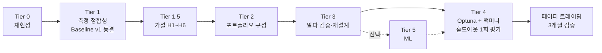

# 퀀트 트레이딩 전략 개선 계획서 (Project_1)

> 최종 갱신: 2026-10-01 (10절 추가: 페이퍼 트레이딩 3계좌 + CCS v2 + 구현 현황 / 작업 요약·진행 가이드는 [WORK_SUMMARY.md](WORK_SUMMARY.md))
> 대상 리포: `sean-ccho/Project_1` (Stock Market Screener, Python)
> 목표: 현재 전략의 진짜 성과를 측정하고, 리스크조정수익을 최대한 끌어올린다. 최종적으로 맥미니 서버에서 Optuna로 파라미터를 자동 탐색한다.
> 코드 변경 절차는 같은 폴더의 **`CODE_CHANGES_GUIDE.md`** 참고.

---

## 0. 핵심 요약 (TL;DR)

1. **실거래는 백테스트와 모순되지 않는다.** 실거래 49건 승률 39% vs 백테스트 약 50%. 49건의 오차 범위(±7%p)를 감안하면 통계적으로 유의한 차이가 아니다. 거래당 평균수익은 오히려 실거래가 높다(+1.3% vs +1.0~1.1%). 전략이 실전에서 망가진 게 아니라, **엣지가 원래 "거래당 +1% 정도"** 이다.
2. **지금 백테스트 수치(+147% 등)는 믿을 수 없다.** 캐시 버그, 펀더멘털 미래 정보 누설, 어닝 필터 오작동, 거래비용 0이 겹쳐 있다.
3. 그래서 **Tier 0(백테스트 재현성)을 가장 먼저** 한다. 이게 안 되면 Optuna는 노이즈만 최적화한다.
4. 가장 큰 개선 지렛대는 **① 거래비용 반영 ② 포지션 분산(3 → 10~20개) ③ 팩터 예측력 검증** 이다.
5. `alpha_model.py`의 IC(Spearman) 기반 팩터모델은 방법론이 탄탄해서 **살릴 자산**이다.
6. 진행 순서: **Tier 0 → Tier 1 → Tier 1.5 → Tier 2 → Tier 3 → Tier 4(Optuna/맥미니) → Tier 5(ML, 선택)**. Tier별 개발 방법은 **9절**.
7. **거래 로그 396건 분석 결과 (2-1절)**: 수익은 **모멘텀 전략 + 상승장**에서 나온다. 바닥반등은 중앙값이 마이너스이고, 트레일링 스탑이 전체 거래의 32%를 승률 7%로 잘라내고 있다. CCS 점수는 수익 순위를 거의 가르지 못한다(IC +0.058, 유의하지 않음).
8. **CCS는 구조적으로 바닥반등 쪽으로 기운다 (10-1절)**: 타이밍·컨플루언스 점수가 바닥반등 종목에 최대 약 +0.15를 더 주고, 상승장 모멘텀 보너스는 최대 0.015다. 그래서 근거 있는 피처만 쓰는 **CCS v2**를 만들었고, 검증 전까지는 스위치(`CCS_VERSION="v1"`)로 꺼 두었다.
9. **페이퍼 트레이딩을 3계좌로 늘린다 (10절)**: PT-1(기존) + PT-2(골든크로스 스윙, 30일 + 추세 유지 시 계속 보유) + PT-3(일봉 단타, 최대 10거래일). 브랜치는 나누지 않고 main 하나에서 계좌 설정으로 운영한다.
10. **실거래 기록에도 버그가 있었다 (10-5절)**: 워크플로가 주말·휴일에도 돌고 날짜를 UTC로 기록해서, 49건 중 6건의 매수가 장이 열리지 않은 날의 묵은 데이터로 체결됐다. 코드는 고쳤고, 워크플로 수정은 10-7절.

---

## 1. 실거래 성과 (페이퍼 트레이딩, 2026-04 ~ 09)

| 구분 | 총거래 | 승률 | 평균수익 | 누적수익* | 최대손실 |
|------|--------|------|----------|-----------|----------|
| 전체 | 49 | 39% | +1.30% | +46.5% | -14.2% |
| 바닥반등 | 24 | 33% | +1.40% | +13.4% | -14.2% |
| 모멘텀 | 24 | 42% | +0.70% | +14.0% | -9.7% |

\* 누적수익은 거래수익률의 **단순 합**이다. 실제 자본 기준 수익률이 아니다.

⚠️ 49건 중 6건의 매수(05-18, 05-31, 06-20, 08-30, 08-31, 09-13 기록)는 주말·휴일(또는 장중 push 실행)의 묵은 데이터로 체결됐다. 기록된 날짜도 UTC라서 미국 동부 날짜보다 하루 늦다. 기록은 고치지 않고, 분석할 때 감안한다 (10-5절).

---

## 2. 백테스트 35개 run 분석 (`output/runs/`)

- 전부 2026-04-07 ~ 04-26 실행분이다.
- 각 폴더에는 `meta.json`(파라미터 + 성과)과 `backtest_trades_enhanced.csv/json`(run당 약 250건, 진입 시점 피처 포함)이 있다.
- 공통 조건: 5년, $5,000, 최대 3포지션, 500종목, 시뮬레이션 2022-03 ~ 2026-04.

### 주요 run

| run | 캐시 | 거래 | 승률 | 전략수익 | SPY | MDD | Sharpe** | 비고 |
|-----|------|------|------|---------|-----|-----|----------|------|
| 04-18_12-16 | 사용 | 240 | 51.3% | +92.9% | +74.9% | -30.2% | 0.59 | |
| 04-18_12-25 | 사용 | 261 | 48.3% | +132.3% | +74.9% | -30.8% | 0.56 | fundamentals **끔** |
| 04-18_12-26 | 사용 | 261 | 48.3% | +132.3% | +74.9% | -30.8% | 0.56 | fundamentals **켬** — 결과 완전 동일 ⚠️ |
| 04-18_17-00 | 사용 | 224 | 46.9% | **+20.1%** | +75.1% | -31.9% | 0.23 | ⚠️ 17-03과 기록상 동일 |
| 04-18_17-03 | 사용 | 261 | 48.3% | **+132.0%** | +75.1% | -30.8% | 0.56 | |
| 04-18_17-47 | 사용 | 231 | 45.9% | +83.3% | +75.1% | -33.8% | 0.45 | `time_profit_min`만 변경 |
| 04-20_18-24 | 사용 | 261 | 48.3% | +132.0% | +75.1% | -30.8% | 0.56 | 유일한 clean commit |
| 04-21_20-16 | 사용 | 263 | 48.3% | +130.2% | +71.3% | -30.8% | 0.56 | ⚠️ 손절 7%→10%인데 결과 동일 |
| 04-22_00-07 | **미사용** | 263 | 51.3% | **+147.2%** | +71.3% | -27.5% | **0.77** | 최고 성과 |
| 04-23_23-25 | 사용 | 265 | 48.7% | +107.4% | +79.1% | -37.0% | 0.69 | 숏스퀴즈 전략 추가 |
| 04-24_02-08 | **미사용** | 266 | 51.9% | +144.2% | +79.1% | -37.8% | 0.77 | 같은 코드, 캐시만 끔 |
| 04-26_17-03 | **미사용** | 244 | 50.0% | +122.1% | +81.8% | **-22.7%** | 0.68 | 최신 run |

\** Sharpe는 자본곡선이 아니라 **거래 수익률로 계산한 값**이라 대략적인 참고치다.
4월 초 run(04-07 ~ 04-17)은 `benchmark` 항목이 없어 거래 통계만 남아 있다.

### run 분석에서 나온 발견

1. **캐시 on/off만 바꿔도 결과가 크게 달라진다.** 같은 코드에서 `9bfaaf`: +130% → +147%, `a0f6de`: +107% → +144%.
2. **파라미터를 바꿔도 결과가 소수점까지 같은 경우가 있다.** 손절 7%→10%, fundamentals on/off.
3. **`meta.json`이 실제 변경을 다 담지 못한다.** 04-18_17-00과 17-03은 기록상 같은데 +20% vs +132%. 35개 중 34개가 `dirty: true`(커밋 안 된 수정 상태)다.
4. **파라미터 하나에 결과가 크게 흔들린다.** `time_profit_min` 0.07 → 0.10 하나로 +132% → +83%. top-1 선택 + 3포지션 구조라 거래 하나가 이후 경로 전체를 바꾼다. 과적합 위험이 크다.
5. **바닥반등은 거의 모든 run에서 모멘텀보다 약하다.** 승률 42 ~ 48% vs 51 ~ 57%. 실거래에서도 바닥반등 승률은 33%다.
6. 숏스퀴즈는 9건뿐이라 아직 판단할 수 없다.
7. 캐시 미사용 run의 연 수익률은 약 22 ~ 25%, SPY는 약 14%. 초과수익은 꾸준하지만 **거래비용이 빠진 수치**이고 MDD는 -23 ~ -38%다.

---

## 2-1. 거래 로그 분석 결과 (2026-09-28)

> 데이터: 캐시 미사용 run 3개(`04-22_00-07`, `04-24_02-08`, `04-26_17-03`)를 합쳐 중복 제거한 **고유 거래 396건**.
> 스크립트: `scripts/analyze_trades_stdlib.py` (pandas 없이 표준 라이브러리만 사용). 실행: `python3 scripts/analyze_trades_stdlib.py`
> 거래비용은 왕복 0.2%로 가정했다. "유의"는 |t| ≥ 2 기준이다.

### ① 전략별 성과 — 수익은 모멘텀에서 나온다

| 전략 | 거래 | 승률 | 평균 | 비용 후 | 중앙값 |
|------|------|------|------|---------|--------|
| 전체 | 396 | 50.0% | +1.15% | +0.95% | +0.04% |
| **모멘텀** | 204 | **55.4%** | **+1.54%** | +1.34% | **+1.19%** |
| 바닥반등 | 186 | 44.1% | +0.74% | +0.54% | **-0.39%** |
| 숏스퀴즈 | 6 | 50.0% | +0.76% | +0.56% | +0.09% |

바닥반등은 **중앙값이 마이너스**다. 가끔 나오는 큰 수익이 평균을 끌어올릴 뿐, 전형적인 거래는 손실이다.

### ② 문제 D 확정 — 백테스트에 저점확률이 아예 없다

`feat_low_prob` 값이 **396건 전부 비어 있다.** 백테스트의 바닥반등은 가장 큰 가점(저점확률 2.5점)과 CCS confluence 가점(0.4)을 한 번도 받지 못했다. 즉 **백테스트의 바닥반등은 실거래 바닥반등과 다른 전략**이다.

### ③ 청산 사유별 성과 — 트레일링 스탑이 가장 큰 누수

| 청산 사유 | 거래 | 승률 | 평균 | 청산 후 20일 |
|-----------|------|------|------|--------------|
| **트레일링** | **126 (32%)** | **7.1%** | **-4.31%** | **+1.38%** |
| 시간익절 | 117 | 99.1% | +7.63% | -0.46% |
| 교체 | 74 | 44.6% | -0.05% | -0.38% |
| 장기보유 | 54 | 46.3% | -0.23% | -0.04% |
| 목표가 | 13 | 100% | +16.87% | +4.76% |
| 손절 | 8 | 0% | -11.67% | +8.30% |

- **트레일링 스탑**은 고점이 진입가를 **1센트라도 넘으면** 켜진다. 그래서 사실상 "진입가 근처에서 -5~6% 손절"로 작동한다. 거래의 32%가 승률 7%로 잘려 나가고, 팔고 난 뒤 20일 동안 오히려 +1.38% 오른다.
- **문제 E의 유력한 설명**: 트레일링이 먼저 걸리기 때문에 손절(-7% / -10%)까지 가는 거래가 **396건 중 8건뿐**이다. 손절 폭을 바꿔도 결과가 거의 안 바뀌는 이유다.
- **시간익절**은 잘 작동한다(승률 99%, 청산 후 추가 상승 없음).
- **목표가**로 판 거래는 이후 +4.76% 더 올랐다(13건이라 참고만).
- **교체**는 비용 전 수익이 0에 가깝다. 비용을 넣으면 교체 74건이 순손실이다.

### ④ CCS 점수는 수익 순위를 거의 가르지 못한다

| 범위 | IC | Q1 → Q5 평균수익 |
|------|-----|------------------|
| 전체 | +0.058 (유의 X) | +0.45%, +2.17%, +0.17%, +0.95%, +2.02% (들쭉날쭉) |
| 모멘텀 | +0.075 (유의 X) | +0.42%, +1.63%, +2.56%, -0.08%, +3.15% |
| 바닥반등 | **-0.064** | +0.68%, +1.67%, +2.66%, -1.07%, -0.22% |

CCS 서브스코어 중 유의한 것은 `ccs_strategy_fit`(IC +0.120, t=2.40) 하나뿐이다. timing · alpha · risk · confluence는 유의한 기여가 보이지 않는다. 바닥반등의 `ccs_alpha`는 오히려 음수(IC -0.108)다.

### ⑤ 시장 환경 의존도가 크다

| 구분 | 거래 | 승률 | 평균 |
|------|------|------|------|
| bull | 237 | 51.1% | +1.41% |
| neutral | 80 | 51.2% | +1.01% |
| bear | 79 | 45.6% | +0.52% (중앙값 -0.39%) |
| 2022 | 60 | 40.0% | **-0.13%** |
| 2023 | 104 | 42.3% | +0.33% |
| 2024 | 101 | 54.5% | +1.96% |
| 2025 | 89 | 57.3% | +1.52% |
| 2026 | 42 | 57.1% | +2.30% |

2022 ~ 2023(약세·횡보)에는 엣지가 거의 없고, 2024년 이후 상승장에서 수익이 난다.

### ⑥ 유의한 피처 (전체 396건)

| 피처 | IC | t | Q5−Q1 | 해석 |
|------|-----|---|-------|------|
| `ccs_strategy_fit` | +0.120 | +2.40 | +3.00% | 전략 점수 자체는 유효 |
| `momentum_fit` | +0.112 | +2.24 | +2.71% | 모멘텀 점수 높을수록 좋음 |
| `spy_close_to_ema200` | +0.112 | +2.23 | +1.48% | SPY가 EMA200 위로 멀수록 좋음 |
| `pos_52w` | +0.111 | +2.22 | +1.33% | 52주 고점 가까울수록 좋음 |
| `ema_gap_50_200` | +0.104 | +2.08 | +1.41% | 장기 추세 강할수록 좋음 |
| `factor_mean_reversion` | -0.099 | -1.97 | -1.42% | 평균회귀 신호는 오히려 역효과 |

모멘텀 거래만 보면 `spy_close_to_ema200`(IC +0.157, t=2.26)이 가장 강하다. 바닥반등 거래에서는 `factor_volatility`(IC -0.145, t=-1.99)가 음수다. 즉 **변동성이 압축된 바닥일수록 결과가 나쁘다.** 현재 바닥반등 알파 가중치(변동성 0.25 + 평균회귀 0.40)가 거꾸로 걸려 있을 가능성이 있다.

### 결론: 검증할 가설 (Tier 1 기준선 확정 후 A/B 백테스트)

| # | 가설 | 근거 | 테스트 방법 |
|---|------|------|-------------|
| H1 | **트레일링 스탑을 일정 수익(+3 ~ 5%) 이후에만 켠다** | 32% 거래가 승률 7%로 잘리고, 청산 후 +1.38% 반등 | 활성화 조건 `highest > entry` → `highest >= entry × (1 + X)` |
| H2 | **바닥반등 비중 축소 또는 중단** | 중앙값 -0.39%, 약세장에서 특히 약함 | 모멘텀 전용 vs 둘 다 (단, 먼저 D를 고친 뒤 재평가) |
| H3 | **시장 레짐 필터 강화** | `spy_close_to_ema200` 유의, 2022 마이너스 | SPY < EMA200일 때 신규 진입 중단 또는 포지션 축소 |
| H4 | **교체 로직 완화 또는 중단** | 74건 비용 전 ≈ 0, 비용 후 순손실 | `CCS_REPLACE_MARGIN` 0.10 → 0.20, 또는 교체 끄기 |
| H5 | **CCS 단순화** | strategy_fit만 유의, 나머지 기여 불명확 | CCS를 strategy_fit + 추세/레짐 피처 중심으로 재구성 |
| H6 | **바닥반등 알파 가중치 재검토** | `factor_volatility` IC 음수, `ccs_alpha` IC 음수 | 변동성·평균회귀 비중 축소 |

**분석의 한계**
- 선택된 거래만 본 것(조건부 표본)이라 "전체 종목에서의 예측력"과는 다르다.
- 피처 약 30개 × 그룹 3개를 동시에 검정해서, 우연히 유의하게 나오는 것이 4 ~ 5개 있을 수 있다. 여러 피처가 **같은 방향**(모멘텀·추세·레짐)을 가리킨다는 점이 신뢰 근거다.
- 패치 전 코드로 만든 거래라 미래 정보(B)가 섞여 있다. 특히 `ccs_risk`가 그렇다.

---

## 3. 코드 진단

### 3-1. Tier 0 원인 추적 (백테스트 결과를 믿을 수 없는 이유)

| # | 문제 | 상태 | 근거 / 영향 |
|---|------|------|-------------|
| A | **캐시 키에 코드 버전과 fundamentals 플래그가 없다** | 확정 | `screener/cache.py`: 키 = `md5(종목\|기간)` + 수동 `FEATURE_VERSION="v1"`. 플래그가 바뀌면 `meta.json`만 새로 쓰고 옛 `parquet`를 그대로 불러온다. fundamentals on/off 결과가 같았던 이유다. 캐시된 피처에는 알파점수, `fund_*` 컬럼, 패턴이 모두 들어 있다. IC 가중치 캐시도 같은 키를 쓴다. |
| B | **펀더멘털 미래 정보 누설** | 확정 | `screener/fundamentals.py`: `yf.Ticker().get_info()`는 **실행 시점의 현재 값**이다. 이 값을 2022년부터 모든 날짜에 쓴다. CCS risk 서브스코어(ROE > 10%, 부채 < 100, 기관보유 > 60%, 공매도)에 반영된다. |
| C | **어닝 회피 필터가 백테스트에서 작동하지 않는다** | 확정 | `days_to_next_earnings`를 실행일 기준으로 계산해서 백테스트 4년 내내 같은 값이 적용된다. 실거래 로직과 다르다. |
| D | **백테스트에 저점확률 계산이 없다** | **확정** | 거래 396건의 `feat_low_prob`이 전부 비어 있다. 바닥반등 최대 가점(2.5)과 CCS confluence(0.4)가 백테스트에서 항상 0이다. 백테스트의 바닥반등은 실거래 바닥반등과 다른 전략이다. |
| E | 손절 7% → 10% 변경에도 결과 동일 | **유력한 설명** | 트레일링 스탑이 먼저 걸려서 손절까지 가는 거래가 396건 중 8건뿐이다(2-1절 ③). 검증 스크립트로 최종 확인한다. |
| G | **`--max-tickers`로 자른 유니버스가 실행할 때마다 다르다** | 확정 (2026-09-30) | `TICKERS = list(set(...))`라서 파이썬 해시 랜덤화로 프로세스마다 순서가 바뀐다. `max_tickers=100`(기본값)이면 매번 다른 100종목이다. "같은 설정인데 결과가 다른" 원인 후보. |
| H | **IC 가중치 디스크 캐시가 "호출 횟수" 번호로 저장됐다** | 확정 (2026-09-30) | 리밸런스 주기가 다른 run이 같은 캐시를 쓰면 같은 번호가 다른 날짜를 가리킨다. 나중 날짜로 계산한 가중치를 앞 날짜에 쓰는 **미래 정보 누설**이 가능하다. |

> 2026-09-30: A · B · C · G · H는 코드를 고쳤다 (실행 검증은 10-7절). D는 백테스트에 추가하지 않고 **CCS v2에서 저점확률을 빼는** 쪽으로 결정했다 (실거래 저점확률은 날짜마다 2년치 모델을 학습해서 백테스트에 넣기에 너무 무겁다). 실거래 쪽 버그(F 등)는 10-5절.

### 3-2. 구조적 문제 (월스트리트급 관점)

| # | 문제 | 근거 | 영향 |
|---|------|------|------|
| 1 | 거래비용 0 | 수수료·슬리피지 없음 | 모든 최적화가 허상 엣지를 쫓는다 |
| 2 | 생존편향 | `TICKERS` = 현재 S&P500 + Nasdaq100 구성종목 | 상장폐지된 종목이 빠져 성과가 과대평가된다 |
| 3 | 극단적 집중 | `PAPER_TRADING_MAX_POSITIONS = 3` | 분산이 거의 없다. 종목 하나 -14% = 자본 -4.7% |
| 4 | 표본 부족 | 실거래 49건 | 실력과 운을 구분할 수 없다 |
| 5 | 잘못된 누적수익 표시 | 시트 누적수익 = 거래수익률 단순 합 | 실제 자본곡선 기준이 아니다 |
| 6 | 균등비중 사이징 | `cash / empty_slots` | 변동성과 확신도를 무시한다 |
| 7 | 손으로 정한 상수 수십 개 | CCS 서브스코어 임계치 전부 수작업 | 예측력이 검증되지 않았다 |

### 3-3. 살릴 자산

- `alpha_model.py`: 5팩터(모멘텀/추세/거래량/변동성/평균회귀) + tanh 정규화 + 60일 IC(Spearman) 동적 가중. 정통 팩터모델이다.
- CCS 5-서브스코어 구조, 레짐 감지, Hold-Winners defer 로직은 설계가 탄탄하다.

---

## 4. 로드맵

### 🔴 Tier 0 — 백테스트 재현성 (가장 먼저)
> 2026-09-30: 코드 변경은 끝났고 표시는 "코드 반영". 실제 실행 검증은 내 컴퓨터에서 (10-7절).
- [x] 캐시 키에 fundamentals 플래그 + 코드 해시 포함 (A) — 코드 반영
- [x] `meta.json`에 config 전체 + `config_hash` + `code_hash` 저장 — 코드 반영
- [x] 유니버스 순서 고정 (G), IC 가중치 캐시를 "전월 말 기준 월 단위"로 (H) — 코드 반영
- [ ] 결정성 테스트: 같은 설정 두 번 → 결과 동일 확인 (`scripts/verify_backtest_integrity.py` 준비됨)
- [ ] 파라미터 반영 테스트: 손절 변경 → 결과가 실제로 달라지는지 확인 (E, 같은 스크립트)
- [x] 저점확률이 백테스트에 빠져 있는지 확인 (D) → **빠져 있음 확정**
- [x] ~~백테스트에 저점확률 계산 추가~~ → 추가하지 않고 CCS v2에서 제외하기로 결정 (3-1절)
- [ ] 이후 모든 백테스트는 커밋된 코드에서만 실행

### 🥇 Tier 1 — 측정 정합성
- [x] 백테스트 날짜 구간(`start_date` / `end_date`) 지원 — PT-1·PT-2·PT-3 백테스트 모두 코드 반영
- [x] 최근 12개월 **홀드아웃 봉인** — `scripts/optimize_optuna.py`가 자동으로 빼고, `--evaluate-holdout`으로 한 번만 평가
- [x] 거래비용·슬리피지 반영 (편도 10bp) — 코드 반영 (PT-2/PT-3 페이퍼 계좌에도 적용)
- [x] 펀더멘털 미래 정보 차단 (B, C) — 코드 반영 (`BACKTEST_FUNDAMENTALS_PIT_SAFE`)
- [x] 자본곡선 기준 지표: CAGR · 일간 Sharpe · Sortino · Calmar · SPY Sharpe — 코드 반영
- [ ] 생존편향 대응 (시점별 지수 구성종목, 최소한 한계 명시)
- [ ] 위를 모두 적용한 **Baseline v1** 확정 (개발 기간 5년, 캐시 없이) — 10-7절 ⑤

### 🧪 Tier 1.5 — 전략 로직 가설 검증 (2-1절 H1 ~ H6)
- [ ] H1: 트레일링 스탑 활성화 조건 변경 (수익 +3 ~ 5% 이후)
- [ ] H2: 바닥반등 비중 축소/중단 (D 수정 후 재평가)
- [ ] H3: 시장 레짐 필터 강화 (SPY < EMA200 시 신규 진입 중단/축소)
- [ ] H4: 교체 마진 상향 또는 교체 중단
- [ ] H5: CCS 단순화 — CCS v2 코드 반영(스위치 꺼짐), 채택 판단은 10-1절 기준
- [ ] H6: 바닥반등 알파 가중치 재검토
- 규칙: 한 번에 하나만 바꾸고, Baseline v1과 비교한다. 채택한 것을 합친 결과가 **Baseline v2**.
- 구현 상태: H1 ~ H6 스위치는 코드에 들어가 있다 (기본값 = 현재 동작). `scripts/run_hypothesis_ab.py`로 한 번에 비교 → 10-7절 ⑤-2. 체크는 결과를 보고 채택/기각을 정한 뒤에 한다.

### 🥈 Tier 2 — 포트폴리오 구성 (리스크조정수익 최대 지렛대)
- [ ] 후보 상위 k개 선정 + 하루 여러 종목 매수
- [ ] 사이징 공유 함수 (백테스트와 실거래가 같은 함수 호출)
- [ ] 포지션 3 / 5 / 10 / 15 / 20개 스윍
- [ ] 리스크 기반 사이징 (역변동성 + CCS 확신도 가중)
- [ ] 섹터/팩터 중립화

### 🥉 Tier 3 — 알파 검증·강화
- [x] 피처별 IC + 5분위 수익률 분석 (1차: 기존 run 396건, 2-1절)
- [ ] 패치 후 새 기준선으로 재분석 (`scripts/analyze_trade_features.py`)
- [ ] 전 종목 × 전 날짜 **연구용 패널 데이터** 구축 (피처 캐시 + 선행 수익률)
- [ ] 팩터별 횡단면 IC 시계열, t-stat, 연도별 부호
- [ ] 바닥반등이 약한 원인 규명 → 개선 또는 비중 축소
- [ ] CCS 점수가 실제로 수익 순위를 가르는지 검증
- [ ] "top 1 선택" → 크로스섹셔널 랭킹 상위 분위 보유로 전환 검토
- [ ] 다중검정 보정 (deflated Sharpe)

### 🏅 Tier 4 — Optuna 최적화 + 맥미니 서버
- [ ] Tier 0 ~ 3 완료 후, 소수의 견고한 파라미터만 최적화
- [ ] walk-forward + 거래비용 반영 목적함수
- [ ] 파라미터를 조금 흔들어도 성과가 유지되는지(robustness) 확인
- [ ] 봉인한 홀드아웃으로 **한 번만** 최종 평가
- [ ] 채택 후 페이퍼 트레이딩 3개월 검증

### Tier 5 — ML (선택)
- [ ] Tier 3 패널 데이터로 LightGBM 순위 예측 모델 (purging/embargo 교차검증)
- [ ] 룰 CCS 대비 표본 외 IC가 높을 때만 `src/ml/` (`ML_ENABLED`) 블렌딩 (16GB RAM 권장)

> 각 Tier를 **어떻게 개발하는지**(작업 순서, 수정 위치, 완료 기준)는 **9절** 참고.

---

## 5. Optuna 설계 (Tier 4, 확정 사항)

### 목표지표: 옵션 A
- 주 목표: `summary["Sharpe"]` 최대화 (Tier 1 이후에는 `Sharpe_일간` 사용 권장), `direction="maximize"`
- 제약(Pruning): `총거래수 < 50` → `TrialPruned`, `승률 < 0.40` → `TrialPruned`(선택)
- 페널티: `score = Sharpe − max(0, |MDD| − 0.30) × 2.0`
- 승률 · 수익률 · MDD · 거래수는 `trial.set_user_attr()`로 저장해서 대시보드에서 비교

### 백테스트 연동 주의사항 (실제 코드 확인)
- 함수: `run_paper_trading_backtest(tickers, *, period, rebalance_every, include_fundamentals, max_tickers, initial_capital, no_cache)` → `{"trades", "summary", "equity_curve", ...}`
- **지표 키가 한글이다**: `summary["Sharpe"]`, `["MDD"]`, `["승률"]`, `["총거래수"]`, `["전략총수익률"]`
- **날짜 구간을 지원하지 않는다**: `period="2y"` 방식뿐. walk-forward를 하려면 `start_date/end_date` 슬라이싱을 추가해야 한다.
- **config 오버라이드 함정**:
  - `EXIT_PARAMS`, `CANDIDATE_REGIME_WEIGHTS` 같은 dict는 in-place 수정이 모든 모듈에 반영되어 안전하다.
  - `ADX_BUY_MIN`, `CANDIDATE_MIN_STRATEGY_SCORE`, `HOLD_WINNERS_*` 같은 스칼라 값은 `from config import X`로 바인딩되어 `setattr(cfg, ...)`가 효과 없다. 사용하는 모듈(`candidate_selector`, `engine`)에 직접 `setattr` 하거나 `cfg.X` 동적 참조로 바꿔야 한다.
- **캐시 규칙**: 코드 해시 패치 후에는 파일 수정 시 캐시가 자동 무효화된다. Optuna가 런타임에 바꾸는 값은 캐시 이후 단계(진입 필터, CCS, 청산) 파라미터여야 한다. 피처 계산 단계 값을 런타임에 바꾸면 캐시가 그 변경을 가린다.
- CCS 가중치는 캐시 이후 단계라 안전하지만, 1차에서는 진입/청산 파라미터만 최적화하고 CCS는 2차로 분리한다.

---

## 6. 맥미니 서버 세팅 (Tier 4 인프라)

- [ ] `pmset` 잠자기 방지 (`sudo pmset -a sleep 0 disksleep 0`) + 정전 후 자동 시작 + 자동 로그인
- [ ] Tailscale(원격 접속, 대시보드) + SSH 키 인증 (비밀번호 로그인 비활성화)
- [ ] launchd 등록: 옵티마이저(`KeepAlive=true`, `Nice=10`) + optuna-dashboard(8080)
- [ ] 로그 로테이션, `optuna.db` 백업, `.gitignore`에 `*.db` 추가
- [ ] 8080 포트를 인터넷에 직접 열지 않기 (Tailscale로만 접속)
- 하드웨어: 8GB RAM은 Tier 0 ~ 4를 순차 실행(`n_jobs=1`)하면 가능. Tier 5 ML은 16GB 권장. 256GB 저장공간은 충분(로그 관리 필요).
- 비용: Optuna, optuna-dashboard, xgboost, lightgbm, shap 모두 무료 오픈소스.

---

## 7. 데이터 인벤토리

| 위치 | 내용 |
|------|------|
| `data/paper_trading/trades.json` | 실거래 49건 원본 |
| `data/paper_trading/positions.json` | 현재 보유 포지션 |
| `data/paper_trading/*_ranked.parquet` | 최신 랭킹 스냅샷 |
| `logs/` | 일별 실행 로그 (2026-04-04 ~) |
| `output/runs/` | 백테스트 35개 run (각 `meta.json` + 거래 CSV/JSON) |
| `data/ml_models/` | ML 아티팩트 |

- 거래 CSV는 진입 시점 피처(RSI, ADX, CCS 서브스코어, 5팩터, 레짐)와 결과(`return_pct`, `post_exit_return_5/10/20d`)를 함께 담고 있다. Tier 3 분석과 ML에 필요한 데이터셋 그 자체다.
- 캐시 문제 때문에 **캐시 미사용 run 3개**(`04-22_00-07`, `04-24_02-08`, `04-26_17-03`)만 분석 기준으로 쓴다.

---

## 8. 진행 상태와 다음 단계

> 2026-09-30: `CODE_CHANGES_GUIDE.md`의 변경 1~8은 코드에 반영됐다. 지금 할 일 목록은 **10-7절**이다 (아래 "다음 단계"는 기록용으로 남긴다).

### 완료
- [x] 코드 전체 정독 (진입/청산/스코어링/알파모델/캐시/펀더멘털/시그널)
- [x] 백테스트 35개 run 전수 분석
- [x] Tier 0 원인 추적 (A ~ D 확정, E 유력한 설명)
- [x] 거래 로그 396건 분석 → 가설 H1 ~ H6 도출 (2-1절)
- [x] 패치 및 검증·분석 스크립트 작성 → `CODE_CHANGES_GUIDE.md`
- [x] 목표지표 옵션 A 확정

### 다음 단계 (본인 맥에서)
1. `CODE_CHANGES_GUIDE.md` 순서대로 코드 변경 (브랜치에서)
2. `python scripts/verify_backtest_integrity.py` 실행
3. `python scripts/analyze_trade_features.py` 실행
4. 저점확률 검색으로 **계산 위치** 파악 (D는 데이터로 확정됨 → 백테스트에 추가하는 패치 준비용)
5. 5년 전체를 캐시 없이 실행해 **진짜 기준선** 확정
6. 이후는 **9절(Tier별 개발 방법)** 순서대로: Tier 1(날짜 구간 + 홀드아웃 → Baseline v1) → Tier 1.5(H1 ~ H6) → Tier 2 → Tier 3 → Tier 4

### 미해결 질문
- [x] D: 저점확률이 백테스트에 정말 빠져 있는가? → **빠져 있음 (396건 전부 공백)**
- [x] D 후속: 실거래 저점확률은 `main.py` / `run_full_scan.py`의 `score_extremes_for_snapshot()`(날짜마다 2년치 모델 학습)에서 만든다 → 백테스트에 넣지 않고 CCS v2에서 제외
- [ ] E: 트레일링이 먼저 걸린다는 설명이 맞는가? (검증 스크립트 C 단계로 확인)
- [ ] 생존편향 대응을 어느 수준까지 할 것인가 (데이터 구매 vs 한계 명시)

> ⚠️ 미래 정보를 빼고 거래비용을 넣으면 +147%였던 수치는 **내려갈 가능성이 높다.** 그게 정상이고, 그 숫자가 개선의 진짜 출발점이다.

---

## 9. Tier별 개발 방법

### 9-0. 모든 Tier에 공통으로 적용하는 원칙

| 원칙 | 방법 | 이유 |
|------|------|------|
| **Tier마다 브랜치** | `tier0-integrity`, `tier1-measurement`, `tier1.5-hypotheses`, `tier2-portfolio` … | 문제가 생기면 그 Tier만 되돌릴 수 있다 |
| **한 번에 하나만 바꾼다** | 변경 1개 → 백테스트 → 기준선과 비교 → 채택/기각 | 여러 개를 같이 바꾸면 무엇이 효과였는지 알 수 없다 |
| **새 파라미터는 기본값 = 현재 동작** | 예: `TRAILING_ACTIVATION_GAIN = 0.0`이면 지금과 동일하게 작동 | 코드는 먼저 merge하고, 채택은 설정값만 바꿔서 한다 |
| **새 파라미터는 `cfg.X`로 읽는다** | `import screener.config as cfg` 후 함수 안에서 `cfg.X` | `from config import X`는 런타임에 바꿀 수 없다. Tier 4 Optuna의 사전 준비다 |
| **홀드아웃 봉인** | 최근 12개월을 Tier 1에서 떼어 두고 Tier 4 마지막에 **딱 한 번만** 평가 | Tier 1.5 ~ 4에서 수십 번 실험하면서 생기는 과적합을 잡는 유일한 장치다 |
| **빠른 반복 / 정식 검증 분리** | 반복은 100종목 × 3년, 채택 판단은 500종목 × 5년(홀드아웃 제외) | 속도와 신뢰도를 둘 다 챙긴다 |
| **실험 기록표 유지** | 9-8절 표에 누적 (run 폴더, code_hash, 바꾼 것, 결과, 채택 여부) | 같은 실험을 반복하지 않고, 나중에 다중검정 보정에 쓴다 |
| **라이브 영향 주의** | `config.py`의 전략 값(청산, 필터, 포지션 수)을 바꾸면 **실거래 페이퍼 트레이딩도 바뀐다** | 게이트를 통과한 변경만 main에 merge한다. merge 시점부터 실거래 성과를 새로 집계한다 |
| **백테스트 = 실거래 로직** | 사이징·후보선정 같은 로직은 공유 함수 하나로 만들고 양쪽에서 호출 | 지금처럼 백테스트와 실거래가 몰래 달라지는 일(D)을 막는다 |

**채택 기준 (Tier 1.5 ~ 3 공통)**
1. 개발 기간의 **일간 Sharpe가 기준선보다 높다**
2. **두 하위 기간(2022 ~ 2023, 2024 ~ 2025) 모두**에서 나빠지지 않는다
3. MDD가 기준선보다 크게(예: 5%p 이상) 나빠지지 않는다
4. 거래 수가 50건 미만으로 줄지 않는다



---

### 9-1. Tier 0 — 백테스트 재현성

**목표**: 같은 코드·같은 설정이면 결과가 항상 같고, 설정을 바꾸면 결과가 반드시 바뀌게 만든다.

**작업 순서**
1. `CODE_CHANGES_GUIDE.md` 변경 1 ~ 8 적용
2. `pytest`에 테스트 추가: fundamentals 플래그나 코드 해시가 바뀌면 캐시 키도 바뀌는지 확인
3. `verify_backtest_integrity.py` 통과시키기. 실패하면 원인을 찾을 때까지 다음 단계로 가지 않는다
4. **D 수정**: 실거래에서 저점확률을 계산하는 코드를 찾아(가이드 변경 9) 백테스트 경로(`_compute_ranked_snapshot`)에 넣는다
   - 모델은 **그 날짜까지의 데이터로만** 학습해야 한다 (미래 정보 금지)
   - 매일 재학습은 느리므로 IC 가중치처럼 **20거래일마다 재학습**하고 캐시한다
5. 커밋 안 된 수정이 있는 상태로 백테스트를 돌리면 경고가 뜨게 한다 (`meta.json`의 `git.dirty` 활용)

**완료 기준 (게이트)**
- [ ] 검증 스크립트 A = B, C ≠ A
- [ ] 새 run의 `meta.json`에 `code_hash`, `config_hash`, `config_full`이 있다
- [ ] 백테스트 거래 로그의 `feat_low_prob`에 값이 들어 있다

---

### 9-2. Tier 1 — 측정 정합성

**목표**: 비용과 미래 정보를 제거한 **진짜 기준선(Baseline v1)** 을 만든다.

**작업 순서**
1. **날짜 구간 지원**을 여기서 먼저 한다 (원래 Tier 4 항목)
   - `run_paper_trading_backtest(..., start_date=None, end_date=None)` 추가
   - 데이터는 앞쪽 지표 계산용으로 넉넉히 받고, **시뮬레이션만** 구간으로 자른다
   - 이유: 홀드아웃을 지금부터 봉인해야 하기 때문
2. **홀드아웃 정의**: 최근 12개월을 `config.py`에 `BACKTEST_HOLDOUT_START`로 적어 두고, 개발용 실행은 그 전날까지만 돌린다
3. 거래비용, 펀더멘털 미래 정보 차단, 자본곡선 지표 (가이드 변경 4 ~ 6)
4. **생존편향 대응**: 둘 중 하나를 고른다
   - 무료: 과거 S&P 500 구성종목 이력(GitHub 공개 데이터셋 등)으로 **날짜별 유니버스**를 만든다. 상장폐지 종목 가격은 yfinance에 없는 경우가 많으니 한계를 기록한다
   - 유료: Norgate, Sharadar 등 상장폐지 포함 데이터
5. (실거래) 시트의 "누적수익"을 자본곡선 기준으로 바꾼다

**완료 기준 (게이트)**
- [ ] 개발 기간 5년(홀드아웃 제외) 캐시 없이 실행한 **Baseline v1** run 폴더를 확정하고, 9-8절 표에 수치를 기록한다
- [ ] Baseline v1의 CAGR · 일간 Sharpe · MDD · SPY 대비 수치가 있다
- [ ] 이후 모든 비교는 Baseline v1 기준

---

### 9-3. Tier 1.5 — 전략 로직 가설 검증 (H1 ~ H6)

**목표**: 거래 로그 분석(2-1절)에서 나온 가설을 하나씩 A/B 테스트해서 채택/기각한다.

**권장 순서** (효과 기대치가 크고 변경이 작은 것부터)

| 순서 | 가설 | 설정 (기본값 = 현재 동작) → 실험값 | A/B 변형 | 수정 위치 |
|------|------|--------------------------------|------|----------|
| 1 | H1 트레일링 활성화 조건 | `EXIT_PARAMS[전략]["trail_activate_pct"] = 0.0` → 0.03, 0.05 | `H1a`, `H1b` | `engine.py::check_sell_conditions` |
| 2 | H3 레짐 필터 강화 | `CANDIDATE_BEAR_BLOCK_NEW = False` → True ("절반만" 옵션은 Tier 2 사이징과 함께) | `H3` | `candidate_selector.py::select_best_candidate` |
| 3 | H4 교체 완화/중단 | `CCS_REPLACE_MARGIN = 0.10` → 0.20, `PT1_REPLACE_ENABLED = True` → False | `H4a`, `H4b` | `engine.py::should_replace` |
| 4 | H2 바닥반등 축소 | `CANDIDATE_ALLOWED_STRATEGIES = None` → `["모멘텀"]` | `H2` | `candidate_selector.py::_apply_hard_filters` |
| 5 | H6 바닥반등 알파 가중치 | `CANDIDATE_ALPHA_WEIGHTS["바닥반등"]` (현재 .10/.10/.15/.25/.40) → .25/.25/.20/.10/.20 | `H6` | `candidate_selector.py::_score_alpha_factor` |
| 6 | H5 CCS 단순화 | `CCS_VERSION = "v1"` → "v2" (10-1절) | `H5` | `candidate_selector.py` |

H2는 **D(저점확률)를 고친 뒤** 평가해야 공정하다.

**실험 방법**
1. 설정 추가 + 기본값으로 백테스트 → Baseline v1과 **완전히 같은지** 확인 (코드 추가가 동작을 바꾸지 않았는지)
2. 실험값으로 빠른 반복(100종목 × 3년) → 유망하면 정식 검증(500종목 × 5년)
3. `scripts/run_hypothesis_ab.py`가 "기준선 vs 변형"을 같은 조건으로 한 번에 돌리고 표로 출력한다 (`output/hypothesis_ab.csv`에 누적). config 파일은 고치지 않고 실행 중에만 바꾼다 (`paper_trading/config_override.py`)
4. 결과를 실험 기록표에 추가

**완료 기준 (게이트)**
- [ ] H1 ~ H4, H6 각각 채택/기각 결론이 기록되어 있다
- [ ] 채택한 것들을 **모두 합친 상태**로 한 번 더 돌려 **Baseline v2**로 확정한다 (조합 효과가 따로 재었을 때와 다를 수 있다)

---

### 9-4. Tier 2 — 포트폴리오 구성

**목표**: 종목 3개 몰빵을 분산된 포트폴리오로 바꿔 리스크조정수익을 올린다.

**작업 순서**
1. **후보를 여러 개 고르게 한다**: `select_best_candidate`가 1개가 아니라 **상위 k개 리스트**를 반환하도록 확장 (기존 함수는 `[0]`을 쓰는 래퍼로 유지해서 호환)
2. **하루 여러 종목 매수 허용**: `PAPER_TRADING_MAX_DAILY_BUY`를 실제로 반영
3. **사이징 공유 함수**를 만든다 (예: `paper_trading/sizing.py`)
   - 역변동성: 종목당 목표 위험 = 자본 × 위험% ÷ ATR%
   - 종목당 최대 비중(예: 10 ~ 15%), 섹터당 최대 비중
   - **백테스트와 실거래(`engine.py`)가 같은 함수를 호출**
4. **포지션 수 스윍**: 3 / 5 / 10 / 15 / 20을 비교 (한 번에 하나씩, 나머지는 Baseline v2 그대로)
5. 회전율과 비용을 함께 본다. 포지션이 늘면 거래 수도 늘어 비용이 커진다

**완료 기준 (게이트)**
- [ ] 포지션 수별 일간 Sharpe · MDD · 회전율 비교표
- [ ] 선택한 구성이 Baseline v2보다 Sharpe가 높고 MDD가 같거나 낮다
- [ ] 실거래 이메일·시트가 여러 포지션을 제대로 표시한다
- [ ] **Baseline v3** 확정

---

### 9-5. Tier 3 — 알파 검증·재설계

**목표**: "선택된 거래"가 아니라 **전 종목 × 전 날짜** 데이터로 각 팩터의 진짜 예측력을 측정하고, 그 근거로 점수 체계를 다시 만든다.

**작업 순서**
1. **연구용 패널 데이터 만들기**: 백테스트 피처 캐시(`data/cache/features/*/YYYY-MM-DD.parquet`)에는 날짜별 전 종목 피처가 이미 있다. 여기에 **5 / 10 / 20일 선행 수익률**을 붙인 패널을 만든다 (`scripts/build_research_panel.py`)
   - 선행 수익률은 **다음날 시가 진입** 기준으로 계산해서 백테스트와 맞춘다
2. **팩터 리서치** (`scripts/factor_research.py`)
   - 날짜별 횡단면 IC → IC 평균, IC의 t-stat, 연도별 부호, 5분위 수익률
   - 예측 기간(5 / 10 / 20일)별로 IC가 어떻게 줄어드는지 확인
   - 레짐(bull / neutral / bear)별로 나눠서 확인
3. **CCS 재설계**
   - 유의하고 연도별 부호가 안정적인 팩터만 남긴다
   - 임계값 가점 방식(RSI 25 ~ 40이면 +0.4 같은 것) 대신 **횡단면 순위 기반** 합성 점수를 검토한다
   - "top 1 선택" 대신 **상위 분위 보유**가 Tier 2 구조와 잘 맞는지 확인한다
4. **다중검정 보정**: 실험 기록표의 시도 횟수로 deflated Sharpe를 계산해, 개선이 우연이 아닌지 확인한다

**완료 기준 (게이트)**
- [ ] 팩터별 IC 리포트 (평균, t-stat, 연도별 부호)
- [ ] 남긴 팩터는 모두 IC t-stat ≥ 2이고 연도별 부호가 대체로 일정하다
- [ ] 새 CCS가 채택 기준을 통과 → **Baseline v4**

---

### 9-6. Tier 4 — Optuna 최적화 + 맥미니 서버

**목표**: 검증된 구조 위에서 **소수의 파라미터**를 자동 탐색하고, 과적합 없이 채택한다.

**작업 순서**
1. **코드 구조**: `src/optimization/`
   - `param_space.py`: 탐색할 파라미터 정의 (**8 ~ 10개 이내**, Tier 1.5 ~ 3에서 민감하다고 확인된 것 위주)
   - `objective.py`: 5절의 옵션 A 목표함수 (일간 Sharpe, 거래 수·승률 제약, MDD 페널티)
   - `runner.py`: SQLite 저장, `TPESampler(seed=42)`, baseline을 `enqueue_trial`로 첫 시도에 넣기
2. **walk-forward**: 개발 기간 안에서 학습/검증 구간을 여러 개로 나눠, 검증 구간 성과의 평균을 목표값으로 쓴다 (홀드아웃은 여기서도 쓰지 않는다)
3. **안정성 확인**: 최적 파라미터를 ±10% 흔들었을 때 성과가 크게 무너지면 기각한다. 뼰족한 정점이 아니라 **평평한 고원**을 고른다
4. **맥미니 배포**: 6절 체크리스트 (잠자기 방지, Tailscale, launchd `KeepAlive` + `Nice=10`, 대시보드, 백업). 8GB면 `n_jobs=1`
5. **홀드아웃 평가 (딱 한 번)**: 최종 후보 1개를 봉인해 둔 최근 12개월로 평가한다
   - 홀드아웃 Sharpe가 Baseline 이상이고, 개발 기간 Sharpe의 50% 이상이면 채택
   - 결과가 나쁘면 파라미터를 다시 튜닝하지 않는다. 그렇게 하면 홀드아웃이 오염된다. 구조(Tier 1.5 ~ 3)로 돌아간다

**완료 기준 (게이트)**
- [ ] 홀드아웃 평가 통과
- [ ] 채택한 파라미터를 `config.py`에 반영하고 main에 merge
- [ ] **페이퍼 트레이딩 3개월 이상** 운영해서, 실거래가 백테스트 기대치의 오차 범위 안에 있는지 확인한 뒤에만 실제 자금 검토

---

### 9-7. Tier 5 — ML (선택)

**목표**: 룰 기반 CCS보다 예측력이 높은 모델이 있는지 확인한다.

**작업 순서**
1. **데이터**: Tier 3의 패널 데이터를 쓴다. 거래 수백 건이 아니라 **종목 × 날짜 수십만 행**이라 ML에 충분하다
2. **모델**: LightGBM으로 **선행 수익률 순위** 예측 (회귀보다 순위 학습이 노이즈에 강하다)
3. **검증**: 시계열 교차검증 + **purging/embargo** (학습과 검증 사이에 예측 기간만큼 간격을 둬서 라벨 누설 방지)
4. **비교**: 같은 기간에서 룰 CCS의 IC vs 모델의 IC → 모델이 확실히 나을 때만 `ML_ENABLED`로 블렌딩
5. **해석**: SHAP으로 모델이 무엇을 보고 판단하는지 확인한다. 설명 안 되는 모델은 쓰지 않는다
6. 맥미니는 **16GB 권장**

**완료 기준 (게이트)**
- [ ] 표본 외 IC가 룰 CCS보다 높다
- [ ] 블렌딩 후 백테스트가 채택 기준 통과
- [ ] Tier 4와 동일하게 홀드아웃 평가 → 페이퍼 트레이딩 검증

---

### 9-8. 실험 기록표 (계속 채워 나간다)

| 날짜 | Tier | 바꾼 것 | run 폴더 | code_hash | 일간 Sharpe | CAGR | MDD | 거래 수 | 결론 |
|------|------|---------|----------|-----------|-------------|------|-----|---------|------|
| | 1 | Baseline v1 | | | | | | | 기준 |
| | | | | | | | | | |

---

## 10. 페이퍼 트레이딩 3계좌 체계 + CCS v2 (2026-09-30)

> 결정 사항: PT-3 = 기존 일봉 지표로 만든 단타 전용 규칙(최대 10거래일) / PT-2 = 30 달력일 + 추세가 살아 있으면 계속 보유 / 이메일은 계좌별 3통 / 순서는 "공통 버그 수정 + 멀티계좌 → PT-2·PT-3 페이퍼 바로 시작, Tier 0는 병행".

### 10-1. CCS 진단과 v2 설계

현재 CCS(v1) = 레짐별 가중치 × 서브스코어 5개 − 섹터 페널티 + 레짐 보너스(최대 0.015)

| 서브스코어 | 계산 | 396건 분석 | 코드에서 찾은 문제 |
|---|---|---|---|
| A 전략적합도 | max(바닥반등, 모멘텀) ÷ 10 | **유일하게 유의** (IC +0.12) | — |
| B 타이밍 | RSI 구간 +0.4, 볼린저 < 0.2 +0.3, 거래량 +0.15, MACD +0.15 | 유의하지 않음 | 볼린저 하단 가점이 모멘텀에도 적용 → 바닥반등 종목이 유리 |
| C 알파 | 5팩터 가중합 (바닥반등: 평균회귀 40% + 변동성 25%) | 유의하지 않음, 바닥반등은 **음수**(-0.108) | IC가 음수인 팩터에 가중치가 가장 큼 |
| D 리스크 | 변동성 압축, 52주 위치, 펀더멘털(최대 0.4), 정배열 | 유의하지 않음 | 모멘텀은 52주 위치 0.55~0.85만 가점 → 신고가 근처는 0점 (데이터는 높을수록 좋음, IC +0.11). 펀더멘털은 백테스트에서 미래 정보 |
| E 컨플루언스 | 저점확률 +0.4(바닥반등만), 반등스코어 +0.2, 멀티TF 패턴 +0.3, 정배열 +0.1 | 유의하지 않음 | 저점확률이 백테스트에서 항상 0 → 백테스트와 실거래가 **다른 점수** |
| 교체 | 오늘 후보 CCS > 보유 종목 CCS + 0.10 | 74건, 비용 반영 시 순손실 | 보유 종목은 **매수 당시** 점수, 후보는 **오늘** 점수 |

**핵심**: B·E가 바닥반등 종목에 최대 약 +0.15를 더 주는데, 상승장 모멘텀 보너스는 최대 0.015다. 그래서 상승장에서도 CCS가 더 약한 전략(바닥반등, 중앙값 -0.39%) 쪽으로 기운다.

**CCS v2** (`candidate_selector._ccs_v2_components`)
- 점수 = 0.40 × 전략적합도 + 0.20 × 장기 추세(`ema_gap_50_200`) 백분위 + 0.20 × 52주 위치 백분위 + 0.20 × 20일 수익률 백분위 − 섹터 페널티 (`CCS_V2_WEIGHTS`)
- 백분위는 하드필터 전 **그날 전체 종목** 기준 (후보 풀은 5~20개라 불안정)
- 펀더멘털·저점확률·타이밍·알파·컨플루언스는 쓰지 않는다 → 백테스트와 실거래 점수가 같아진다
- 레짐은 점수에 넣지 않고, 기존 약세장 제한(모멘텀 제외, 포지션 축소)으로만 쓴다
- 최소 점수 `CCS_V2_MIN = 0.55` (v1의 0.40/0.45 대신)
- 교체: v2 모드에서는 보유 종목도 오늘 스냅샷 점수로 다시 매겨 비교한다 (`engine.current_ccs`)
- 스위치: `CCS_VERSION = "v1"`(기본) / `"v2"`. v1 모드에서도 백테스트 거래 로그에 `feat_ccs_v1`, `feat_ccs_v2`를 함께 남긴다

**채택 기준** (모두 통과해야 `CCS_VERSION = "v2"`)
1. `scripts/analyze_ccs_ic.py`: v2의 평균 IC t값 ≥ 2, v1보다 높음, 2022~2026 연도별 부호가 대부분 양수
2. 같은 조건(비용 포함, 캐시 정상) 백테스트에서 일간 Sharpe가 좋아지고 MDD는 나빠지지 않음
3. 켤 때 PT-1 체결도 다음날 시가로 바꾼다 (10-5절 I)

### 10-2. 3계좌 구조

| 계좌 | 보유 기간 | 시험하는 가설 | 코드 | 데이터 |
|---|---|---|---|---|
| PT-1 기존 | 모멘텀 8~18일 / 바닥반등 12~25일 (달력일, 시간익절·장기보유 규칙) | 스크리너 점수 + CCS | `engine.py`, `candidate_selector.py` | `data/paper_trading/` |
| PT-2 골든크로스 스윙 | 30 달력일 + 추세 유지 시 기간 제한 없음 | 추세 초입 진입 + 수익을 길게 끌고 가기 | `pt2_golden_cross.py` | `data/paper_trading/pt2/` |
| PT-3 일봉 단타 | 최대 10거래일 | 짧은 눌림목 반등·돌파 | `pt3_short_term.py` | `data/paper_trading/pt3/` |

- **운영은 main 하나.** 전략별 브랜치는 쓰지 않는다: ① GitHub Actions cron은 기본 브랜치에서만 돈다 ② 브랜치마다 스크리너를 돌리면 Yahoo 다운로드가 3배가 된다 ③ 공통 코드 수정이 갈라진다 ④ 상태 파일 커밋이 충돌한다. 브랜치는 개발용(기능 브랜치 → PR → main)으로만 쓴다.
- **하루 흐름**: `main.py` → `run_full_scan.py` → `run_paper_trading.py`(PT-1) → `--account pt2` → `--account pt3`. 스크리너는 한 번만 돌고 세 계좌가 같은 스냅샷을 쓴다.
- **PT-2/PT-3 체결·회계 규칙** (`account_engine.py`)
  - 신호는 장 마감 기준 → 다음 일봉 시가 체결 (시가가 갭 상한을 넘으면 매수 취소)
  - 손절·목표는 일봉 고가/저가로 판정. 갭으로 뚫고 시작하면 시가 체결, 같은 날 둘 다 닿으면 손절로 본다 (보수적)
  - 편도 비용 0.1%, 가상 자본 $5,000, 목표 배분 = 평가액 ÷ 최대 포지션 수, 섹터당 최대 2종목
  - 실행이 빠진 날은 최대 10거래일까지 따라잡는다 (체결·손절만. 신규 선정은 스냅샷이 있는 날만)
  - 실거래와 백테스트가 같은 `process_bar()`를 호출한다
- 파라미터는 dict(`PT2_PARAMS`, `PT3_PARAMS`)로 둬서 Optuna가 런타임에 바꿀 수 있다.

### 10-3. PT-2 골든크로스 스윙 (v0)

| 단계 | 규칙 | 파라미터 |
|---|---|---|
| 후보 | 골든크로스 목록 (일봉 EMA20/50, 주봉 SMA10/40, 월봉 SMA3/10). v0는 **교차 직후**만, 임박은 백테스트로 비교 | `entry_types`, `timeframes` |
| 필터 | 주가 ≥ $5, 거래대금 ≥ $10M, 어닝 3일 이내 제외, RSI < 75 · 볼린저 < 0.95 · 5일 수익 < 15%, 종가 > EMA200, SPY < EMA200이면 신규 진입 중단 | `min_*`, `rsi_max` 등 |
| 순위 | 교차 TF 수 0.30 + 일봉 포함 0.10 + 갭 근접 0.10 + 장기 추세 0.20 + 52주 위치 0.15 + ADX 0.10 + 거래량 배수 0.05 (추세 이하 4개는 백분위) | `rank_weights` |
| 손절 | 매수가 − 2×ATR | `stop_atr_mult` |
| 추세 이탈 | 일봉 데드크로스(정배열을 한 번 본 뒤부터) 또는 종가 < EMA50 2일 연속 → 다음날 시가 매도 | `below_ema50_days` |
| 트레일링 | 최고 종가가 +5%를 넘은 뒤에만, 최고 종가 − 3×ATR | `trail_activate_pct`, `trail_atr_mult` |
| 30일 규칙 | 30일째부터 매일 추세 체크 (종가 > EMA20 > EMA50, ADX ≥ 20, 20일 수익 > 0). 통과하면 계속 보유, 실패하면 매도. 이후 트레일링은 2.5×ATR | `hold_days`, `extend_adx_min` |
| 운용 | 최대 5종목, 하루 최대 2종목, 교체 없음, 목표가 없음 | `max_positions`, `max_daily_buys` |

### 10-4. PT-3 일봉 단타 (v0)

| 단계 | 규칙 | 파라미터 |
|---|---|---|
| 셋업 A 눌림목 | 종가 > EMA50 > EMA200, RSI 35~50 또는 볼린저 < 0.3, 5일 수익 < 0, 반전 확인 (강세잉걸핑·모닝스타·망치형, 또는 종가 > 전일 고가) | `pullback_*` |
| 셋업 B 돌파 | 변동성압축 ≤ 0.9, 종가 > 직전 20일 고가, 거래량 ≥ 1.5배, ADX ≥ 20, 종가 > EMA50, RSI < 80, 5일 수익 < 15%. 약세장이면 중단 | `breakout_*` |
| 공통 필터 | 주가 ≥ $5, 거래대금 ≥ $20M, 어닝 5일 이내 제외 | |
| 순위 | 장기 추세 0.35 + 20일 수익 0.25 + 52주 위치 0.20 + 거래량 배수 0.20 (백분위) | `rank_weights` |
| 손절 / 목표 | 매수가 − 1.5×ATR / + 2×ATR (일봉 고가·저가로 체결) | `stop_atr_mult`, `target_atr_mult` |
| 본절 | 고가가 +1×ATR에 닿으면 손절선을 매수가로 올림 | `breakeven_atr_mult` |
| 셋업 완료 | A: RSI ≥ 60 또는 볼린저 ≥ 0.8 / B: 종가 < 돌파선 − 0.5×ATR → 다음날 시가 매도 | `pullback_exit_*`, `breakout_fail_atr` |
| 시간 청산 | 10거래일 보유 후 다음날 시가 | `max_hold_bars` |
| 운용 | 최대 5종목, 하루 최대 2종목, 시가가 +3% 넘게 갭 상승하면 매수 취소 | |

### 10-5. 이번에 새로 찾아서 고친 문제

| # | 문제 | 영향 | 수정 |
|---|---|---|---|
| F | 워크플로가 주말·휴일·push 때마다 돌고, 엔진은 `date.today()`(러너 = UTC)를 거래일로 씀 | 실거래 49건 중 6건 매수가 묵은 데이터로 체결, 날짜도 하루 늦게 기록 | `market_date.py`: 거래일 = 스냅샷의 마지막 일봉 날짜(`_bar_date`), 장중이면 건너뜀, 계좌별 `state.json`에 처리한 일봉 기록 → 같은 일봉은 한 번만 처리. **워크플로가 `state.json`을 커밋해야 동작한다 (10-7절 ②)**. 배포 이후 기록 날짜는 미국 동부 거래일 |
| G | 백테스트 유니버스 순서가 실행마다 바뀜 (3-1절) | 같은 설정인데 결과가 다름 | `default_universe()`: 정렬 후 고정 시드 |
| H | IC 가중치 캐시가 호출 횟수 번호로 저장됨 (3-1절) | 미래 정보 누설 가능 | 월 단위(전월 말 기준)로 계산·저장 |
| I | 실거래는 장 마감 후 그날 가격으로 매수 기록, 백테스트는 다음날 시가 | 실거래 성과가 실제로 살 수 없는 가격 기준 | PT-2/PT-3는 다음날 시가로 통일. PT-1은 CCS v2 전환 때 함께 바꾼다 |
| J | 헬스체크가 로그 폴더를 UTC 날짜로 찾음 | 매일 "degraded" | 토론토 날짜로 |
| K | 한쪽 스크리너가 실패하면 전날 스냅샷이 섞임 | 묵은 데이터로 매매 | 일봉 날짜가 가장 최신인 스냅샷만 사용 |
| L | 실행 가드가 '지금 시각'으로 일봉 확정을 판단 (2026-10-01) | 장중 push 실행이 16:30을 넘겨 페이퍼 단계에 오면 미완성 일봉으로 매매, 그날 저녁 실행은 건너뜀 | `main.py`·`run_full_scan.py`가 데이터를 받은 시점에 판단, 미확정이면 `_bar_date`를 비워 건너뜀 |

### 10-6. 구현 현황 (이 노트북의 Source Control에서 변경 확인 가능)

| 파일 | 내용 |
|---|---|
| `src/paper_trading/market_date.py`, `json_store.py` | 거래일 판정·중복 실행 방지, 원자적 JSON 저장 |
| `src/paper_trading/accounts.py`, `account_engine.py` | 계좌 프로필, 공통 엔진(예약 체결·손절·평가액·따라잡기), 실거래 실행 |
| `src/paper_trading/pt2_golden_cross.py`, `pt3_short_term.py` | PT-2/PT-3 선정·청산 규칙 |
| `src/paper_trading/indicators.py`, `golden_cross.py` | 순수 파이썬 지표(EMA·ATR·RSI·ADX·볼린저), 골든크로스 추출(PT-1 이메일과 공용) |
| `src/paper_trading/account_email.py`, `sheet_sync.py` | 계좌별 이메일, 시트 탭 인자화 (`페이퍼2_*`, `페이퍼3_*`) |
| `src/paper_trading/run_paper_trading.py` | `--account pt1/pt2/pt3/all`, `--dry-run`, `--as-of` |
| `src/paper_trading/runner.py`, `src/main.py`, `src/run_full_scan.py` | PT-1 실행 가드, 스냅샷에 `_bar_date` 기록 |
| `src/paper_trading/backtest.py`, `src/screener/backtest.py`, `src/screener/cache.py` | Tier 0 (가이드 변경 1~6), G·H 수정, `start_date`/`end_date`, `save_run` |
| `src/paper_trading/candidate_selector.py`, `engine.py` | CCS v2 (스위치), v2 모드 교체 시 오늘 점수 비교, Tier 1.5 스위치 H1 ~ H4·H6 |
| `src/paper_trading/config_override.py`, `scripts/run_hypothesis_ab.py` | 실행 중 config 덮어쓰기(끝나면 원복), Tier 1.5 A/B 비교 실행기 |
| `src/paper_trading/account_backtest.py`, `scripts/run_account_backtest.py` | PT-2/PT-3 백테스트 (실거래와 같은 엔진) |
| `scripts/verify_backtest_integrity.py`, `analyze_trade_features.py`, `analyze_ccs_ic.py`, `optimize_optuna.py`, `requirements-research.txt` | 검증·분석·최적화 |
| `src/screener/config.py` | `PT2_PARAMS`, `PT3_PARAMS`, `CCS_VERSION`, `CCS_V2_*`, `BACKTEST_COST_PER_SIDE`, `BACKTEST_FUNDAMENTALS_PIT_SAFE`, Tier 1.5 스위치 (`trail_activate_pct`, `CANDIDATE_ALLOWED_STRATEGIES`, `CANDIDATE_BEAR_BLOCK_NEW`, `PT1_REPLACE_ENABLED`, `CCS_REPLACE_MARGIN`, `CANDIDATE_ALPHA_WEIGHTS`) |
| `tests/paper_trading/test_*.py` (새 파일 13개) | pandas 없이 도는 테스트 73개(엔진·규칙·지표·이메일 본문·합성 시세 통합·config 덮어쓰기·통계·구성종목)는 이 노트북에서 전부 통과. `test_pt1_switches.py`(H1 ~ H6·T2, 9개), `test_snapshot_bar_date.py`(L, 3개), `test_benchmarks.py`(5개)는 pandas가 필요해서 내 컴퓨터에서 돌린다 |
| `src/paper_trading/evaluation.py`, `benchmarks.py`, `universe.py`, `scripts/fetch_sp500_membership.py` | 비판적 검토 반영: 쉬운 방법(SPY·12-1 모멘텀 상위 20) 비교와 알파, A/B 운 판정(짝지은 블록 부트스트랩), 하루 여러 종목 매수(T2, 백테스트만), PIT 유니버스(`--pit-universe`). 자세한 내용은 [WORK_SUMMARY.md](WORK_SUMMARY.md) 2-8 |
| `docs/quant_improvement/WORK_SUMMARY.md` | 작업 요약 + 메인 컴퓨터 진행 가이드 |

**아직 실행하지 못한 것** (회사 프록시로 pip·yfinance가 막힘): pandas가 필요한 코드 경로 전부 (스냅샷 로드, 백테스트, 시트 동기화, 이메일 발송).

### 10-7. 내 컴퓨터에서 할 일 (순서대로)

> 2026-10-01: 실제 진행 순서와 전환 주의사항은 [WORK_SUMMARY.md](WORK_SUMMARY.md) 4절이 기준이다 (⑧ 머지는 ④ 다음에 하고, ⑤~⑦·⑨는 병행). 변경 옮기기(①)는 패치 대신 zip + AirDrop → [HANDOFF.md](HANDOFF.md).

① **변경 옮기기** — 이 노트북 저장소는 원격 main(2026-09-28) 사본에 기준선 커밋을 만든 것이다.
```bash
# 이 노트북에서: 변경 전체를 패치 하나로
git add -A && git diff --cached --binary > ~/pt_3accounts.patch
# 내 컴퓨터에서
git checkout -b feat/pt-3accounts && git apply ~/pt_3accounts.patch
```

② **워크플로 수정** (`.github/workflows/run-screener.yml`은 로컬 사본에 없어서 여기서 못 고쳤다)

"Upload paper trading log" 스텝 다음에 추가:
```yaml
      - name: Run PT-2 golden cross swing
        if: always()
        env:
          EMAIL_PASSWORD: ${{ secrets.EMAIL_PASSWORD }}
          GOOGLE_SERVICE_ACCOUNT_JSON: ${{ secrets.GOOGLE_SERVICE_ACCOUNT_JSON }}
        run: |
          set -o pipefail
          mkdir -p logs/$LOG_DATE
          PYTHONPATH=.:src python src/paper_trading/run_paper_trading.py --account pt2 | tee logs/$LOG_DATE/paper_trading_pt2.log

      - name: Run PT-3 daily short-term
        if: always()
        env:
          EMAIL_PASSWORD: ${{ secrets.EMAIL_PASSWORD }}
          GOOGLE_SERVICE_ACCOUNT_JSON: ${{ secrets.GOOGLE_SERVICE_ACCOUNT_JSON }}
        run: |
          set -o pipefail
          mkdir -p logs/$LOG_DATE
          PYTHONPATH=.:src python src/paper_trading/run_paper_trading.py --account pt3 | tee logs/$LOG_DATE/paper_trading_pt3.log
```

"Commit & push logs and paper trading state" 스텝의 기존 `git add` 다음 줄에 추가 (**`state.json`이 커밋되지 않으면 주말 중복 매매 방지가 동작하지 않는다**):
```bash
          git add data/paper_trading/state.json data/paper_trading/pt2/*.json data/paper_trading/pt3/*.json 2>/dev/null || true
```
cron(주말 포함)은 그대로 둬도 된다. 주말·휴일 실행은 코드에서 건너뛴다.

③ **테스트**: `pip install -r requirements.txt pytest` → `PYTHONPATH=.:src pytest tests/paper_trading -v`

④ **dry-run** (지금 커밋된 스냅샷에는 `_bar_date`가 없어서 `--as-of`가 필요):
```bash
PYTHONPATH=.:src python src/paper_trading/run_paper_trading.py --account pt1 --dry-run --as-of 2026-09-29
PYTHONPATH=.:src python src/paper_trading/run_paper_trading.py --account pt2 --dry-run --as-of 2026-09-29
PYTHONPATH=.:src python src/paper_trading/run_paper_trading.py --account pt3 --dry-run --as-of 2026-09-29
```

⑤ **Tier 0 검증 + Baseline v1**:
```bash
rm -rf data/cache/features data/cache/ic_weights
PYTHONPATH=.:src python scripts/verify_backtest_integrity.py
PYTHONPATH=.:src python scripts/run_sp500_backtest.py --period 5y --rebalance 1 --capital 5000 --no-cache
```

⑤-2 **Tier 1.5 A/B** (Baseline v1 다음. 최근 12개월 홀드아웃은 `--end`로 뺀다):
```bash
PYTHONPATH=.:src python scripts/run_hypothesis_ab.py --period 5y --max-tickers 300 --end 2025-09-30
```
같은 조건으로 돈 `BASE`가 기준선이다. 기간·종목 수가 같은 Baseline v1과 `BASE` 숫자가 다르면 스위치 추가가 동작을 바꾼 것이니 먼저 조사한다. 변형별 채택/기각은 9-8절 기록표에 남기고, 채택한 것만 config 기본값을 바꾼 뒤 합친 상태로 다시 돌려 Baseline v2로 확정한다.

⑥ **PT-2/PT-3 백테스트**:
```bash
PYTHONPATH=.:src python scripts/run_account_backtest.py --account pt2 --period 5y --max-tickers 300
PYTHONPATH=.:src python scripts/run_account_backtest.py --account pt3 --period 5y --max-tickers 300
```

⑦ **CCS v1 vs v2**: `PYTHONPATH=.:src python scripts/analyze_ccs_ic.py --period 5y --max-tickers 300` → 10-1절 채택 기준 확인

⑧ **기능 브랜치 → PR → main 머지**. 머지 push가 워크플로를 한 번 돌리는데, 장중이면 페이퍼 트레이딩은 자동으로 건너뛴다.

⑨ **Optuna** (⑤~⑦ 이후): `pip install -r requirements-research.txt` → `PYTHONPATH=.:src python scripts/optimize_optuna.py --account pt2 --trials 100` → 끝나면 `--evaluate-holdout`으로 홀드아웃을 한 번만 평가

### 10-8. 성공·중단 기준 (미리 정해 둔다)

- **백테스트 우선**: PT-2/PT-3 백테스트(5년, 비용 포함)의 일간 Sharpe가 SPY 일간 Sharpe보다 낮으면, 페이퍼 결과와 상관없이 규칙을 다시 설계한다 (v1).
- **페이퍼 = 실행 검증**: 3개월 또는 30건이 쌓이면 같은 기간 백테스트와 비교한다. 거래당 평균수익 차이가 백테스트 표준오차의 2배를 넘으면 체결·데이터 차이부터 조사한다.
- **버전 분리**: 규칙을 바꾸면 `version`(예: `pt2-v1`)을 올리고, 성과는 버전별로 따로 본다.
- **CCS v2**: 10-1절 채택 기준을 모두 통과할 때만 켠다.
- **Optuna**: 계좌별 파라미터 5~8개, 거래 50건 미만·승률 40% 미만은 버리고, 구간 간 편차를 감점한다. 홀드아웃은 한 번만 본다.

---

## 부록: 전략 로직 요약

- **진입**: Hard Filter 9개 (전략점수 ≥ 6.0, 바닥반등 52주 포지션 ≤ 0.65, 판단 등급, RSI < 75 · 볼린저 < 0.95 · 5일 수익 < 15%, 유동성 ≥ $10M, 어닝 3일 회피, 보유 중복 제외, 모멘텀 ADX ≥ 25, 바닥반등 RSI 30~35 차단, 섹터당 2개) → CCS 5-서브스코어(strategy_fit / timing / alpha / risk / confluence)를 레짐별 가중 → Top 1 선정
- **청산**: 목표가 / 시간익절 / 손절 / 트레일링 / 장기보유 + Hold-Winners defer(모멘텀이 강하면 익절 지연, tight trail 3.5%)
- **교체**: 새 후보 CCS가 가장 약한 보유 종목보다 0.10 이상 높으면 교체
- **레짐**: SPY EMA 기반 bull / neutral / bear. 약세장은 모멘텀 제외 + 포지션 1개 축소
- **알파**: 5팩터 tanh 정규화 + 60일 IC(Spearman) 동적 가중. 백테스트에서는 2026-09-30부터 매달 "전월 말까지의 데이터"로 재계산 (예전: 20회 호출마다)
- **현재 설정**: `STRATEGY_MODE="AGGRESSIVE"`, `ML_ENABLED=False`, 최대 3포지션, `CCS_VERSION="v1"`
- **PT-2 / PT-3**: 10절 참고
