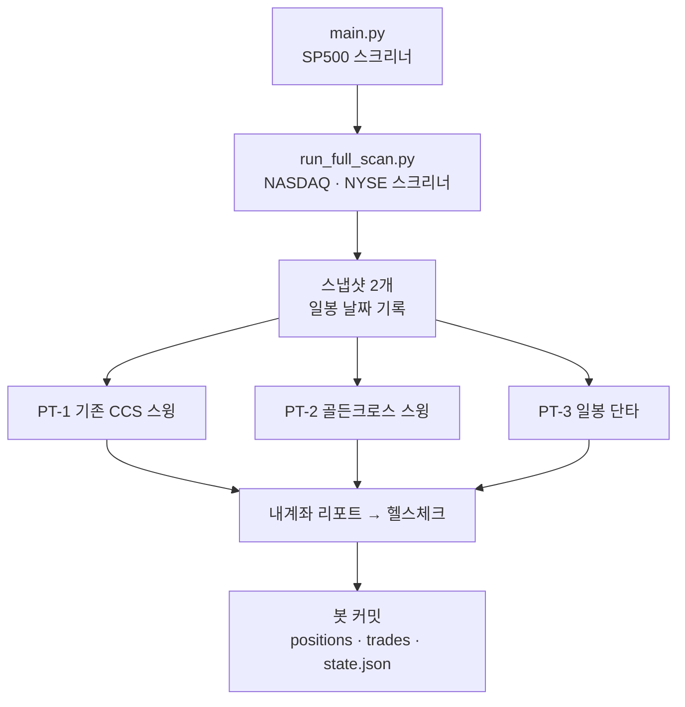

# 작업 요약 & 메인 컴퓨터 진행 가이드

> 최종 갱신: 2026-10-03 (토론토) · 대상 리포: `sean-ccho/Project_1`
> ⚠️ 2026-10-09: PT-2·PT-3 은 삭제됐다 (아래 2-1절의 3계좌 설명은 당시 기록). 지금 상태는 [HANDOFF.md](HANDOFF.md) 0·0-1절.
> 근거와 설계 전체는 [QUANT_IMPROVEMENT_PLAN.md](QUANT_IMPROVEMENT_PLAN.md) (특히 10절). 이후 작업도 이 문서 9절에 이어서 기록한다. **새 컴퓨터에서 이어서 작업할 때는 [HANDOFF.md](HANDOFF.md) 하나만 보면 된다.**

---

## 0. 한눈에 보기

| 항목 | 내용 |
|---|---|
| 한 일 | 새 페이퍼 계좌 2개(PT-2 골든크로스 스윙, PT-3 일봉 단타), 버그 7개(F~L) 수정, 백테스트 정합성(Tier 0), CCS v2·가설 스위치(H1~H6), 분석·최적화 도구, 비판적 검토 반영(쉬운 방법 비교·운 판정·종목 수 늘리기·생존 편향 완화, 2-8) |
| 상태 | **메인 컴퓨터로 이전하고 main에 머지 완료** (머지 커밋 `3b732a4`, 2026-10-01). 매일 GitHub Actions가 PT-1·PT-2·PT-3을 실행한다. 연구는 Tier 3(알파 검증)까지 진행 → **결론: 현재 전략에 통계적으로 의미 있는 알파 없음** |
| 아직 안 한 것 | 새 피처 추가·더 긴 표본(Tier 3 후속), PT-2·PT-3 백테스트, Optuna, 홀드아웃 1회 평가 |
| 실거래 영향 | PT-1 매매 규칙은 그대로. 바뀐 건 실행 시점뿐 (주말·장중·중복 실행은 건너뜀, 기록 날짜는 미국 동부 거래일). 새 스위치는 전부 꺼짐 |
| 다음 | **[HANDOFF.md](HANDOFF.md) 5절** — 새 피처 데이터 소스 결정 → 장기 표본 패널 → 팩터·합성 재검증 |


---

## 1. 배경 — 왜 바꿨나

- **실거래**: 49건 승률 39%, 거래당 약 +1%. 백테스트(약 50%)와 통계적으로 모순되지 않는다. 엣지가 원래 그 정도다.
- **백테스트를 믿을 수 없었다** (계획서 3-1절 A~E): 캐시가 설정 변경을 무시, 펀더멘털 미래 정보, 어닝 필터 오작동, 거래비용 0, 저점확률 누락.
- **거래 396건 분석** (2-1절): 수익은 모멘텀 + 상승장에서 나온다. 트레일링 스탑이 거래의 32%를 승률 7%로 잘라낸다. CCS 점수는 수익 순위를 거의 못 가른다 (IC +0.058) → 가설 H1~H6.
- **CCS 진단** (10-1절): 유의한 건 전략적합도 하나(IC +0.12). 타이밍·컨플루언스가 바닥반등에 최대 +0.15를 더 주는데 상승장 모멘텀 보너스는 0.015. 교체는 보유 종목의 *매수 당시* 점수와 후보의 *오늘* 점수를 비교하고 있었다.
- **실행 버그** (10-5절): 워크플로가 주말에도 돌고 날짜를 UTC로 써서, 49건 중 6건 매수가 장이 안 열린 날의 묵은 데이터로 체결됐다.

---

## 2. 무엇을 만들었나

### 2-1. 페이퍼 트레이딩 3계좌

| 계좌 | 전략 | 보유 기간 | 운용 | 데이터 | 시트 탭 |
|---|---|---|---|---|---|
| PT-1 기존 | 스크리너 점수 + CCS (모멘텀·바닥반등) | 8~25일 | 최대 3종목, 기존 규칙 그대로 | `data/paper_trading/` | 기존 |
| PT-2 골든크로스 스윙 | 골든크로스 직후 진입, 추세가 살아 있으면 계속 보유 | 30일 + 추세 유지 시 연장 | 5종목 · 하루 2종목 · $5,000 | `data/paper_trading/pt2/` | `페이퍼2_*` |
| PT-3 일봉 단타 | 눌림목 반등(A) · 압축 돌파(B) | 최대 10거래일 | 5종목 · 하루 2종목 · $5,000 | `data/paper_trading/pt3/` | `페이퍼3_*` |

- 운영은 **main 하나**. 스크리너는 한 번 돌고 세 계좌가 같은 스냅샷을 쓴다. 이메일은 계좌별로 3통.
- PT-2·PT-3 공통 규칙 (`account_engine.py`)
  - 장 마감 신호 → **다음날 시가 체결**
  - 손절·목표는 일봉 고가/저가로 판정 (갭이면 시가, 같은 날 둘 다 닿으면 손절)
  - 편도 비용 0.1%, 섹터당 최대 2종목, 빠진 날은 최대 10거래일 따라잡기
  - 실거래와 백테스트가 같은 `process_bar()`를 쓴다
- **PT-2** (계획서 10-3절)
  - 후보: 골든크로스 직후 (일봉 EMA20/50, 주봉 SMA10/40, 월봉 SMA3/10)
  - 필터: 주가 ≥ $5, 거래대금 ≥ $10M, 어닝 3일 이내 제외, 과열 제외, 종가 > EMA200, SPY < EMA200이면 신규 진입 중단
  - 청산: 손절 −2×ATR / 추세 이탈(데드크로스, 종가 < EMA50 2일) / +5% 이후 트레일링 3×ATR / 30일째부터 추세 체크를 통과하면 계속 보유 (트레일링 2.5×ATR)
- **PT-3** (10-4절)
  - 셋업 A 눌림목: 정배열, RSI 35~50 또는 볼린저 < 0.3, 5일 수익 < 0, 반전 확인
  - 셋업 B 압축 돌파: 변동성 압축, 20일 고가 돌파, 거래량 1.5배 이상, ADX ≥ 20 (약세장이면 중단)
  - 청산: 손절 −1.5×ATR / 목표 +2×ATR / +1×ATR 후 본절 / 셋업 완료 / 10거래일 / 시가가 +3% 넘게 갭 상승하면 매수 취소



### 2-2. 버그 수정 (F~L)

| # | 문제 | 수정 |
|---|---|---|
| F | 주말·휴일·push 때도 매매, 날짜는 UTC → 묵은 데이터로 매수 | 거래일 = 스냅샷의 일봉 날짜. 계좌별 `state.json`으로 같은 일봉은 한 번만 처리 |
| G | 백테스트 종목 순서가 실행마다 바뀜 | 정렬 + 고정 시드 |
| H | IC 가중치 캐시가 호출 횟수로 저장 (미래 정보 가능) | 월 단위(전월 말 기준) |
| I | 실거래는 장 마감 후 그날 가격, 백테스트는 다음날 시가 | PT-2·PT-3는 다음날 시가. PT-1은 CCS v2 전환 때 함께 |
| J | 헬스체크가 UTC 날짜로 로그 폴더를 찾음 → 매일 degraded | 토론토 날짜 |
| K | 한쪽 스크리너가 실패하면 전날 스냅샷이 섞임 | 일봉 날짜가 가장 최신인 스냅샷만 사용 |
| L | 장중 push 실행이 16:30을 넘겨 페이퍼 단계에 오면 미완성 일봉을 확정으로 판단 | 데이터를 **받은 시점** 기준으로 판단, 미확정이면 일봉 날짜를 비워 건너뜀 |

### 2-3. 백테스트 정합성 (Tier 0·1)

- 캐시 키에 코드 해시 → 코드·설정을 바꾸면 캐시가 자동으로 무효화된다
- 펀더멘털 미래 정보 차단, 편도 비용 0.1% 반영
- 자본곡선 지표: 일간 Sharpe·Sortino, CAGR, Calmar, SPY 일간 Sharpe
- `meta.json`에 code_hash · config_hash · 전체 설정
- 유니버스 고정 순서(G), IC 가중치 월 단위(H), `start_date`/`end_date`(홀드아웃·walk-forward), `save_run=False`(반복 실행용)

### 2-4. CCS v2 (스위치, 기본 꺼짐)

- 점수 = 0.40 × 전략적합도 + 0.20 × 장기 추세 백분위 + 0.20 × 52주 위치 백분위 + 0.20 × 20일 수익률 백분위 − 섹터 페널티
- 백분위는 그날 전체 종목 기준. 펀더멘털·저점확률을 안 써서 백테스트와 실거래 점수가 같다
- 최소 점수 0.55. 교체 때는 보유 종목도 오늘 점수로 다시 매겨 비교한다
- `CCS_VERSION = "v1"`(기본). 켜는 조건: IC t ≥ 2이고 v1보다 높음 + 백테스트 일간 Sharpe 상승·MDD 악화 없음 + 켤 때 PT-1 체결도 다음날 시가로

### 2-5. Tier 1.5 가설 스위치 (기본값 = 현재 동작)

| 가설 | 설정 → 실험값 | A/B 변형 |
|---|---|---|
| H1 트레일링을 수익이 난 뒤에만 | `trail_activate_pct = 0.0` → 0.03 / 0.05 | `H1a`, `H1b` |
| H2 바닥반등 중단 | `CANDIDATE_ALLOWED_STRATEGIES = None` → `["모멘텀"]` | `H2` |
| H3 약세장 신규 진입 중단 | `CANDIDATE_BEAR_BLOCK_NEW = False` → True | `H3` |
| H4 교체 완화·중단 | `CCS_REPLACE_MARGIN = 0.10` → 0.20, `PT1_REPLACE_ENABLED = True` → False | `H4a`, `H4b` |
| H5 CCS v2 | `CCS_VERSION = "v1"` → "v2" | `H5` |
| H6 바닥반등 알파 가중치 | .10/.10/.15/.25/.40 → .25/.25/.20/.10/.20 | `H6` |

Tier 2 변형(`T2-5`·`T2-10`·`T2-20`)은 2-8 참고. config 파일은 고치지 않고 실행 중에만 바꾼다 (`config_override.py`).

### 2-6. 분석·최적화 도구

| 파일 | 용도 |
|---|---|
| `scripts/verify_backtest_integrity.py` | 캐시 on/off 결과가 같은지, 손절 폭에 결과가 반응하는지 |
| `scripts/analyze_trade_features.py` | 거래 로그 피처별 IC |
| `scripts/run_account_backtest.py` | PT-2·PT-3 백테스트 (실거래와 같은 엔진) |
| `scripts/analyze_ccs_ic.py` | CCS v1 vs v2 전 종목 IC |
| `scripts/run_hypothesis_ab.py` | H1~H6·T2 A/B 비교 + 운 판정 → `output/hypothesis_ab.csv`에 누적 |
| `scripts/optimize_optuna.py` | 계좌별 Optuna (구간을 나눠 평가, 홀드아웃 봉인) |
| `scripts/fetch_sp500_membership.py` | 과거 S&P 500 구성종목 CSV 다운로드 (`--pit-universe`용) |
| `src/paper_trading/config_override.py` | 실행 중 config 덮어쓰기 (끝나면 원래대로) |
| `src/paper_trading/evaluation.py` | Sharpe·CAGR·MDD, 알파 회귀, 짝지은 블록 부트스트랩, 판정 (순수 파이썬) |
| `src/paper_trading/benchmarks.py` | 쉬운 방법 기준: SPY 보유, 12-1 모멘텀 상위 20 매달 교체 |
| `src/paper_trading/universe.py` | 날짜별 S&P 500 구성종목 조회 |

### 2-7. 테스트

| 구분 | 파일 | 개수 | 실행 위치 |
|---|---|---|---|
| pandas 불필요 | `test_market_date`, `test_account_engine`, `test_pt2_golden_cross`, `test_pt3_short_term`, `test_indicators`, `test_account_email`, `test_account_simulation`, `test_config_override`, `test_evaluation`, `test_universe` | 73 | 이 노트북에서 전부 통과 |
| pandas 필요 | `test_pt1_switches`, `test_snapshot_bar_date`, `test_benchmarks` | 17 | 메인 컴퓨터 (4-4) |

### 2-8. 비판적 검토 반영 (2026-10-01)

"이대로 하면 최고의 퀀트가 되나?" 검토에서 나온 4가지. 기본값은 전부 **지금 동작 그대로**이고 연구 실행에서 켠다.

| # | 문제 | 한 것 | 어디서 보나 |
|---|---|---|---|
| 1 | 복잡한 전략이 쉬운 방법보다 나은지 모른다 | 모든 백테스트에 같은 기간·같은 비용의 **SPY 보유**와 **"1년간 많이 오른 20종목 매달 교체"(12-1 모멘텀)** 를 함께 계산. 둘로 설명되고 남는 수익 = 알파(연, t값) | 결과 출력 "쉬운 방법과 비교", `meta.json`의 `baselines` |
| 2 | A/B 차이가 운인지 모른다 | 같은 날짜끼리 묶어 20거래일 블록으로 1,000번 재표본 → ΔSharpe 95% 구간 + 기간 3등분 일관성 → `채택 후보` / `운과 구분 안 됨` / `기각` | A/B 표의 `ΔSharpe_95%`·`구간개선`·`판정` |
| 3 | 3종목이면 운이 너무 크게 작용한다 | 빈 슬롯이 있으면 하루 여러 종목 매수 (`PAPER_TRADING_MAX_DAILY_BUY`, 같은 날 고른 종목끼리도 섹터 한도). 변형 `T2-5`(5종목·하루 2) / `T2-10`(10·3) / `T2-20`(20·5). `--base T2-10`이면 분산된 기준선 위에서 H1~H6를 비교 | A/B 실행기 |
| 4 | 지금 살아있는 회사로 과거를 돌린다 (생존 편향) | `--pit-universe`: 그날 실제 S&P 500 구성종목만 후보로. 기간 중 빠진 종목도 유니버스에 넣는다 | A/B·계좌 백테스트·Optuna (4-8 ②) |

- 판정 `채택 후보` = 95% 구간 하한 > 0 + 3구간 중 2개 이상 개선 + MDD가 2%p 넘게 나빠지지 않음
- 3번은 **백테스트만**. 실거래 PT-1은 여전히 하루 1종목 (config를 2 이상으로 바꾸면 경고 로그). T2를 채택하면 그때 실거래 엔진에도 넣는다
- 4번은 부분 해결. 상장폐지·인수된 회사는 yfinance에 가격이 없어 여전히 빠진다 → 결과는 여전히 조금 낙관적이다

---

## 3. 변경 파일 (52개)

<details>
<summary>수정 15개</summary>

| 파일 | 내용 |
|---|---|
| `docs/quant_improvement/QUANT_IMPROVEMENT_PLAN.md` | 10절 추가 등 |
| `src/main.py`, `src/run_full_scan.py` | 스냅샷에 일봉 날짜 기록 (받은 시점 기준) |
| `src/monitoring/health_check.py` | 토론토 날짜, `pt*/` 계좌 파일 검사 |
| `src/paper_trading/backtest.py` | Tier 0, 고정 유니버스, 날짜 구간, `save_run`, 스위치 반영, 하루 여러 종목 매수, PIT 유니버스, 쉬운 방법 비교 |
| `src/paper_trading/candidate_selector.py` | CCS v2, H2·H3·H6, `select_top_candidates` (후보 k개) |
| `src/paper_trading/engine.py` | 교체 점수(`current_ccs`), H1·H4, 최대 포지션 런타임, 하루 매수 수 경고 |
| `src/paper_trading/portfolio.py` | JSON 저장 공용화 |
| `src/paper_trading/run_paper_trading.py` | `--account`, `--dry-run`, `--as-of` |
| `src/paper_trading/runner.py` | PT-1 실행 가드, 묵은 스냅샷 제외 |
| `src/paper_trading/sheet_sync.py` | 시트 탭 이름 인자화 |
| `src/screener/backtest.py`, `src/screener/cache.py` | IC 가중치 월 단위 |
| `src/screener/config.py` | PT-2·PT-3, CCS v2, Tier 0·1.5 설정, PIT·비교 기준 설정 |
| `src/screener/exporter.py` | PT-1 메일 제목 날짜 |

</details>

<details>
<summary>새 파일 37개</summary>

| 위치 | 파일 |
|---|---|
| `src/paper_trading/` (14) | `account_backtest.py`, `account_email.py`, `account_engine.py`, `accounts.py`, `benchmarks.py`, `config_override.py`, `evaluation.py`, `golden_cross.py`, `indicators.py`, `json_store.py`, `market_date.py`, `pt2_golden_cross.py`, `pt3_short_term.py`, `universe.py` |
| `scripts/` (7) | `analyze_ccs_ic.py`, `analyze_trade_features.py`, `fetch_sp500_membership.py`, `optimize_optuna.py`, `run_account_backtest.py`, `run_hypothesis_ab.py`, `verify_backtest_integrity.py` |
| `tests/paper_trading/` (13) | `test_account_email.py`, `test_account_engine.py`, `test_account_simulation.py`, `test_benchmarks.py`, `test_config_override.py`, `test_evaluation.py`, `test_indicators.py`, `test_market_date.py`, `test_pt1_switches.py`, `test_pt2_golden_cross.py`, `test_pt3_short_term.py`, `test_snapshot_bar_date.py`, `test_universe.py` |
| 기타 (3) | `requirements-research.txt`, `docs/quant_improvement/WORK_SUMMARY.md` (이 문서), `docs/quant_improvement/HANDOFF.md` (단일 인수인계 문서) |

</details>

---

## 4. 메인 컴퓨터에서 진행하기

### 4-0 ~ 4-7. 이전·머지·첫 실행 (완료)

노트북 변경 52개 파일을 메인 컴퓨터로 옮겨 `feat/pt-3accounts` 브랜치에서 최신 main과 병합하고, 워크플로 수정까지 마쳐 main에 머지했다. 상세 절차 문서(옛 HANDOFF.md 3절)는 완료 후 삭제했다 (git 히스토리에 있음).

| 단계 | 상태 | 근거 |
|---|---|---|
| 파일 이전 · 브랜치 · 최신 main 병합 | ✅ | 커밋 `d4157de`, 병합 `79d9908` (2026-10-01) |
| 워크플로 수정 (PT-2·PT-3 실행 + 상태 파일 커밋) | ✅ | `9cfb8ca`, `.github/workflows/run-screener.yml`에 반영 |
| 테스트 · dry-run (3계좌) | ✅ | 2026-10-02 기록 (9절). 2026-10-03 전체 `pytest tests`: 168 통과, 2 실패(`test_portfolio_report`의 N/A 표기, 이번 작업과 무관) |
| main 머지 | ✅ | `3b732a4` (2026-10-01, `[skip ci]`) |
| 첫 정기 실행 | ✅ 봇 커밋 확인 | 2026-10-01·10-02·10-03 `chore: update logs and paper trading state`, `data/paper_trading/pt2·pt3` 상태 파일 생성됨 |

이메일 3통·시트 탭 자동 생성은 이 문서 작성 시점에 코드로 확인하지 못했다 (정기 실행 로그·받은편지함에서 확인).

### 4-8. 연구 작업 (머지와 병행, 순서대로)

홀드아웃은 **2025-10-01 이후로 고정**하고, 개발 구간 실행에는 모두 `--end 2025-09-30`을 붙인다. `--max-tickers 1000`은 전 종목이라는 뜻이다.

**순서가 바뀜다 (2-8)**: 종목 수(Tier 2)를 먼저 정하고, 그 위에서 H1~H6를 본다. 3종목짜리에서 고른 설정은 운에 맞춰진 것일 가능성이 크다.


**진행 상태 (2026-10-03)**: ①~④ 완료, H1~H6(⑤)는 규칙에 따라 건너뜀(알파 t<1), Tier 3 팩터·합성 검증 완료(알파 없음). 이어서 할 일은 [HANDOFF.md](HANDOFF.md) 5절. ⑥~⑧은 아직.

① **Tier 0 검증**
```bash
rm -rf data/cache/features data/cache/ic_weights
PYTHONPATH=.:src python scripts/verify_backtest_integrity.py
```

② **과거 S&P 500 구성종목 파일** (한 번만. `data/universe/sp500_membership.csv`, 커밋하지 않는다)
```bash
PYTHONPATH=.:src python scripts/fetch_sp500_membership.py
```

③ **Baseline v1 + 쉬운 방법 비교** (결과는 `output/hypothesis_ab.csv`에 code_hash와 함께 남는다)
```bash
PYTHONPATH=.:src python scripts/run_hypothesis_ab.py --only BASE --period 5y --max-tickers 1000 --end 2025-09-30 --pit-universe
PYTHONPATH=.:src python scripts/run_hypothesis_ab.py --only BASE --period 5y --max-tickers 1000 --end 2025-09-30   # 비교용: 생존 편향이 얼마나 컸나
```
끝에 나오는 "기준선 vs 쉬운 방법"을 본다. **모멘텀 대비 판정이 `기각`이거나 알파 t가 1 미만**이면 지금 전략은 쉬운 모멘텀을 비싸게 하는 것이다 → H1~H6 미세조정보다 Tier 3(알파 재설계)가 먼저다.

④ **Tier 2 종목 수** → `채택 후보` 중 Sharpe가 가장 높은 변형을 고른다 (없으면 BASE 유지)
```bash
PYTHONPATH=.:src python scripts/run_hypothesis_ab.py --only T2-5 T2-10 T2-20 --period 5y --max-tickers 1000 --end 2025-09-30 --pit-universe
```

⑤ **Tier 1.5 A/B** (④에서 고른 변형을 `--base`로. 빠른 반복은 `--max-tickers 100 --period 3y`)
```bash
PYTHONPATH=.:src python scripts/run_hypothesis_ab.py --base T2-10 --period 5y --max-tickers 1000 --end 2025-09-30 --pit-universe
```
채택 규칙: 판정이 `채택 후보`인 것만, 한 번에 하나씩 → 합쳐서 다시 돌린 결과가 Baseline v2. `운과 구분 안 됨`은 Sharpe가 올랐어도 채택하지 않는다.

⑥ **PT-2·PT-3 백테스트** ("쉬운 방법과 비교"가 같이 출력된다)
```bash
PYTHONPATH=.:src python scripts/run_account_backtest.py --account pt2 --period 5y --max-tickers 0 --end 2025-09-30 --pit-universe
PYTHONPATH=.:src python scripts/run_account_backtest.py --account pt3 --period 5y --max-tickers 0 --end 2025-09-30 --pit-universe
```

⑦ **CCS v1 vs v2** (`--end` 옵션이 없어 홀드아웃까지 포함 → 참고용)
```bash
PYTHONPATH=.:src python scripts/analyze_ccs_ic.py --period 5y --max-tickers 300
```

⑧ **Optuna** (①~⑦ 이후)
```bash
pip install -r requirements-research.txt
PYTHONPATH=.:src python scripts/optimize_optuna.py --account pt2 --trials 100 --pit-universe
PYTHONPATH=.:src python scripts/optimize_optuna.py --account pt2 --evaluate-holdout --pit-universe   # 마지막에 딱 한 번
```

참고: 전체 기간 run 폴더가 필요하면 `scripts/run_sp500_backtest.py --period 5y --rebalance 1 --capital 5000 --no-cache` (날짜 구간 옵션 없음).

### 4-9. 결과 공유 체크리스트 (다음 분석용)

- [ ] `pytest tests/paper_trading` 결과 (실패가 있으면 전체 출력)
- [ ] dry-run 출력 (3계좌)
- [ ] 첫 정기 실행의 Actions 로그, 이메일 3통
- [ ] `verify_backtest_integrity.py` 출력
- [ ] `fetch_sp500_membership.py` 출력 (기간·구성종목 수)
- [ ] Baseline 두 번(PIT 있음·없음)의 "기준선 vs 쉬운 방법" 출력
- [ ] `output/hypothesis_ab.csv` (BASE + T2 + 변형, 판정 포함)
- [ ] PT-2·PT-3 백테스트 요약 (쉬운 방법 비교 포함)
- [ ] `analyze_ccs_ic.py` 출력

---

## 5. 성공·중단 기준 (미리 정해 둠, 계획서 10-8절)

- **백테스트 우선**: PT-2·PT-3 백테스트(비용 포함)의 일간 Sharpe가 SPY보다 낮으면, 페이퍼 결과와 상관없이 규칙을 다시 설계한다
- **쉬운 방법 기준**: 어느 계좌든 "모멘텀 상위 20 매달 교체" 대비 판정이 `기각`이면 미세조정(H1~H6·Optuna)보다 알파 재설계가 먼저
- **A/B 채택**: 판정 `채택 후보`만. Sharpe가 올라도 `운과 구분 안 됨`이면 채택하지 않는다
- **페이퍼 = 실행 검증**: 3개월 또는 30건이 쌓이면 같은 기간 백테스트와 비교. 거래당 평균수익 차이가 백테스트 표준오차의 2배를 넘으면 체결·데이터 차이부터 조사
- **버전 분리**: 규칙을 바꾸면 `version`(예: `pt2-v1`)을 올리고 성과는 버전별로 본다
- **CCS v2**: 2-4절 조건을 모두 통과할 때만 켠다
- **Optuna**: 거래 50건 미만·승률 40% 미만은 버리고, 구간 간 편차를 감점한다. 홀드아웃은 한 번만 본다

---

## 6. 알려진 제약

- pandas·네트워크 경로(스냅샷 로드, 백테스트)는 2026-10-02 메인 컴퓨터에서 테스트·dry-run·백테스트로 확인했다. 시트·이메일은 정기 실행에서만 동작한다
- PT-1 체결은 아직 장 마감 가격 기록 (I). CCS v2를 켤 때 다음날 시가로 바꾼다
- H3의 "절반만 진입" 옵션은 없다 (Tier 2 사이징과 함께)
- Optuna PT-1 탐색 공간: 청산 4개 × 전략 2 + CCS 버전 + 교체 on/off (시간익절은 고정)
- 기록 날짜가 미국 동부 거래일로 바뀐다 (이전 기록은 UTC라 하루 늦게 찍혀 있다)
- `run_sp500_backtest.py`에는 날짜 구간 옵션이 없다 → 개발 구간 기준선은 A/B 실행기의 BASE
- 백테스트 결과물(`output/`)은 필요할 때만 커밋. main에 직접 커밋하면 `[skip ci]`
- PIT 유니버스는 부분 해결: 상장폐지·인수된 회사는 yfinance에 가격이 없고, 같은 티커를 다른 회사가 재사용했을 수 있다. 후보만 거르고 피처는 유니버스 전체로 계산한다
- 하루 여러 종목 매수는 백테스트만 (실거래 PT-1은 하루 1종목). 교체는 여전히 하루 1건
- 알파 t값은 일반 OLS 기준(자기상관 보정 없음) → 참고용. 채택 판정은 블록 부트스트랩 기준
- 모멘텀 기준은 매달 말 종가 신호 → 다음 거래일 종가 체결, 달 중에는 동일가중 유지(비용은 교체 때만)

---

## 7. 문제 해결

| 증상 | 원인 | 조치 |
|---|---|---|
| `git pull`이 divergent로 거부 | 2026-09-30 히스토리 재작성 이전 클론 | 로컬 전용 작업 백업 후 새로 clone |
| `건너뜀: 스냅샷에 일봉 날짜(_bar_date)가 없음` | 옛 스냅샷이거나 장중에 받은 데이터 | dry-run은 `--as-of`. 정기 실행이면 정상 (다음 실행에서 처리) |
| `일봉이 아직 확정되지 않음 (장중 실행)` | 16:30(토론토) 전 실행 | 정상 |
| `이미 처리한 일봉` | `state.json`에 기록된 일봉 | 정상 (중복 매매 방지) |
| PT-2·PT-3 `SPY ... 일봉이 없어 건너뜀` | yfinance 지연 | 다음 실행에서 최대 10거래일 따라잡는다 |
| `ModuleNotFoundError: paper_trading` | import 경로 | 명령 앞에 `PYTHONPATH=.:src` |
| 헬스체크 degraded `오늘 로그 파일` | 실행이 자정을 넘겨 로그 날짜와 다름 | 실패 2개 이하면 워크플로는 계속 진행 |
| `sp500_membership.csv 없음` | `--pit-universe`인데 파일을 안 받음 | `scripts/fetch_sp500_membership.py` (네트워크 필요) |
| 표의 `판정`이 `데이터 부족` | 구간이 40거래일보다 짧음 | 기간을 늘린다 |

---

## 8. 참고 문서와 용어

- [QUANT_IMPROVEMENT_PLAN.md](QUANT_IMPROVEMENT_PLAN.md): 근거·설계 전체 (10절 = 이번 작업)
- [HANDOFF.md](HANDOFF.md): 새 컴퓨터에서 이어서 작업하는 **단일 인수인계 문서** (현재 상태·다음 할 일·데이터 파일)
- [SIGNAL_RESEARCH_PLAN.md](SIGNAL_RESEARCH_PLAN.md): Tier 3-B 신호 연구 구현 가이드 (단계·코드 골격·판정 기준)
- [CLAUDE.md](../../CLAUDE.md): 커밋 메시지 규칙 (`type: 한국어 설명`)

| 용어 | 뜻 |
|---|---|
| CCS | PT-1의 후보 점수 (Composite Conviction Score) |
| PT-1/2/3 | 페이퍼 트레이딩 계좌 1·2·3 |
| 홀드아웃 | 최적화에 쓰지 않고 마지막에 한 번만 평가하는 최근 12개월 |
| IC | 점수와 이후 수익률의 순위 상관. 클수록 점수가 수익을 잘 가른다 |
| A/B 변형 | 기준선(BASE)에서 가설 하나만 바꾼 백테스트 |
| dry-run | 파일 저장·시트·이메일 없이 결과만 출력하는 실행 |
| 12-1 모멘텀 | 최근 12개월 수익률(마지막 1개월 제외) 상위 종목을 사는 가장 흔한 "쉬운" 퀀트 전략 |
| 알파 | SPY와 쉬운 모멘텀으로 설명되고 남는 수익. t ≥ 2면 의미 있는 크기 |
| 블록 부트스트랩 | 날짜를 20일 묶음으로 다시 뽑아 "운으로도 이 정도 차이가 나는지" 보는 방법 |
| PIT (point-in-time) | 그 날짜에 실제로 알 수 있었던 정보만 쓰는 것. 여기서는 그날의 S&P 500 구성종목 |
| 생존 편향 | 지금까지 살아남은 회사만으로 과거를 돌려 성과가 부풀려지는 것 |

---

## 9. 진행 기록

| 날짜 | 내용 |
|---|---|
| 2026-09-28 | 백테스트 35개 run · 거래 396건 분석, 개선 계획서 작성 |
| 2026-09-30 | 3계좌(PT-2·PT-3), 버그 F~K 수정, Tier 0, CCS v2 스위치, 계좌별 백테스트, Optuna 스크립트 |
| 2026-10-01 | Tier 1.5 스위치 H1~H6 + A/B 실행기, 버그 L 수정, 이 문서 |
| 2026-10-01 | 비판적 검토 반영 (2-8): 쉬운 방법 비교·알파, A/B 운 판정, 하루 여러 종목 매수(T2), PIT 유니버스. 연구 순서를 T2 → H1~H6으로 변경 |
| 2026-10-01 | 메인 컴퓨터 이전 가이드 [HANDOFF.md](HANDOFF.md) + zip 패키지 (패치 방식 대체) |
| 2026-10-02 | 메인 컴퓨터 이전 완료 (머지 커밋 `3b732a4`). Python 3.11.17 설치, 테스트 134개 통과, dry-run 3계좌(PT-1·PT-2·PT-3) 정상 확인 |
| 2026-10-03 | Tier 3-1·3-2 완료: 연구 패널 + 팩터 IC 리서치(44팩터×3기간). PIT 기준 통과 1/132건 → 유의한 팩터 사실상 없음. 인수인계 [HANDOFF.md](HANDOFF.md) |
| 2026-10-03 | Tier 3-3 합성 점수 검증: 시도 150건(보정 임계 |t|≈3.59). 고정 합성 최고 t≈2.2, 워크포워드 OOS t≈±1 이하 → 채택할 알파 없음(Baseline v4 없음). 새 피처·장기 표본 필요. [HANDOFF.md](HANDOFF.md) |
| 2026-10-03 | 문서 정리: HANDOFF.md를 단일 인수인계 문서로 통합. 완료된 문서(옛 HANDOFF 이전 가이드, CODE_CHANGES_GUIDE, analyze_trades_stdlib.py, tier3/HANDOFF_TIER3.md) 삭제. 연구 데이터 번들(parquet) 정리 |
| 2026-10-05 | 10년 표본(`px10y`) 데이터 패널 생성 및 팩터·합성 리서치 재실행. 장기 데이터 및 다양한 레짐에서도 팩터들이 다중검정 임계값(t≈3.59)을 넘지 못함 (OOS 실패, 노이즈로 확인). 개별 종목 알파 추구 중단 및 Baseline 대체 방향으로 [HANDOFF.md](HANDOFF.md) 요약 및 할 일 갱신. |
| 2026-10-05 | (노트북 검토) 사용자 결정으로 신호 연구 2차 계획 [SIGNAL_RESEARCH_PLAN.md](SIGNAL_RESEARCH_PLAN.md) 작성: 미검증 스크리너 출력·조건부 반전·PEAD·패널 ML, Optuna는 채택 후보 뒤. 백테스트 buy_signal 상시 False(섹터 ETF 누락)·실거래 섹터명 불일치 의심 발견 → 0-8·6단계 |
| 2026-10-07 | Tier 3-B 0단계 완료: `research_utils.py`(NW t·Bonferroni·시도 기록·개발 구간 로드), `TRIAL_LOG.csv`(누적 294건), `signal_portfolio_sim.py`, `deflated_sharpe`, factor/composite에 `t_nw`·세트별 파라미터. px10y 연 1회 재학습 합성(OOS 2019~) 통과 0. 0-8 진단: 백테스트 buy_signal 2025-09 전부 0(필터 전 13~20)·실거래 섹터명 불일치 확정 → 6단계 수정 |
| 2026-10-07 | Tier 3-B 1단계 스크리너 출력 이벤트 스터디 (`signal_event_study.py`, pit 2022-08~2025-09): 고친 규칙(섹터 GICS 채움·ETF 강도·Unknown 통과)으로 신호 재계산, family 117건(z=3.52) **전부 탈락** — 후보·관찰·역신호 0. 최고 S6_hard 5일 t_nw +1.77(비용 후 음), 최저 PW_컵앤핸들 20일 −2.96. 누적 시도 411건 |
| 2026-10-07 | Tier 3-B 2단계 조건부 반전 (`conditional_research.py`, px10y 2016~2025-09): 18건(z=2.99) → 관찰 1 · 탈락 17, 후보 0. 관찰 A2 20일(거래량 급증 종목의 반전, t_nw +2.44)은 Chan(2003) 가설과 반대 방향이고 2023·2024 음수, 롱 온리 비용 후 +0.05%/20일 → 채택 안 함. 누적 시도 429건 |
| 2026-10-07 | Tier 3-B 3-1 PEAD 대리 이벤트 (`pead_research.py --proxy`, 갭≥4% & 거래량≥3×, px10y 3,489건): 10건(z=2.81) **전부 탈락**. 상승 이벤트 후 지속 없음(40일 t_nw −2.20, 오히려 약한 되돌림), 하락 이벤트도 무의미. 누적 시도 439건. 3-2 EDGAR 수집은 보류 |
| 2026-10-07 | Tier 3-B 추가: 반전 캔들 확인 vs 미확인 (`pattern_confirm_research.py`, px10y, patterns.py 정의 벡터화·일치 테스트): 18건(z=2.99) **전부 탈락**. 다음날 확인 버전이 오히려 더 나쁨(강세잉걸핑 확인 20일 t_nw −2.41 vs 미확인 +0.96). 이중바닥 넥라인 버전은 생략. 누적 시도 457건 |
| 2026-10-07 | Tier 3-B 4단계 패널 ML (`panel_ml.py`, LightGBM 고정 파라미터, px10y 매년 재학습, OOS 2019-01~2025-09, `_sn`·close 제외(탈락 누설)): **탈락** — OOS IC +0.015 (t_nw 1.86 < 3.0), 상위 10% 비용 후 양수 해 4/7, 시뮬 k=20 h=10 SPY 대비 ΔSharpe −0.37 [−0.69, +0.06], 베타 1.46·MDD −59%. 셔플 대조 IC −0.002 정상. **1~4단계 후보 0 → 중단 규칙 발동**. 누적 시도 458건 |
| 2026-10-07 | 중단 규칙 이후 실거래 정비 (로컬, push 전): 시트·메일 SPY 비교 열, 비주식(ETN 등) 유니버스 제외, 같은 회사 클래스주 중복 방지, 섹터명 GICS 매핑, PT1_UNIVERSE 스위치, 병행 계좌 PT-1S. 지수 타이밍 비교(SPY vs EMA200·SMA200) 채택 없음 |
| 2026-10-08 | 6-1·6-2: 섹터 버그 수정 후 새 BASE (PIT 2022-08~2025-09) Sharpe 0.83 · 총 +68.4% vs SPY +68.6% (SPY Sharpe 1.08), 알파 t 0.44. R1 장중 손절 ΔSharpe −0.34, H3 약세장 진입 중단 −0.05 (MDD −27.9→−21.6%) → 둘 다 `운과 구분 안 됨`, 채택 없음. 누적 시도 462건 |
| 2026-10-08 | T2-10 새 BASE 재측정: Sharpe 0.51 (ΔSharpe −0.32 [−1.02, +0.40]) 채택 없음. 6-3 PT-2·PT-3 사전 기준 백테스트: PT-2 Sharpe 0.22 · +6.9%, PT-3 −0.03 · −3.9% (SPY 1.09 · +68.6%) → 10-8 규칙상 재설계/중단, 사용자 결정 대기 |
| 2026-10-08 | SEC EDGAR 수집(566개 회사, 8-K 2.02 실적일 24,824건 · 10-K 연간 재무, 접수 시각 UTC→ET 확인) 후 ① 재무 팩터 14건(BM·EP·GPA·AG·ACC·ISS·COMP × 21/63일, z=2.91): 후보 0 · 관찰 1 (ACC 63일 t 2.50) — v1은 옛 연도 정정 선택 버그로 무효 처리 후 v2 재실행 ② 실제 실적일 PEAD 10건(z=2.81) 전부 탈락. 종목 선택 연구 종료, 누적 시도 503건 |
| 2026-10-08 | CCS 점검: 어닝 회피 필터(yfinance 1.x 키·epoch·ET 날짜) 복구, 바닥반등 MACD 기준 주가 대비로, 백테스트 SEC 실적일(예정 발표만 기본) 반영, 교체 비교 오늘 점수 스위치(R2, 꺼짐). 새 BASE Sharpe 1.14 / 1.02 / 0.98 (예정만·전부·필터 끔) vs SPY 1.08. A/B R2 −0.45 · H4b −0.05 · H5 −0.47 · H2 +0.25 → 채택 없음. PT-2 0.29 · PT-3 0.13. 워크플로 push 재시도 수정. 누적 시도 507건 |
| 2026-10-08 | CCS 플라시보 3년: 실제 CCS = 문턱 통과 후보 중 무작위 선택 분포의 75백분위 → 운과 구분 안 됨. 홀드아웃 1회(사전 등록, 2025-10-01~2026-10-07): 모멘텀만(H2) Sharpe 0.91 vs SPY 1.32 불통과 (BASE 0.76) — 재조정·재시험 안 함 |
| 2026-10-09 | 10년 백테스트 지원(13y·피처 5년 창) → CCS 플라시보 10년: CCS 0.70 · CAGR 14.2% · MDD −43.6% vs SPY 0.89 · 15.2% · −33.7%, 무작위와 구분 안 됨. PT-1 구조 워크포워드(8개 설정, Optuna): 표본 외 0.05 vs 현재 0.58 vs SPY 0.85 불통과. 누적 시도 932건 → **연구 단계 종료** |
| 2026-10-09 | 실전 정리: PT-SPY(SPY $5,000 보유) 추가, PT-2·PT-3 중단 → 완전 삭제, PT-1·PT-1S $5,000 계좌 표시(메일·`페이퍼_계좌` 탭), Yahoo 요청 제한 대응(재시도 + 전날 값), S&P 500 목록 갱신(29 추가·25 제거) + 매달 자동 갱신·메일, 백테스트 평가 버그(빈 종가를 0원으로) 수정 — 10년 결과 변화 없음. 커밋은 Source Control 확인 후 허락받기로 (CLAUDE.md) |
